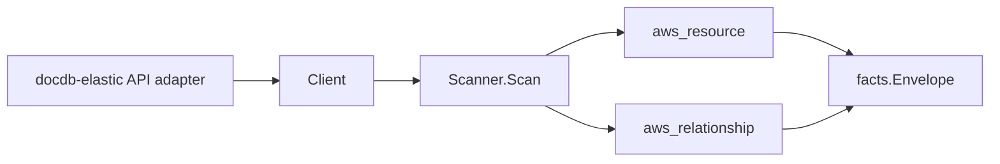

# Amazon DocumentDB Elastic Clusters Scanner

## Purpose

`internal/collector/awscloud/services/docdbelastic` owns the Amazon DocumentDB
Elastic Clusters scanner contract for the AWS cloud collector. It converts
elastic cluster control-plane metadata into `aws_resource` facts and emits
relationship evidence for VPC subnet placement, attached security groups, the
KMS encryption key, and the Secrets Manager admin-credential secret.

This is the sharded, serverless-scaling DocumentDB Elastic Clusters surface and
is a separate `service_kind` (`docdbelastic`) from the classic instance-based
DocumentDB scanner (`docdb`); the two services have distinct APIs, resource
types, and ARNs.

## Ownership boundary

This package owns scanner-level DocumentDB Elastic fact selection and identity
mapping. It does not own AWS SDK pagination, STS credentials, workflow claims,
fact persistence, graph writes, reducer admission, or query behavior.

## Exported surface

See `doc.go` for the godoc contract.

- `Client` - minimal DocumentDB Elastic metadata read surface consumed by
  `Scanner`.
- `Scanner` - emits cluster resources plus their relationships for one boundary.
- `Snapshot`, `Cluster` - scanner-owned views with document, collection, index,
  query-result, endpoint, admin-username, and password fields intentionally
  absent.

## Dependencies

- `internal/collector/awscloud` for boundaries, resource constants,
  relationship constants, partition helpers, and envelope builders.
- `internal/facts` for emitted fact envelope kinds.

The package depends on a small `Client` interface rather than the AWS SDK for
Go v2 so tests can use fake clients and the runtime adapter can own SDK
behavior.

## Telemetry

This scanner emits no spans or logs directly. `awsruntime.ClaimedSource`
records scan duration and emitted resource counts after `Scanner.Scan` returns.
The `awssdk` adapter records DocumentDB Elastic API call counts, throttles, and
pagination spans.

## Gotchas / invariants

- DocumentDB Elastic facts are metadata only. The scanner must never read
  document contents, collections, indexes, or query results, must never read or
  persist the admin password, the admin user name, or the cluster endpoint
  connection string, and must never call any mutation API.
- The cluster node publishes its resource_id as the cluster ARN (falling back
  to the cluster name). Every outgoing edge is sourced on that id.
- `ListClusters` returns identity-only summaries, so the adapter calls
  `GetCluster` per cluster for the full control-plane metadata. Pagination of
  `ListClusters` runs to exhaustion.
- The cluster-to-subnet and cluster-to-security-group edges are keyed by the
  bare `subnet-...` and `sg-...` ids AWS reports, which match the EC2 scanner's
  published subnet and security-group resource_ids; no ARN is synthesized.
- The cluster-to-KMS-key edge is emitted only when AWS reports a key
  identifier; `target_arn` is set only for ARN-shaped identifiers, matching the
  KMS scanner's published key resource_id.
- The cluster-to-admin-secret edge is emitted only for `SECRET_ARN` auth, when
  AWS reports an ARN-shaped secret reference in the `AdminUserName` field; that
  ARN matches the Secrets Manager scanner's published secret resource_id. The
  secret value is never read. Under `PLAIN_TEXT` auth the admin user name is
  dropped entirely and no edge is emitted.
- Emit reported evidence only. Do not infer deployment, workload, repository
  ownership, environment, or deployable-unit truth from cluster names or AWS
  tags.

## Evidence

Collector Performance Evidence:
`go test ./internal/collector/awscloud/services/docdbelastic/...` covers the
bounded DocumentDB Elastic metadata path: one paginated ListClusters stream,
one GetCluster point read per cluster, one ListTagsForResource point read per
cluster, no document reads, no queries, no mutations, and no graph writes in
the collector.

No-Regression Evidence: metadata-only control-plane scanner; new read path, no change to existing hot paths. `go test ./internal/collector/awscloud/services/docdbelastic/...` green.

No-Observability-Change: reuses shared AWS pagination span + API-call/throttle counters; no telemetry contract change.

Collector Deployment Evidence: DocumentDB Elastic runs inside the existing
hosted `collector-aws-cloud` runtime, so `/healthz`, `/readyz`, `/metrics`, and
`/admin/status` stay covered by the command wiring and Helm collector runtime.

## Related docs

- `docs/public/services/collector-aws-cloud.md`
- `docs/public/services/collector-aws-cloud-scanners.md`
- `docs/public/services/collector-aws-cloud-security.md`
