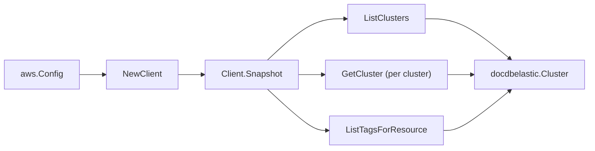

# Amazon DocumentDB Elastic Clusters SDK Adapter

## Purpose

`internal/collector/awscloud/services/docdbelastic/awssdk` adapts AWS SDK for
Go v2 DocumentDB Elastic Clusters responses to the scanner-owned `Client`
contract. It owns cluster pagination, per-cluster detail reads, resource-tag
reads, throttle classification, and per-call AWS API telemetry.

## Ownership boundary

This package owns SDK calls for DocumentDB Elastic. It does not own workflow
claims, credential acquisition, DocumentDB Elastic fact selection, graph
writes, reducer admission, or query behavior.

## Exported surface

See `doc.go` for the godoc contract.

- `Client` - AWS SDK-backed implementation of `docdbelastic.Client`.
- `NewClient` - builds a `Client` for one claimed AWS boundary.

## Dependencies

- `internal/collector/awscloud` for account, region, and service boundary
  labels.
- `internal/collector/awscloud/services/docdbelastic` for scanner-owned result
  types.
- `internal/telemetry` for AWS API call and throttle instruments.
- AWS SDK for Go v2 `docdbelastic` and Smithy error contracts.

## Telemetry

DocumentDB Elastic paginator pages and point reads are wrapped with:

- `aws.service.pagination.page`
- `eshu_dp_aws_api_calls_total`
- `eshu_dp_aws_throttle_total`

Metric labels stay bounded to service, account, region, operation, and result.
Cluster ARNs, names, tags, and raw AWS error payloads stay out of metric
labels.

## Gotchas / invariants

- `ListClusters` returns identity-only summaries (`ClusterInList`). The adapter
  calls `GetCluster` per cluster for the full control-plane metadata and pages
  `ListClusters` to exhaustion.
- The adapter reads metadata only. It must never call `CreateCluster`,
  `UpdateCluster`, `DeleteCluster`, `CopyClusterSnapshot`,
  `CreateClusterSnapshot`, `RestoreClusterFromSnapshot`, `StartCluster`,
  `StopCluster`, `ApplyPendingMaintenanceAction`, or any other mutation API, and
  never reads snapshot or document contents.
- The admin password is never read. Under `SECRET_ARN` auth AWS reports the
  Secrets Manager secret ARN in the `AdminUserName` field; the adapter captures
  that ARN only as the admin-secret reference and only when it is ARN-shaped.
  Under `PLAIN_TEXT` auth the admin user name is dropped entirely.
- The cluster endpoint connection string is never copied into scanner-owned
  metadata.
- `ListTagsForResource` is a metadata read; DocumentDB Elastic tags carry no
  document content.
- SDK adapters translate AWS records into scanner-owned types; scanner tests
  should not mock AWS SDK pagination.

## Related docs

- `docs/public/services/collector-aws-cloud-scanners.md`
- `docs/public/services/collector-aws-cloud-security.md`
