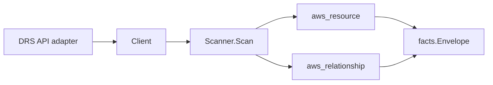

# AWS Elastic Disaster Recovery (DRS) Scanner

## Purpose

`internal/collector/awscloud/services/drs` owns the AWS Elastic Disaster
Recovery scanner contract for the AWS cloud collector. It converts DRS source
server, recovery instance, and replication configuration template metadata into
`aws_resource` facts and emits relationship evidence for the
source-server-to-recovery-instance association and the
recovery-instance-to-EC2-instance backing.

## Ownership boundary

This package owns scanner-level DRS fact selection and identity mapping. It does
not own AWS SDK pagination, STS credentials, workflow claims, fact persistence,
graph writes, reducer admission, or query behavior.

## Exported surface

See `doc.go` for the godoc contract.

- `Client` - minimal DRS metadata read surface consumed by `Scanner`.
- `Scanner` - emits source server, recovery instance, and replication
  configuration template resources plus their relationships for one boundary.
- `Snapshot`, `SourceServer`, `RecoveryInstance`,
  `ReplicationConfigurationTemplate` - scanner-owned views with agent secret,
  replicated disk, and snapshot fields intentionally absent.

## Dependencies

- `internal/collector/awscloud` for boundaries, resource constants,
  relationship constants, and envelope builders.
- `internal/facts` for emitted fact envelope kinds.

The package depends on a small `Client` interface rather than the AWS SDK for
Go v2 so tests can use fake clients and the runtime adapter can own SDK
behavior.

## Telemetry

This scanner emits no spans or logs directly. `awsruntime.ClaimedSource`
records scan duration and emitted resource counts after `Scanner.Scan` returns.
The `awssdk` adapter records DRS API call counts, throttles, and pagination
spans.

## Gotchas / invariants

- DRS facts are metadata only. The scanner must never install or read
  replication agent secrets, never read replicated disk data or point-in-time
  snapshot contents, never read job logs, and never call any recover, start,
  stop, or mutation API.
- The source server node publishes its resource_id as the source server id
  (falling back to the ARN). The source-server-to-recovery-instance edge is
  keyed by the recovery instance id so it joins the recovery instance node the
  scanner publishes within the same DRS scan.
- The recovery instance node publishes its resource_id as the recovery instance
  id (falling back to the ARN). The recovery-instance-to-EC2-instance edge is
  keyed by the bare EC2 instance id (`i-...`) DRS reports, matching how EC2
  instance identity is keyed as a relationship target across the collector.
  `target_type` is `aws_ec2_instance`, a documented forward reference in
  `relguard.KnownTargetTypeAllowlist` (Eshu emits no EC2 instance resource yet),
  with `target_arn` left empty.
- The source-server-to-replication-config edge is intentionally NOT emitted: the
  DRS API exposes no field on a source server that references a specific
  replication configuration template, so keying that edge would dangle or invent
  truth. Replication configuration templates are emitted as account-level
  resources instead.
- Emit reported evidence only. Do not infer deployment, workload, repository
  ownership, environment, or deployable-unit truth from server, instance, or
  template names, or AWS tags.

## Evidence

Collector Performance Evidence:
`go test ./internal/collector/awscloud/services/drs/...` covers the bounded DRS
metadata path: one paginated DescribeSourceServers stream, one paginated
DescribeRecoveryInstances stream, and one paginated
DescribeReplicationConfigurationTemplates stream, with no agent reads, no
replicated-disk reads, no snapshot reads, no job-log reads, no mutations, and no
graph writes in the collector.

No-Regression Evidence: metadata-only control-plane scanner; new read path, no change to existing hot paths. `go test ./internal/collector/awscloud/services/drs/...` green.

No-Observability-Change: reuses shared AWS pagination span + API-call/throttle counters; no telemetry contract change.

Collector Deployment Evidence: DRS runs inside the existing hosted
`collector-aws-cloud` runtime, so `/healthz`, `/readyz`, `/metrics`, and
`/admin/status` stay covered by the command wiring and Helm collector runtime.

## Related docs

- `docs/public/services/collector-aws-cloud.md`
- `docs/public/services/collector-aws-cloud-scanners.md`
- `docs/public/services/collector-aws-cloud-security.md`
