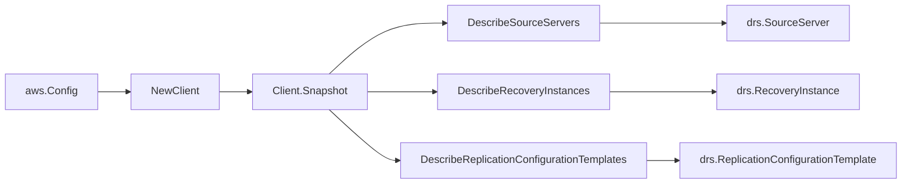

# AWS Elastic Disaster Recovery SDK Adapter

## Purpose

`internal/collector/awscloud/services/drs/awssdk` adapts AWS SDK for Go v2 DRS
responses to the scanner-owned `Client` contract. It owns source server,
recovery instance, and replication configuration template pagination, throttle
classification, and per-call AWS API telemetry.

## Ownership boundary

This package owns SDK calls for DRS. It does not own workflow claims, credential
acquisition, DRS fact selection, graph writes, reducer admission, or query
behavior.

## Exported surface

See `doc.go` for the godoc contract.

- `Client` - AWS SDK-backed implementation of `drs.Client`.
- `NewClient` - builds a `Client` for one claimed AWS boundary.

## Dependencies

- `internal/collector/awscloud` for account, region, and service boundary
  labels.
- `internal/collector/awscloud/services/drs` for scanner-owned result types.
- `internal/telemetry` for AWS API call and throttle instruments.
- AWS SDK for Go v2 `drs` and Smithy error contracts.

## Telemetry

DRS paginator pages are wrapped with:

- `aws.service.pagination.page`
- `eshu_dp_aws_api_calls_total`
- `eshu_dp_aws_throttle_total`

Metric labels stay bounded to service, account, region, operation, and result.
DRS resource ARNs, names, hostnames, tags, and raw AWS error payloads stay out
of metric labels.

## Gotchas / invariants

- The adapter reads metadata only. Its accepted `apiClient` interface is
  `Describe`-only by construction (DescribeSourceServers,
  DescribeRecoveryInstances, DescribeReplicationConfigurationTemplates). It must
  never call any agent-read, snapshot-read, job-log-read, or mutation API
  (`Recover*`, `Start*`, `Stop*`, `Reverse*`, `Terminate*`, `Create*`,
  `Update*`, `Delete*`). The `exclusion_test` fails the build if any forbidden
  method reaches the interface.
- The adapter copies only safe identity, replication state, origin, and
  configuration metadata plus resource tags returned inline by the describe
  responses. It never reads the replication agent, replicated disks, or
  snapshots.
- SDK adapters translate AWS records into scanner-owned types; scanner tests
  should not mock AWS SDK pagination.

No-Regression Evidence: metadata-only control-plane scanner; new read path, no change to existing hot paths. `go test ./internal/collector/awscloud/services/drs/...` green.

No-Observability-Change: reuses shared AWS pagination span + API-call/throttle counters; no telemetry contract change.

## Related docs

- `docs/public/services/collector-aws-cloud-scanners.md`
- `docs/public/services/collector-aws-cloud-security.md`
