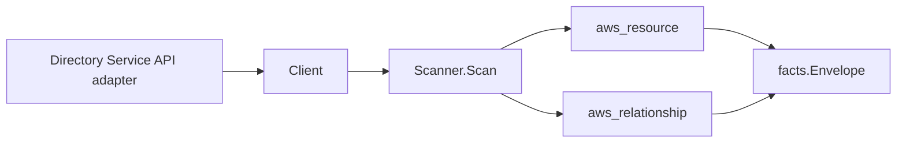

# AWS Directory Service Scanner

## Purpose

`internal/collector/awscloud/services/ds` owns the Directory Service scanner
contract for the AWS cloud collector. It converts AWS Directory Service
directories (AWS Managed Microsoft AD, Simple AD, AD Connector), their trust
relationships, shared-directory invitations, and LDAPS settings metadata into
AWS cloud fact envelopes. One scanner covers all three directory types.

## Ownership boundary

This package owns scanner-level Directory Service fact selection and
relationship mapping. It does not own AWS SDK pagination, STS credentials,
workflow claims, fact persistence, graph writes, reducer admission, or query
behavior.

## Exported surface

See `doc.go` for the godoc contract.

- `Client` - minimal Directory Service read surface consumed by `Scanner`. It
  exposes only describe-style reads (`ListDirectories`, `ListTrusts`,
  `ListSharedDirectories`, `ListLDAPSSettings`) and no mutations.
- `Scanner` - emits Directory Service resource and relationship envelopes for
  one boundary.
- `Directory`, `Trust`, `SharedDirectory`, `LDAPSSetting` - scanner-owned
  Directory Service resource representations. None carry the directory admin
  password, RADIUS shared secret, or AD Connector service-account credential.

## Dependencies

- `internal/collector/awscloud` for boundaries, resource constants, relationship
  constants, and envelope builders.
- `internal/facts` for emitted fact envelope kinds.

The package depends on a small `Client` interface rather than the AWS SDK for Go
v2 so tests can use fake clients and the runtime adapter (`awssdk`) owns SDK
behavior.

## Telemetry

This scanner emits no spans or logs directly. `awsruntime.ClaimedSource` records
scan duration and emitted resource/relationship counts after `Scanner.Scan`
returns. The `awssdk` adapter records Directory Service API call counts,
throttles, and pagination spans. The collector counts emitted facts under
`eshu_dp_aws_resources_emitted_total{service="ds"}` and
`eshu_dp_aws_relationships_emitted_total{service="ds"}`.

## Gotchas / invariants

- The scanner is metadata-only. It never calls a mutation API (ResetUserPassword,
  Create/Delete/Update/Enable/Disable/...). A reflection test in the `awssdk`
  adapter fails the build if any such method is added to the SDK seam.
- The directory admin password and the RADIUS shared secret are never persisted.
  `DescribeDirectories` does not return the admin password, and the scanner-owned
  types have no field for either secret; the adapter never reads `RadiusSettings`
  or the AD Connector `CustomerUserName`.
- The directory `resource_id` is the bare directory ID (`d-xxxxxxxxxx`). This is
  the join key the FSx scanner's AD-directory edges target, so the merged FSx
  dangling edge resolves against this scanner's directory resource.
- Relationship target identity joins the target scanner's `resource_id`: VPC and
  subnet edges target the bare AWS ID (`aws_ec2_vpc`, `aws_ec2_subnet`);
  trust-to-directory and shared-directory-to-owner-directory edges target the
  bare directory ID (`aws_ds_directory`); the owner-account edge targets the bare
  12-digit account ID (`aws_account`) with no synthesized ARN.
- LDAPS is queried only for AWS Managed Microsoft AD directories; Simple AD and
  AD Connector do not support LDAPS, and the adapter skips the call for them.
- The scanner stops on client errors and wraps each list error with `%w`,
  including the per-directory trust and shared-directory fan-out. Runtime
  adapters decide whether an AWS service error is retryable, terminal, or a
  warning fact.

## Evidence

Collector Performance Evidence: `go test ./internal/collector/awscloud/services/ds/...`
covers the bounded Directory Service metadata path: a paginated
DescribeDirectories account-wide describe, then a bounded per-directory fan-out
of DescribeTrusts, DescribeSharedDirectories, and (for Managed Microsoft AD only)
DescribeLDAPSSettings, each paginated. There is no fan-out beyond the directory
count per claim; trusts, shares, and LDAPS reads are bounded by that count and
their own page sizes. No mutation calls and no graph writes exist in the
collector.

No-Regression Evidence: `go test ./cmd/collector-aws-cloud ./internal/collector/awscloud/...`
covers Directory Service metadata fact emission across all three directory types,
VPC/subnet/trust/shared-directory/owner-account relationship emission with
non-empty target_type and join keys, the bare-directory-id resource_id that the
FSx AD edge joins, omission of directory admin passwords and the RADIUS shared
secret, SDK pagination, the per-directory error propagation path, runtime
self-registration, the derived supported-service guard, and command
configuration.

Collector Observability Evidence: Directory Service uses the existing AWS
collector `aws.service.pagination.page` span plus `eshu_dp_aws_api_calls_total`,
`eshu_dp_aws_throttle_total`, `eshu_dp_aws_resources_emitted_total`,
`eshu_dp_aws_relationships_emitted_total`, and `aws_scan_status` rows. Metric
labels stay bounded to service, account, region, operation, result, and status.

No-Observability-Change: the existing AWS collector telemetry contract already
diagnoses Directory Service scans through `aws.service.scan`,
`aws.service.pagination.page`, API/throttle counters, resource/relationship
counters, and `aws_scan_status`.

Collector Deployment Evidence: Directory Service runs inside the existing hosted
`collector-aws-cloud` runtime, so `/healthz`, `/readyz`, `/metrics`, and
`/admin/status` stay covered by the command wiring and Helm collector runtime.

## Related docs

- `docs/public/services/collector-aws-cloud-scanners.md`
- `docs/public/guides/collector-authoring.md`
