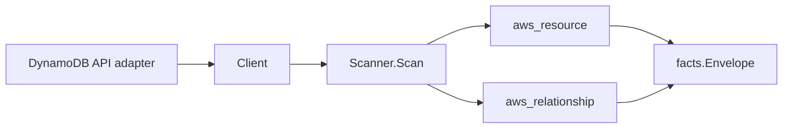

# AWS DynamoDB Scanner

## Purpose

`internal/collector/awscloud/services/dynamodb` owns the Amazon DynamoDB scanner
contract for the AWS cloud collector. It converts DynamoDB control-plane table
metadata into `aws_resource` facts and emits relationship evidence when
DynamoDB directly reports a server-side encryption KMS key identifier.

## Ownership boundary

This package owns scanner-level DynamoDB fact selection and identity mapping.
It does not own AWS SDK pagination, STS credentials, workflow claims, fact
persistence, graph writes, reducer admission, workload ownership, or query
behavior.

## Exported surface

See `doc.go` for the godoc contract.

- `Client` - minimal DynamoDB metadata read surface consumed by `Scanner`.
- `Scanner` - emits table metadata and direct KMS relationship facts for one
  boundary.
- `Table` - scanner-owned metadata-only table representation.
- `KeySchemaElement`, `AttributeDefinition`, `Throughput`,
  `OnDemandThroughput`, `SSE`, `TTL`, `ContinuousBackups`, `Stream`,
  `SecondaryIndex`, and `Replica` - table metadata shapes copied into safe
  resource attributes.

## Dependencies

- `internal/collector/awscloud` for boundaries, resource constants,
  relationship constants, and envelope builders.
- `internal/facts` for emitted fact envelope kinds.

The package depends on a small `Client` interface rather than the AWS SDK for Go
v2 so tests can use fake clients and runtime adapters can own SDK behavior.

## Telemetry

This scanner emits no spans or logs directly. `awsruntime.ClaimedSource`
records scan duration and emitted resource counts after `Scanner.Scan` returns.
The `awssdk` adapter records DynamoDB API call counts, throttles, and pagination
spans.

## Gotchas / invariants

- DynamoDB facts are metadata only. The scanner must not read table items,
  query or scan tables, read stream records, fetch exports, fetch backup
  payloads, fetch resource policies, run PartiQL, or mutate resources.
- Attribute definitions, key schema, index definitions, TTL attribute names,
  stream settings, capacity settings, table class, replicas, tags, and backup
  status are reported control-plane metadata.
- Tags are raw AWS tag evidence. Do not infer environment, owner, workload,
  repository, or deployable-unit truth from tags in this package.
- The KMS relationship is reported join evidence only. Correlation belongs in
  reducers.

## Evidence

Collector Performance Evidence: `go test ./internal/collector/awscloud/services/dynamodb/...`
covers the bounded DynamoDB metadata path: paginated ListTables with
Limit=100, one DescribeTable, one paginated ListTagsOfResource, one
DescribeTimeToLive, and one DescribeContinuousBackups per discovered table;
no item reads, table scans, table queries, stream record reads, backup payload
reads, export reads, resource-policy reads, PartiQL calls, mutations, or graph
writes in the collector.

No-Regression Evidence: `go test ./cmd/collector-aws-cloud ./internal/collector/awscloud/...`
covers DynamoDB table metadata fact emission, direct KMS relationship emission,
omission of data-plane fields, SDK pagination, tag reads, runtime registration,
command configuration, and the SDK adapter's safe metadata mapping.

Collector Observability Evidence: DynamoDB uses the existing AWS collector
`aws.service.pagination.page` span plus `eshu_dp_aws_api_calls_total`,
`eshu_dp_aws_throttle_total`, `eshu_dp_aws_resources_emitted_total`,
`eshu_dp_aws_relationships_emitted_total`, and `aws_scan_status` rows. Metric
labels stay bounded to service, account, region, operation, result, and status.

No-Observability-Change: the existing AWS collector telemetry contract already
diagnoses DynamoDB scans through `aws.service.scan`,
`aws.service.pagination.page`, API/throttle counters, resource/relationship
counters, and `aws_scan_status`.

Collector Deployment Evidence: DynamoDB runs inside the existing hosted
`collector-aws-cloud` runtime, so `/healthz`, `/readyz`, `/metrics`, and
`/admin/status` stay covered by the command wiring and Helm collector runtime.

## Related docs

- `docs/docs/adrs/2026-04-20-aws-cloud-scanner-collector.md`
- `docs/docs/guides/collector-authoring.md`
