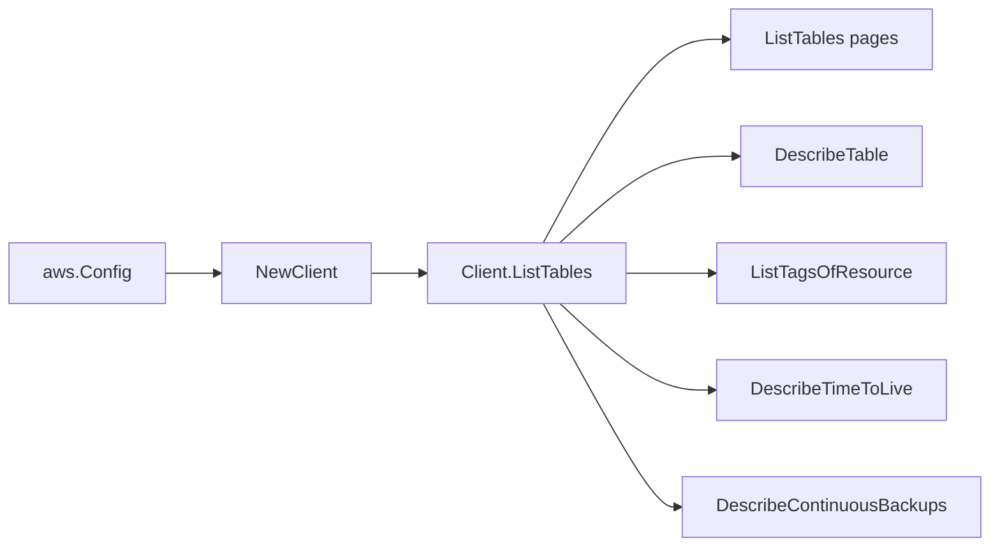

# AWS DynamoDB SDK Adapter

## Purpose

`internal/collector/awscloud/services/dynamodb/awssdk` adapts AWS SDK for Go v2
DynamoDB responses to the scanner-owned `Client` contract. It owns DynamoDB
pagination, table metadata point reads, resource tag reads, TTL and continuous
backup metadata reads, throttle classification, and per-call AWS API telemetry.

## Ownership boundary

This package owns SDK calls for DynamoDB. It does not own workflow claims,
credential acquisition, DynamoDB fact selection, graph writes, reducer
admission, workload ownership, or query behavior.

## Exported surface

See `doc.go` for the godoc contract.

- `Client` - AWS SDK-backed implementation of `dynamodb.Client`.
- `NewClient` - builds a `Client` for one claimed AWS boundary.

## Dependencies

- `internal/collector/awscloud` for account, region, and service boundary
  labels.
- `internal/collector/awscloud/services/dynamodb` for scanner-owned result
  types.
- `internal/telemetry` for AWS API call and throttle instruments.
- AWS SDK for Go v2 `dynamodb` and Smithy error contracts.

## Telemetry

DynamoDB list pages, point reads, and tag pages are wrapped with:

- `aws.service.pagination.page`
- `eshu_dp_aws_api_calls_total`
- `eshu_dp_aws_throttle_total`

Metric labels stay bounded to service, account, region, operation, and result.
Table names, ARNs, tags, index names, KMS key IDs, TTL attribute names, and raw
AWS error payloads stay out of metric labels.

## Gotchas / invariants

- The adapter calls only `ListTables`, `DescribeTable`, `ListTagsOfResource`,
  `DescribeTimeToLive`, and `DescribeContinuousBackups`.
- `ListTables` sets `Limit=100`, the documented maximum, and follows
  `LastEvaluatedTableName`.
- `ListTagsOfResource` is called only when AWS returned a table ARN and follows
  `NextToken`.
- The adapter maps safe control-plane fields and drops item values, table scan
  results, query results, stream records, backup/export payloads, resource
  policies, and mutation surfaces.
- The adapter must not call `Scan`, `Query`, `GetItem`, `BatchGetItem`,
  `ExecuteStatement`, DynamoDB Streams record APIs, export/backup payload APIs,
  resource-policy APIs, or mutation APIs.

## Related docs

- `docs/docs/adrs/2026-04-20-aws-cloud-scanner-collector.md`
- `docs/docs/guides/collector-authoring.md`
