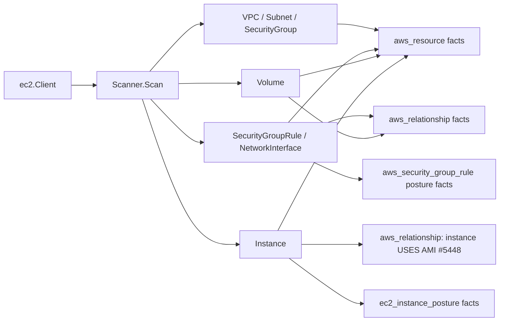

# AWS EC2 Scanner

## Purpose

`internal/collector/awscloud/services/ec2` owns scanner-side EC2 network and
volume fact selection for the AWS cloud collector. It converts VPCs, subnets,
security groups, security group rules, network interfaces, and EBS volumes into
`aws_resource` and `aws_relationship` facts. Each security-group rule
additionally emits one normalized `aws_security_group_rule` posture fact
carrying the reachability tuple `(group_id, direction, ip_protocol, from_port,
to_port, source_kind, source_value)` plus metadata-only derived booleans
(`is_internet`, `is_all_protocols`, `is_all_ports`).

For every EC2 instance the scanner emits one metadata-only
`ec2_instance_posture` fact from the existing `DescribeInstances` pass: IMDS
settings (`imds_v2_required`, `imds_http_endpoint`, `imds_http_put_hop_limit`),
user-data PRESENCE (`user_data_present`, a boolean only), detailed monitoring,
EBS optimization, public-IP association, the attached instance-profile ARN,
per-volume block-device metadata, and tenancy / Nitro-enclave state. The
scanner never reads user-data content.

For every EC2 instance the scanner ALSO emits (#5448) one `aws_resource`
identity fact (`resource_type=aws_ec2_instance`) carrying the launch AMI id
(`ami_id`, from the same `DescribeInstances` pass, no new API call), and, when
an AMI id is present, one `aws_relationship` fact recording the
instance-to-AMI usage. This identity fact resolves to the SAME canonical
`cloud_resource_uid` the `ec2_instance_posture` fact's node materialization
uses, but is projected by a SEPARATE, narrow reducer domain
(`EC2InstanceIdentityMaterialization`) that only ever augments the node with
the disjoint `ami_id` property — it never creates the node or touches the
posture domain's base identity/posture properties. See
`go/internal/reducer/ec2_instance_identity_materialization.go` for the
dual-writer safety argument. The instance->AMI relationship stays
Postgres-only: no AMI/MachineImage graph node class exists yet (tracked
follow-up: https://github.com/eshu-hq/eshu/issues/5717), so the generic AWS
relationship edge projection's target join never resolves it.

For every EBS volume the scanner emits one metadata-only `aws_ec2_volume`
resource fact from a single boundary-scoped `DescribeVolumes` pass. It records
reported encryption, KMS key, attachment, and operational shape metadata and
emits a volume-to-KMS relationship only when AWS reports a non-empty KMS key
identifier. Volume contents, snapshots, user-data, and reducer posture
decisions stay out of this package.

The package implements the EC2 network-topology slice from
`docs/public/services/collector-aws-cloud.md`.

## Ownership boundary

This package owns scanner-owned EC2 models and fact-envelope construction. It
does not own AWS SDK calls, credentials, throttling, workflow claims, graph
writes, reducer admission, instance inventory, or query behavior.

## Exported surface

See `doc.go` for the godoc contract.

- `Scanner` - emits EC2 network topology, EBS volume, instance-posture, and
  (#5448) instance-identity facts for one claimed AWS boundary.
- `Client` - scanner-owned read surface implemented by `awssdk.Client`.
- `VPC`, `Subnet`, `SecurityGroup`, `SecurityGroupRule`, `NetworkInterface`,
  `Volume`, and `Instance` - scanner-owned EC2 records.
- `BlockDevice` - one instance block-device mapping entry (device name, volume
  id, delete-on-termination, status); per-volume encryption is not reported by
  `DescribeInstances`, so it stays unset.
- `VolumeAttachment` - one EBS volume attachment entry reported by
  `DescribeVolumes`, including instance id or AWS-managed associated-resource
  metadata when AWS reports it.
- `NetworkInterfaceAttachment` - ENI attachment metadata, including attached
  resource ARN when AWS reports enough data to derive one.

The normalized `aws_security_group_rule` posture fact and its source-kind /
direction constants are owned by `internal/collector/awscloud`
(`NewSecurityGroupRuleEnvelope`, `SecurityGroupRuleObservation`); this scanner
maps each `SecurityGroupRule` into that observation in `scanner.go`. The
`ec2_instance_posture` fact, its `EC2InstancePostureObservation`, and
`NewEC2InstancePostureEnvelope` are likewise owned by
`internal/collector/awscloud`; this scanner maps each `Instance` into that
observation in `posture.go`.

## Dependencies

- `internal/collector/awscloud` for AWS boundaries and fact envelopes.
- `internal/facts` for durable fact envelopes.

## Telemetry

This package emits no metrics or spans directly. The `awssdk` adapter emits
AWS API call counters, throttle counters, and pagination spans.

## Gotchas / invariants

- EC2 instance inventory is INTENTIONALLY MINIMAL, not absent. The scanner
  emits an `aws_ec2_instance` `aws_resource` fact per instance, but it is
  scoped narrowly to identity + the launch AMI id (#5448) — it never carries
  posture, IMDS, user-data-presence, block-device, or any other property the
  `ec2_instance_posture` fact and its CloudResource node materialization own.
  A future change that wants to add another EC2 instance property to the
  `aws_resource` identity fact MUST NOT let it collide with a posture-owned
  property name; see `go/internal/reducer/aws_resource_materialization.go`'s
  `cloudResourceNodeRow` exclusion and
  `go/internal/storage/cypher/ec2_instance_identity_node_writer.go`'s
  disjointness proof before adding one.
- The `ec2_instance_posture` fact carries user-data PRESENCE only. The user-data
  content (which can hold secrets), instance console output, environment
  variables, and any other instance payload are never read or persisted. The
  `DescribeInstances` pass does not include user-data, so `user_data_present`
  stays unset unless a later bounded enrichment fills it; PR1 adds no
  per-instance API fan-out.
- Per-volume block-device `encrypted` is not reported by `DescribeInstances`, so
  it stays unset on the posture fact. The reducer joins each volume id to the
  boundary-wide EBS volume facts and KMS relationship evidence (#1304);
  per-instance `DescribeVolumes` fan-out remains forbidden.
- EBS volume facts are metadata only. They record the volume id, synthesized
  volume ARN, state, availability zone, encrypted flag, KMS key id, attachment
  summaries, and safe operational scalars. They never read or persist volume
  contents, snapshot payloads, CloudWatch metric samples, cost data, or
  user-data content.
- The `ec2_instance_posture` fact emits no graph edges. The USES_PROFILE join to
  the IAM instance profile (#1146), the block-device KMS posture projection
  (#1304), and the derived internet-exposed flag (#1135) are reducer slices.
- Security group rules are child `aws_resource` facts with a security-group to
  rule `aws_relationship` edge, plus one normalized `aws_security_group_rule`
  posture fact per rule.
- The posture fact's `is_internet` boolean is an exact-CIDR normalization
  (`0.0.0.0/0` / `::/0`), not a reachability or exposure claim. Real
  internet-exposure truth needs the reducer reachability slice and the
  exposure query, which are deferred follow-ups in issue #1135.
- The posture fact emits no graph edges. Projecting it into
  `ALLOWS_INGRESS`/`ALLOWS_EGRESS` edges and `:CidrBlock`/`:PrefixList` nodes is
  the reducer PR2 slice, under principal review.
- ENIs emit placement and attachment relationships so reducers can later join
  ECS, EKS, or Lambda runtime evidence to subnet and VPC topology.
- Descriptions and tags are user-controlled text. They are preserved in fact
  payloads, but must never become metric labels.
- This package emits reported AWS evidence only. Do not infer public exposure,
  service ownership, environment, deployable-unit truth, or workload truth here.

## Evidence

### ec2_instance_posture fact, PR1 facts-only (#1146)

No-Regression Evidence: `go test
./internal/collector/awscloud/services/ec2/... ./internal/facts -count=1` covers
`TestScannerEmitsInstancePostureFactsWithoutInventory` (one
`ec2_instance_posture` fact, zero `aws_resource` facts, no `aws_ec2_instance`
resource, IMDS / user-data-presence / instance-profile-ARN asserted, no
`relationship_type` and no user-data content on the payload),
`TestMapInstanceDerivesMetadataOnlyPosture` /
`TestMapInstanceDerivesPartitionForGovCloud` (SDK mapper derives IMDSv2-required,
endpoint, hop limit, monitoring, EBS-optimized, public-IP, instance-profile ARN,
tenancy, enclave, and block-device metadata; `UserDataPresent` and per-volume
`Encrypted` stay nil; the synthesized instance ARN is partition-aware), and the
`facts` registry/envelope tests. The fact is built from the `DescribeInstances`
pass the scanner now runs once per boundary; user-data content is never fetched,
so there is no per-instance API fan-out.

No-Observability-Change: the scanner emits facts only; it adds no instrument,
span, metric label, or `aws_scan_status` row. The `awssdk` adapter's existing
pagination span and API-call counter cover the new `DescribeInstances` read via
`recordAPICall`.

### EBS volume metadata facts (#1303)

Collector Performance Evidence: the EBS volume path is one paginated
`DescribeVolumes` stream per claimed account/region boundary, not a
per-instance fan-out. `go test ./internal/collector/awscloud/services/ec2/... -count=1`
covers scanner emission and SDK mapping for the boundary-scoped pass, including
encrypted/KMS, missing-key, unencrypted, attached, and missing-identity cases.
The emitted fact volume is linear in the number of volumes returned by AWS and
adds at most one resource fact plus one optional KMS relationship fact per
volume.

No-Regression Evidence: `go test ./internal/collector/awscloud/services/ec2/... -count=1`
covers `TestScannerEmitsEBSVolumeMetadataAndKMSRelationship` (one
`aws_ec2_volume` resource fact, one volume-to-KMS relationship keyed to
`aws_kms_key`, one attachment summary, and no `aws_ec2_instance` inventory fact),
`TestScannerKeepsVolumesWithoutKMSRelationshipWhenKeyMissing` (encrypted or
unencrypted volumes without a reported KMS key remain resource-only), and
`TestScannerSkipsVolumeWithoutIdentity` (missing volume identity produces no
unjoinable fact). `TestMapVolumePreservesEncryptionKMSAndAttachments` and
`TestMapVolumeDerivesPartitionForGovCloud` prove the SDK adapter maps
`DescribeVolumes` encryption, KMS, attachment, and partition-aware volume ARN
metadata without reading volume contents or snapshots.

No-Observability-Change: the EC2 volume path reuses the existing EC2 SDK
adapter pagination span and AWS API call/throttle counters through
`recordAPICall` with operation `DescribeVolumes`. The scanner emits source
facts only and adds no new metric labels or scan-status dimensions.

### security_group_rule posture fact, PR1 facts-only (#1135)

No-Regression Evidence: `go test
./internal/collector/awscloud/services/ec2/... ./internal/facts -count=1` covers
`TestScannerEmitsNetworkTopologyWithoutInstanceFacts` (now also asserting one
`aws_security_group_rule` fact with `group_id=sg-123`, `direction=ingress`,
`source_kind=cidr_ipv4`, `source_value=0.0.0.0/0`, `is_internet=true`) and the
`aws_resource`/`aws_relationship` counts (5/7) are unchanged, proving the
posture fact is purely additive. The new fact is built from the rule slice the
scanner already fetched via `ListSecurityGroupRules`, so it adds no AWS API call
and no per-resource fan-out; emission is one extra in-memory envelope per rule
inside the existing rule loop.

No-Observability-Change: the scanner emits facts only; it adds no instrument,
span, metric label, or `aws_scan_status` row. The `awssdk` adapter's existing
`DescribeSecurityGroupRules` pagination span and API-call counter already cover
the read that sources the fact.

### Partition-aware ARNs (#866)

No-Regression Evidence: `go test ./internal/collector/awscloud/services/ec2/... -count=1`
covers the new `TestEC2InstanceARNDerivesPartition` (commercial / `aws-us-gov` /
`aws-cn`) alongside the existing commercial assertions. The synthesized EC2
instance ARN used as a network-interface attachment target now derives its
partition from the instance region via `awscloud.PartitionForRegion` instead of
hardcoding `aws`, so the ENI->instance edge resolves in GovCloud and China.
Commercial output (`us-east-1`) is byte-for-byte unchanged; this is a
metadata-only correctness fix with no graph-write, queue, or hot-path behavior
change.

No-Observability-Change: the fix only changes the partition substring of a
synthesized ARN value; no instrument, span, metric label, or `aws_scan_status`
row changes.

### EC2 instance identity fact + instance->AMI relationship (#5448)

No-Regression Evidence: `go test ./internal/collector/awscloud/services/ec2/... -count=1`
covers `TestScannerEmitsInstancePostureAndIdentityFacts` (one
`ec2_instance_posture` fact, one `aws_resource` identity fact carrying
`ami_id`, and one `aws_relationship` instance->AMI fact) and
`TestScannerEmitsIdentityWithoutAMIRelationshipWhenImageIDBlank` (the identity
fact still emits with an empty `ami_id` when the instance carries no AMI id,
but no relationship fact is fabricated). The identity fact is built from the
same `DescribeInstances` entry the posture fact already reads (`instance.ImageID`,
mapped in `awssdk/mapper.go`'s `mapInstance`), so it adds no AWS API call and
no per-instance fan-out.

No-Observability-Change: the scanner emits facts only; it adds no instrument,
span, metric label, or `aws_scan_status` row. The existing `DescribeInstances`
pagination span and API-call counter already cover the read.

## Related docs

- `docs/public/services/collector-aws-cloud.md`
- `docs/public/reference/telemetry/index.md`
