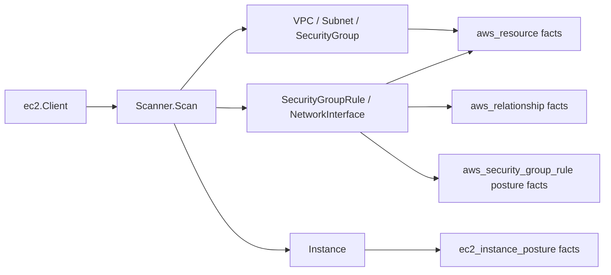

# AWS EC2 Scanner

## Purpose

`internal/collector/awscloud/services/ec2` owns scanner-side EC2 network fact
selection for the AWS cloud collector. It converts VPCs, subnets, security
groups, security group rules, and network interfaces into `aws_resource` and
`aws_relationship` facts. Each security-group rule additionally emits one
normalized `aws_security_group_rule` posture fact carrying the reachability
tuple `(group_id, direction, ip_protocol, from_port, to_port, source_kind,
source_value)` plus metadata-only derived booleans (`is_internet`,
`is_all_protocols`, `is_all_ports`).

For every EC2 instance the scanner emits one metadata-only
`ec2_instance_posture` fact from the existing `DescribeInstances` pass: IMDS
settings (`imds_v2_required`, `imds_http_endpoint`, `imds_http_put_hop_limit`),
user-data PRESENCE (`user_data_present`, a boolean only), detailed monitoring,
EBS optimization, public-IP association, the attached instance-profile ARN,
per-volume block-device metadata, and tenancy / Nitro-enclave state. The
scanner does not emit an `aws_resource` inventory fact for instances and never
reads user-data content.

The package implements the EC2 network-topology slice from
`docs/public/services/collector-aws-cloud.md`.

## Ownership boundary

This package owns scanner-owned EC2 models and fact-envelope construction. It
does not own AWS SDK calls, credentials, throttling, workflow claims, graph
writes, reducer admission, instance inventory, or query behavior.

## Exported surface

See `doc.go` for the godoc contract.

- `Scanner` - emits EC2 network topology and instance-posture facts for one
  claimed AWS boundary.
- `Client` - scanner-owned read surface implemented by `awssdk.Client`.
- `VPC`, `Subnet`, `SecurityGroup`, `SecurityGroupRule`, `NetworkInterface`,
  and `Instance` - scanner-owned EC2 records.
- `BlockDevice` - one instance block-device mapping entry (device name, volume
  id, delete-on-termination, status); per-volume encryption is not reported by
  `DescribeInstances`, so it stays unset.
- `NetworkInterfaceAttachment` - ENI attachment metadata, including attached
  resource ARN when AWS reports enough data to derive one.

The normalized `aws_security_group_rule` posture fact and its source-kind /
direction constants are owned by `internal/collector/awscloud`
(`NewSecurityGroupRuleEnvelope`, `SecurityGroupRuleObservation`); this scanner
maps each `SecurityGroupRule` into that observation in `scanner.go`. The
`ec2_instance_posture` fact, its `EC2InstancePostureObservation`, and
`NewEC2InstancePostureEnvelope` are likewise owned by
`internal/collector/awscloud`; this scanner maps each `Instance` into that
observation in `posture.go`.

## Dependencies

- `internal/collector/awscloud` for AWS boundaries and fact envelopes.
- `internal/facts` for durable fact envelopes.

## Telemetry

This package emits no metrics or spans directly. The `awssdk` adapter emits
AWS API call counters, throttle counters, and pagination spans.

## Gotchas / invariants

- EC2 instance *inventory* is out of scope. ENI attachment metadata may carry
  an instance ARN as target evidence, and the scanner emits one metadata-only
  `ec2_instance_posture` fact per instance, but it does not emit an
  `aws_ec2_instance` `aws_resource` inventory fact.
- The `ec2_instance_posture` fact carries user-data PRESENCE only. The user-data
  content (which can hold secrets), instance console output, environment
  variables, and any other instance payload are never read or persisted. The
  `DescribeInstances` pass does not include user-data, so `user_data_present`
  stays unset unless a later bounded enrichment fills it; PR1 adds no
  per-instance API fan-out.
- Per-volume block-device `encrypted` is not reported by `DescribeInstances`, so
  it stays unset on the posture fact. The reducer joins each volume id to its
  encryption and KMS evidence (#1146 PR2); deriving it at scan time would be an
  N+1 `DescribeVolumes` fan-out, which this slice avoids.
- The `ec2_instance_posture` fact emits no graph edges. The USES_PROFILE join to
  the IAM instance profile (#1134), the block-device to KMS join, and the
  derived internet-exposed flag (#1135) are reducer slices.
- Security group rules are child `aws_resource` facts with a security-group to
  rule `aws_relationship` edge, plus one normalized `aws_security_group_rule`
  posture fact per rule.
- The posture fact's `is_internet` boolean is an exact-CIDR normalization
  (`0.0.0.0/0` / `::/0`), not a reachability or exposure claim. Real
  internet-exposure truth needs the reducer reachability slice and the
  exposure query, which are deferred follow-ups in issue #1135.
- The posture fact emits no graph edges. Projecting it into
  `ALLOWS_INGRESS`/`ALLOWS_EGRESS` edges and `:CidrBlock`/`:PrefixList` nodes is
  the reducer PR2 slice, under principal review.
- ENIs emit placement and attachment relationships so reducers can later join
  ECS, EKS, or Lambda runtime evidence to subnet and VPC topology.
- Descriptions and tags are user-controlled text. They are preserved in fact
  payloads, but must never become metric labels.
- This package emits reported AWS evidence only. Do not infer public exposure,
  service ownership, environment, deployable-unit truth, or workload truth here.

## Evidence

### ec2_instance_posture fact, PR1 facts-only (#1146)

No-Regression Evidence: `go test
./internal/collector/awscloud/services/ec2/... ./internal/facts -count=1` covers
`TestScannerEmitsInstancePostureFactsWithoutInventory` (one
`ec2_instance_posture` fact, zero `aws_resource` facts, no `aws_ec2_instance`
resource, IMDS / user-data-presence / instance-profile-ARN asserted, no
`relationship_type` and no user-data content on the payload),
`TestMapInstanceDerivesMetadataOnlyPosture` /
`TestMapInstanceDerivesPartitionForGovCloud` (SDK mapper derives IMDSv2-required,
endpoint, hop limit, monitoring, EBS-optimized, public-IP, instance-profile ARN,
tenancy, enclave, and block-device metadata; `UserDataPresent` and per-volume
`Encrypted` stay nil; the synthesized instance ARN is partition-aware), and the
`facts` registry/envelope tests. The fact is built from the `DescribeInstances`
pass the scanner now runs once per boundary; user-data content is never fetched,
so there is no per-instance API fan-out.

No-Observability-Change: the scanner emits facts only; it adds no instrument,
span, metric label, or `aws_scan_status` row. The `awssdk` adapter's existing
pagination span and API-call counter cover the new `DescribeInstances` read via
`recordAPICall`.

### security_group_rule posture fact, PR1 facts-only (#1135)

No-Regression Evidence: `go test
./internal/collector/awscloud/services/ec2/... ./internal/facts -count=1` covers
`TestScannerEmitsNetworkTopologyWithoutInstanceFacts` (now also asserting one
`aws_security_group_rule` fact with `group_id=sg-123`, `direction=ingress`,
`source_kind=cidr_ipv4`, `source_value=0.0.0.0/0`, `is_internet=true`) and the
`aws_resource`/`aws_relationship` counts (5/7) are unchanged, proving the
posture fact is purely additive. The new fact is built from the rule slice the
scanner already fetched via `ListSecurityGroupRules`, so it adds no AWS API call
and no per-resource fan-out; emission is one extra in-memory envelope per rule
inside the existing rule loop.

No-Observability-Change: the scanner emits facts only; it adds no instrument,
span, metric label, or `aws_scan_status` row. The `awssdk` adapter's existing
`DescribeSecurityGroupRules` pagination span and API-call counter already cover
the read that sources the fact.

### Partition-aware ARNs (#866)

No-Regression Evidence: `go test ./internal/collector/awscloud/services/ec2/... -count=1`
covers the new `TestEC2InstanceARNDerivesPartition` (commercial / `aws-us-gov` /
`aws-cn`) alongside the existing commercial assertions. The synthesized EC2
instance ARN used as a network-interface attachment target now derives its
partition from the instance region via `awscloud.PartitionForRegion` instead of
hardcoding `aws`, so the ENI->instance edge resolves in GovCloud and China.
Commercial output (`us-east-1`) is byte-for-byte unchanged; this is a
metadata-only correctness fix with no graph-write, queue, or hot-path behavior
change.

No-Observability-Change: the fix only changes the partition substring of a
synthesized ARN value; no instrument, span, metric label, or `aws_scan_status`
row changes.

## Related docs

- `docs/public/services/collector-aws-cloud.md`
- `docs/public/reference/telemetry/index.md`
