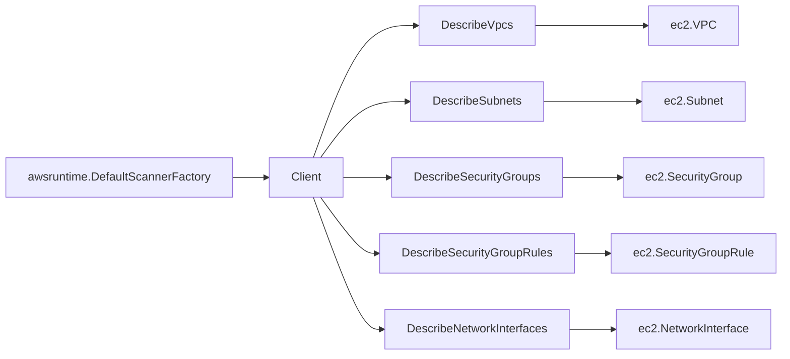

# AWS EC2 SDK Adapter

## Purpose

`internal/collector/awscloud/services/ec2/awssdk` adapts AWS SDK for Go v2 EC2
responses to the scanner-owned `ec2.Client` contract. It owns EC2 read API
pagination, response mapping, throttle classification, and per-call telemetry.

## Ownership boundary

This package owns SDK calls for EC2. It does not own workflow claims,
credential acquisition, fact-envelope identity, graph writes, reducer
admission, instance inventory, or query behavior.

## Exported surface

See `doc.go` for the godoc contract.

- `Client` - EC2 SDK adapter implementing `services/ec2.Client`.
- `NewClient` - constructs a claim-scoped EC2 adapter from AWS SDK config,
  boundary, tracer, and telemetry instruments.

## Dependencies

- AWS SDK for Go v2 `service/ec2`.
- `internal/collector/awscloud` for claim boundary labels.
- `internal/collector/awscloud/services/ec2` for scanner-owned target types.
- `internal/telemetry` for AWS API counters, throttle counters, and pagination
  spans.

## Telemetry

EC2 paginator pages are wrapped with:

- `aws.service.pagination.page`
- `eshu_dp_aws_api_calls_total{service="ec2",operation,result}`
- `eshu_dp_aws_throttle_total{service="ec2"}`

Resource IDs, attached resource ARNs, descriptions, and tags are never metric
labels.

## Gotchas / invariants

- Use only read APIs: `DescribeVpcs`, `DescribeSubnets`,
  `DescribeSecurityGroups`, `DescribeSecurityGroupRules`, and
  `DescribeNetworkInterfaces`.
- Every listed API uses SDK pagination with `MaxResults=1000`.
- `DescribeNetworkInterfaces` sets `IncludeManagedResources=true` so
  AWS-managed ENIs can support Lambda/ECS/EKS network joins when the account
  allows managed-resource visibility.
- Attachment instance ARNs are derived from AWS-reported instance ID, owner
  account, and claim region. They are target evidence only; no instance facts
  are emitted.

## Related docs

- `docs/docs/adrs/2026-04-20-aws-cloud-scanner-collector.md`
- `docs/docs/reference/telemetry/index.md`
