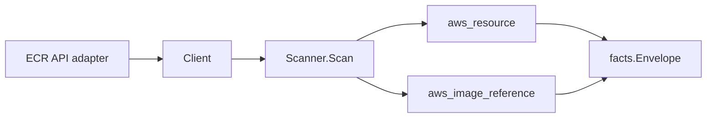

# AWS ECR Scanner

## Purpose

`internal/collector/awscloud/services/ecr` owns the ECR scanner contract for the
AWS cloud collector. It converts repositories, repository lifecycle policies,
and image digest/tag records into AWS cloud fact envelopes.

## Ownership boundary

This package owns scanner-level ECR fact selection and identity mapping. It
does not own AWS SDK pagination, STS credentials, workflow claims, fact
persistence, graph writes, reducer admission, or query behavior.

## Exported surface

See `doc.go` for the godoc contract.

- `Client` - minimal ECR read surface consumed by `Scanner`.
- `Scanner` - emits repository, lifecycle policy, and image-reference fact
  envelopes for one boundary.
- `Repository` - scanner-owned ECR repository representation.
- `Image` - scanner-owned image digest and tag-set representation.
- `LifecyclePolicy` - scanner-owned repository lifecycle policy
  representation.

## Dependencies

- `internal/collector/awscloud` for boundaries, resource constants, and
  envelope builders.
- `internal/facts` for emitted fact envelope kinds.

The package depends on a small `Client` interface rather than the AWS SDK for Go
v2 so tests can use fake clients and runtime adapters can own SDK behavior.

## Telemetry

This scanner emits no spans or logs directly. `awsruntime.ClaimedSource`
records scan duration and emitted resource counts after `Scanner.Scan` returns.
The `awssdk` adapter records ECR API call counts, throttles, and pagination
spans.

## Gotchas / invariants

- ECR image references are emitted as `aws_image_reference`, not `aws_resource`.
- Repository lifecycle policies are emitted as child `aws_resource` facts with
  `ResourceTypeECRLifecyclePolicy`.
- Untagged images still emit one image-reference fact with an empty tag so the
  digest remains visible to downstream consumers.
- The scanner stops on client errors. Runtime adapters decide whether an AWS
  service error is retryable, terminal, or a warning fact.
- Lifecycle policy JSON is payload evidence. Do not promote it to metric
  labels.

## Related docs

- `docs/docs/adrs/2026-04-20-aws-cloud-scanner-collector.md`
- `docs/docs/guides/collector-authoring.md`
