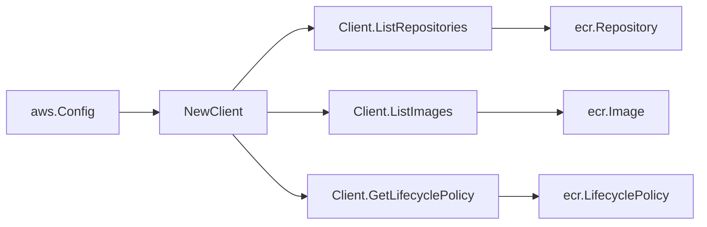

# AWS ECR SDK Adapter

## Purpose

`internal/collector/awscloud/services/ecr/awssdk` adapts AWS SDK for Go v2 ECR
responses to the scanner-owned `ecr.Client` contract. It owns ECR API
pagination, repository tag reads, lifecycle policy reads, throttle
classification, and per-call AWS API telemetry.

## Ownership boundary

This package owns SDK calls for ECR. It does not own workflow claims,
credential acquisition, ECR fact selection, graph writes, reducer admission, or
query behavior.

## Exported surface

See `doc.go` for the godoc contract.

- `Client` - AWS SDK-backed implementation of `ecr.Client`.
- `NewClient` - builds a `Client` for one claimed AWS boundary.

## Dependencies

- `internal/collector/awscloud` for account, region, and service boundary
  labels.
- `internal/collector/awscloud/services/ecr` for scanner-owned result types.
- `internal/telemetry` for AWS API call and throttle instruments.
- AWS SDK for Go v2 `ecr` and Smithy error contracts.

## Telemetry

ECR paginator pages and point reads are wrapped with:

- `aws.service.pagination.page`
- `eshu_dp_aws_api_calls_total`
- `eshu_dp_aws_throttle_total`

Metric labels stay bounded to service, account, region, operation, and result.
Repository ARNs, tags, lifecycle policy JSON, image digests, and raw AWS error
payloads stay out of metric labels.

## Gotchas / invariants

- `DescribeImages` is used for image pagination because it returns digest, tag,
  pushed-at, size, and media-type metadata in one paged source.
- `LifecyclePolicyNotFoundException` is a valid empty policy result.
- `ListTagsForResource` is called per repository because `DescribeRepositories`
  does not return repository tags.
- SDK adapters translate AWS records into scanner-owned types; scanner tests
  should not mock AWS SDK paginators.

## Related docs

- `docs/docs/adrs/2026-04-20-aws-cloud-scanner-collector.md`
- `docs/docs/guides/collector-authoring.md`
