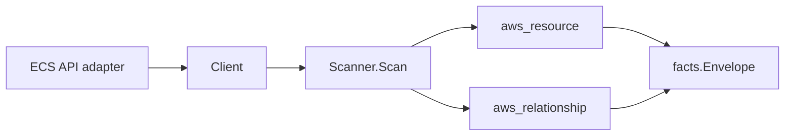

# AWS ECS Scanner

## Purpose

`internal/collector/awscloud/services/ecs` owns the ECS scanner contract for
the AWS cloud collector. It converts clusters, services, task definitions,
tasks, service load-balancer bindings, and container image references into AWS
cloud fact envelopes.

## Ownership boundary

This package owns scanner-level ECS fact selection, task-definition redaction,
and identity mapping. It does not own AWS SDK pagination, STS credentials,
workflow claims, fact persistence, graph writes, reducer admission, or query
behavior.

## Exported surface

See `doc.go` for the godoc contract.

- `Client` - minimal ECS read surface consumed by `Scanner`.
- `Scanner` - emits ECS resource and relationship envelopes for one boundary.
- `Cluster`, `Service`, `TaskDefinition`, and `Task` - scanner-owned ECS
  resource representations.
- `Container`, `EnvironmentVariable`, `SecretReference`, `LoadBalancer`,
  `TaskContainer`, and `TaskNetworkInterface` - scanner-owned nested ECS
  records.

## Dependencies

- `internal/collector/awscloud` for boundaries, resource constants,
  relationship constants, and envelope builders.
- `internal/facts` for emitted fact envelope kinds.
- `internal/redact` for HMAC-SHA256 task-definition environment value markers.

The package depends on a small `Client` interface rather than the AWS SDK for
Go v2 so tests can use fake clients and runtime adapters can own SDK behavior.

## Telemetry

This scanner emits no spans or logs directly. `awsruntime.ClaimedSource`
records scan duration and emitted resource/relationship counts after
`Scanner.Scan` returns. The `awssdk` adapter records ECS API call counts,
throttles, and pagination spans.

## Gotchas / invariants

- ECS task-definition environment values are always replaced with
  `redacted:hmac-sha256:` markers before persistence.
- ECS secret `value_from` references are preserved because they are ARNs or
  provider references, not secret values.
- ECS service-to-task-definition, task-definition-to-image,
  service-to-load-balancer, and task-to-ENI bindings are emitted as
  `aws_relationship` facts.
- ECS task ENI details are reported attachment evidence used by later reducers
  to join tasks to EC2 subnet and VPC topology.
- Container images are relationship targets, not `aws_resource` facts in this
  package.
- The scanner stops on client errors. Runtime adapters decide whether an AWS
  service error is retryable, terminal, or a warning fact.

## Related docs

- `docs/docs/adrs/2026-04-20-aws-cloud-scanner-collector.md`
- `docs/docs/guides/collector-authoring.md`
