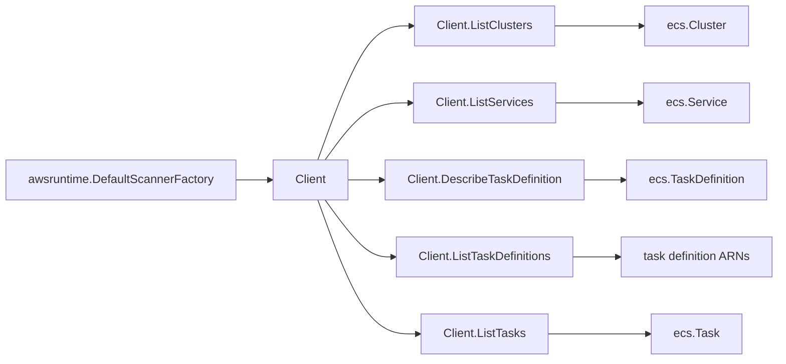

# AWS ECS SDK Adapter

## Purpose

`internal/collector/awscloud/services/ecs/awssdk` adapts AWS SDK for Go v2 ECS
responses to the scanner-owned `ecs.Client` contract. It owns ECS API
pagination, batched describe calls, response mapping, throttle classification,
and per-call telemetry.

## Ownership boundary

This package owns SDK calls for ECS. It does not own workflow claims,
credential acquisition, ECS fact selection, graph writes, reducer admission, or
query behavior.

## Exported surface

See `doc.go` for the godoc contract.

- `Client` - ECS SDK adapter implementing `services/ecs.Client`.
- `NewClient` - constructs a claim-scoped ECS adapter from AWS SDK config,
  boundary, tracer, and telemetry instruments.

## Dependencies

- AWS SDK for Go v2 `service/ecs`.
- `internal/collector/awscloud` for claim boundary labels.
- `internal/collector/awscloud/services/ecs` for scanner-owned target types.
- `internal/telemetry` for AWS API counters, throttle counters, and pagination
  spans.

## Telemetry

ECS paginator pages and point reads are wrapped with:

- `aws.service.pagination.page`
- `eshu_dp_aws_api_calls_total{service="ecs",operation,result}`
- `eshu_dp_aws_throttle_total{service="ecs"}`

Resource ARNs, service names, task definition ARNs, image refs, tags, and secret
references are never metric labels.

## Gotchas / invariants

- `ListClusters`, `ListServices`, `ListTaskDefinitions`, and `ListTasks` use
  AWS SDK paginators.
- ECS describe APIs are batched at documented limits: clusters `100`, services
  `10`, and tasks `100`.
- `DescribeTaskDefinition` includes tags but maps only the scanner-owned fields
  used by this slice.
- `DescribeTasks` maps ElasticNetworkInterface attachment details so task facts
  can join to EC2 ENI, subnet, and VPC topology.
- Environment values are passed to the scanner-owned type and redacted by the
  scanner before persistence. Do not log or label them here.
- Secret `ValueFrom` fields are references and are preserved for the scanner.

## Related docs

- `docs/docs/adrs/2026-04-20-aws-cloud-scanner-collector.md`
- `docs/docs/reference/telemetry/index.md`
