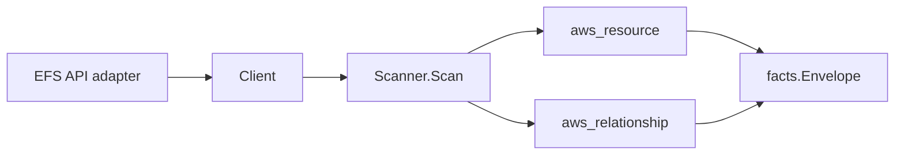

# AWS EFS Scanner

## Purpose

`internal/collector/awscloud/services/efs` owns the EFS scanner contract for the
AWS cloud collector. It converts file system, access point, mount target, and
replication configuration metadata into `aws_resource` facts and emits the
reported subnet, security group, KMS-key, access-point, and replication
relationships.

## Ownership boundary

This package owns scanner-level EFS fact selection and identity mapping. It does
not own AWS SDK pagination, STS credentials, workflow claims, fact persistence,
graph writes, reducer admission, or query behavior.

## Exported surface

See `doc.go` for the godoc contract.

- `Client` - minimal EFS metadata read surface consumed by `Scanner`.
- `Scanner` - emits EFS metadata facts for one boundary.
- `FileSystem`, `AccessPoint`, `MountTarget`, `ReplicationConfiguration`,
  `ReplicationDestination`, `LifecyclePolicySummary` - scanner-owned EFS
  representations. NFS file system policy bodies are intentionally outside the
  contract.

## Dependencies

- `internal/collector/awscloud` for boundaries, resource constants,
  relationship constants, and envelope builders.
- `internal/facts` for emitted fact envelope kinds.

The package depends on a small `Client` interface rather than the AWS SDK for Go
v2 so tests can use fake clients and runtime adapters can own SDK behavior.

## Telemetry

This scanner emits no spans or logs directly. `awsruntime.ClaimedSource`
records scan duration and emitted resource counts after `Scanner.Scan` returns.
The `awssdk` adapter records EFS API call counts, throttles, and pagination
spans.

## Gotchas / invariants

- EFS facts are metadata only. The scanner must not read file contents or
  persist NFS file system policy bodies.
- The file-system-to-KMS-key relationship is emitted only when the file system
  is encrypted and AWS reports a KMS key ARN.
- Mount target relationships fan out one edge per reported security group.
- The lifecycle policy is summarized as transition rule names only.
- Tags are raw AWS tag evidence. Do not infer environment, owner, workload, or
  deployable-unit truth from tags in this package.

## Evidence

Collector Performance Evidence: `go test ./internal/collector/awscloud/services/efs/...`
covers the bounded EFS metadata path: one paginated file system listing, one
access point and mount target listing per file system, one security group read
per mount target, one lifecycle configuration read per file system, and one
account-wide replication configuration listing, with no file reads and no
mutations.

No-Regression Evidence: `go test ./cmd/collector-aws-cloud ./internal/collector/awscloud/...`
covers EFS file system, access point, mount target, and replication
configuration fact emission, the five EFS relationships, omission of NFS file
system policy bodies, runtime registration, command configuration, and the SDK
adapter's metadata-only describe seam. Input shape: one file system with one
access point, one mount target with two security groups, and one replication
configuration with one destination. Backend: none (the scanner is a pure mapping
stage that emits facts.Envelope values; no graph backend is exercised).

Collector Observability Evidence: EFS uses the existing AWS collector
`aws.service.pagination.page` span plus `eshu_dp_aws_api_calls_total`,
`eshu_dp_aws_throttle_total`, `eshu_dp_aws_resources_emitted_total`,
`eshu_dp_aws_relationships_emitted_total`, and `aws_scan_status` rows. Metric
labels stay bounded to service, account, region, operation, result, and status.

No-Observability-Change: the existing AWS collector telemetry contract already
diagnoses EFS scans through `aws.service.scan`, `aws.service.pagination.page`,
API/throttle counters, the centrally recorded resource/relationship counters in
`awsruntime/source.go`, and `aws_scan_status`. The EFS scanner adds no new
counter, span, log scope, or metric label.

Collector Deployment Evidence: EFS runs inside the existing hosted
`collector-aws-cloud` runtime, so `/healthz`, `/readyz`, `/metrics`, and
`/admin/status` stay covered by the command wiring and Helm collector runtime.

## Related docs

- `docs/public/services/collector-aws-cloud-scanners.md`
- `docs/public/guides/collector-authoring.md`
