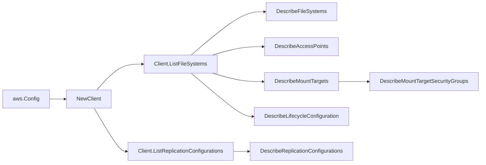

# AWS EFS SDK Adapter

## Purpose

`internal/collector/awscloud/services/efs/awssdk` adapts AWS SDK for Go v2 EFS
responses to the scanner-owned `efs.Client` contract. It owns EFS describe
pagination, mount target security group reads, lifecycle configuration reads,
throttle classification, and per-call AWS API telemetry.

## Ownership boundary

This package owns SDK calls for EFS. It does not own workflow claims, credential
acquisition, EFS fact selection, graph writes, reducer admission, or query
behavior.

## Exported surface

See `doc.go` for the godoc contract.

- `Client` - AWS SDK-backed implementation of `efs.Client`.
- `NewClient` - builds a `Client` for one claimed AWS boundary.

## Dependencies

- `internal/collector/awscloud` for account, region, and service boundary
  labels.
- `internal/collector/awscloud/services/efs` for scanner-owned result types.
- `internal/telemetry` for AWS API call and throttle instruments.
- AWS SDK for Go v2 `efs` and Smithy error contracts.

## Telemetry

EFS paginator pages and point reads are wrapped with:

- `aws.service.pagination.page`
- `eshu_dp_aws_api_calls_total`
- `eshu_dp_aws_throttle_total`

Metric labels stay bounded to service, account, region, operation, and result.
File system ARNs, IP addresses, root directory paths, tags, and raw AWS error
payloads stay out of metric labels.

## Gotchas / invariants

- The `apiClient` interface lists only describe-class metadata reads. The
  reflection guard in `client_test.go` fails the build if a forbidden mutation
  or policy-read method is added.
- The adapter must not call `DescribeFileSystemPolicy`, `DescribeBackupPolicy`,
  or any Create/Delete/Put/Update/Modify API.
- Mount target security group reads tolerate `IncorrectMountTargetState` by
  skipping security group evidence for that mount target rather than failing the
  whole scan.
- Replication configurations are listed account-wide; the source file system ID
  keys each configuration.
- SDK adapters translate AWS records into scanner-owned types; scanner tests
  should not mock AWS SDK paginators.

## Related docs

- `docs/public/services/collector-aws-cloud-scanners.md`
- `docs/public/guides/collector-authoring.md`
