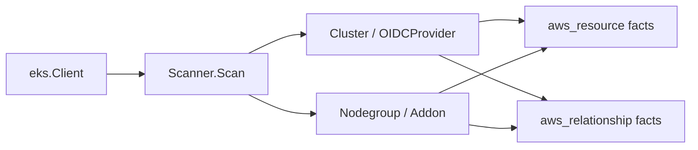

# AWS EKS Scanner

## Purpose

`internal/collector/awscloud/services/eks` owns scanner-side Amazon EKS fact
selection for the AWS cloud collector. It converts clusters, IAM OIDC provider
evidence, managed node groups, managed add-ons, IAM role joins, subnet joins,
and security group joins into `aws_resource` and `aws_relationship` facts.

The package implements the EKS slice from
`docs/docs/adrs/2026-04-20-aws-cloud-scanner-collector.md`.

## Ownership boundary

This package owns scanner-owned EKS models and fact-envelope construction. It
does not own AWS SDK calls, credentials, throttling, workflow claims, graph
writes, reducer admission, or query behavior.

## Exported surface

See `doc.go` for the godoc contract.

- `Scanner` - emits EKS facts for one claimed AWS boundary.
- `Client` - scanner-owned read surface implemented by `awssdk.Client`.
- `Cluster`, `OIDCProvider`, `Nodegroup`, and `Addon` - scanner-owned EKS
  records.
- `VPCConfig` and `ScalingConfig` - non-secret EKS configuration blocks used as
  fact attributes.

## Dependencies

- `internal/collector/awscloud` for AWS boundaries and fact envelopes.
- `internal/facts` for durable fact envelopes.

## Telemetry

This package emits no metrics or spans directly. The `awssdk` adapter emits AWS
API call counters, throttle counters, and pagination spans.

## Gotchas / invariants

- EKS facts are reported AWS evidence. They do not prove Kubernetes workload,
  deployment environment, or ownership truth until reducer correlation admits
  them.
- OIDC provider facts preserve issuer URL, client IDs, and thumbprints so IRSA
  trust chains can be joined to IAM role trust policies.
- Node group role relationships use the managed node group IAM role. Add-on
  role relationships use the service-account role only when AWS reports one.
- Cluster and node group subnet/security group relationships are EC2 topology
  join evidence. The collector does not infer exposure or reachability.
- Duplicate cluster security group IDs are collapsed before relationship fact
  emission.
- Resource ARNs, names, tags, OIDC URLs, and thumbprints must not become metric
  labels.

## Related docs

- `docs/docs/adrs/2026-04-20-aws-cloud-scanner-collector.md`
- `docs/docs/reference/telemetry/index.md`
