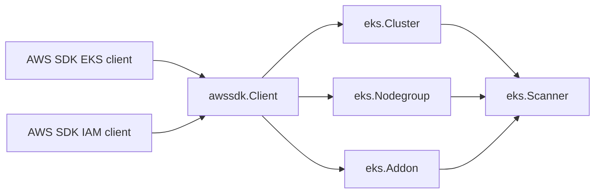

# AWS EKS SDK Adapter

## Purpose

`internal/collector/awscloud/services/eks/awssdk` adapts AWS SDK for Go v2 EKS
and IAM responses into scanner-owned records. It handles pagination,
`Describe*` enrichment, IAM OIDC provider lookup, telemetry, and response
normalization for one claimed account and region. The code keeps pagination,
mapping, OIDC enrichment, and telemetry in separate files so the adapter stays
under the package line budget.

## Ownership boundary

This package owns AWS EKS and IAM API calls needed for the EKS scan slice. The
parent `eks` package owns fact-envelope construction. Credential loading,
workflow claims, graph writes, reducer admission, and query behavior live
outside this package.

## Exported surface

See `doc.go` for the godoc contract.

- `Client` - implements `eks.Client`.
- `NewClient` - builds an EKS SDK adapter for one claimed AWS boundary.

## Dependencies

- AWS SDK for Go v2 EKS client and EKS types.
- AWS SDK for Go v2 IAM client and IAM OIDC provider types.
- `internal/collector/awscloud` for the claimed boundary.
- `internal/collector/awscloud/services/eks` for scanner-owned records.
- `internal/telemetry` for AWS API call counters, throttle counters, and
  pagination spans.

## Telemetry

`recordAPICall` emits:

- `aws.service.pagination.page` spans with service, account, region, and
  operation attributes.
- `eshu_dp_aws_api_calls_total` with service, account, region, operation, and
  result labels.
- `eshu_dp_aws_throttle_total` for throttling errors during EKS and IAM OIDC
  lookups.

## Gotchas / invariants

- `ListClusters`, `ListNodegroups`, and `ListAddons` only return names. The
  adapter calls the matching `Describe*` API before returning scanner-owned
  records.
- EKS `DescribeCluster` reports the OIDC issuer URL. IAM reports provider ARN,
  thumbprints, and client IDs. The adapter joins them by normalized issuer
  path.
- If IAM OIDC provider lookup does not find a matching provider, the adapter
  still returns the EKS-reported issuer URL so the missing IAM evidence remains
  visible.
- IAM OIDC provider thumbprints and client IDs are persisted evidence, not
  credentials. Do not add credential material, kubeconfig, or Kubernetes bearer
  tokens to this adapter.

## Related docs

- `docs/docs/adrs/2026-04-20-aws-cloud-scanner-collector.md`
- `docs/docs/reference/telemetry/index.md`
