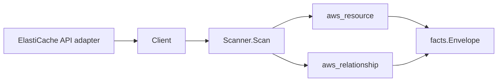

# AWS ElastiCache Scanner

## Purpose

`internal/collector/awscloud/services/elasticache` owns the ElastiCache scanner
contract for the AWS cloud collector. It converts cache cluster, replication
group, parameter group, subnet group, user, user group, and snapshot metadata
into `aws_resource` facts and emits relationship evidence for cluster-to-VPC,
cluster-to-subnet, cluster-to-KMS, replication-group-to-cluster, and
user-group-to-user edges.

## Ownership boundary

This package owns scanner-level ElastiCache fact selection and identity
mapping. It does not own AWS SDK pagination, STS credentials, workflow claims,
fact persistence, graph writes, reducer admission, or query behavior.

## Exported surface

See `doc.go` for the godoc contract.

- `Client` - minimal ElastiCache metadata read surface consumed by `Scanner`.
- `Scanner` - emits cache cluster, replication group, parameter group, subnet
  group, user, user group, and snapshot facts for one boundary.
- `CacheCluster`, `ReplicationGroup`, `SubnetGroup`, `ParameterGroup`, `User`,
  `UserGroup`, `SnapshotMetadata` - scanner-owned metadata-only views with
  AUTH token values, user passwords, user access strings, and snapshot data
  intentionally omitted.

## Dependencies

- `internal/collector/awscloud` for boundaries, resource constants,
  relationship constants, and envelope builders.
- `internal/facts` for emitted fact envelope kinds.

The package depends on a small `Client` interface rather than the AWS SDK for
Go v2 so tests can use fake clients and runtime adapters can own SDK behavior.

## Telemetry

This scanner emits no spans or logs directly. `awsruntime.ClaimedSource`
records scan duration and emitted resource counts after `Scanner.Scan` returns
- `eshu_dp_aws_resources_emitted_total{service="elasticache"}` covers each new
resource type. The `awssdk` adapter records ElastiCache API call counts,
throttles, and pagination spans.

## Gotchas / invariants

- ElastiCache facts are metadata only. The scanner must not call
  CreateCacheCluster, DeleteCacheCluster, ModifyCacheCluster,
  CreateReplicationGroup, DeleteReplicationGroup, ModifyReplicationGroup,
  CreateUser, DeleteUser, ModifyUser, or any mutation/data API.
- AUTH token values, user passwords, user access strings, cache keys, cache
  values, and snapshot data are never persisted in facts or logs.
  `auth_token_enabled` is a boolean signal; the token itself stays in AWS.
- ElastiCache's `User` resource exposes `Passwords` and `AccessString` fields
  in the AWS SDK shape. Both are dropped by the SDK adapter before scanner
  code sees them; do not re-introduce either into `User` or its attributes.
- Snapshot metadata is restricted to name, source, and status per #713.
  Node-snapshot detail, engine version, KMS keys, snapshot windows, and AUTH
  token state stay outside `SnapshotMetadata`.
- Cache cluster KMS evidence comes from the cluster's replication group; AWS's
  CacheCluster response does not expose a KMS key field directly.
- Cluster VPC and subnet evidence comes from the cache subnet group; relations
  are emitted only when AWS reports the subnet group identity.
- Tags are raw AWS tag evidence. Do not infer environment, owner, workload, or
  deployable-unit truth from tags in this package.

## Evidence

Collector Performance Evidence:
`go test ./internal/collector/awscloud/services/elasticache/...` covers the
bounded ElastiCache metadata path: one paginated DescribeCacheClusters stream,
one paginated DescribeReplicationGroups stream (cached and reused for cluster
KMS resolution), one paginated DescribeCacheSubnetGroups stream (cached and
reused for cluster VPC/subnet resolution), one paginated
DescribeCacheParameterGroups stream, one paginated DescribeUsers stream, one
paginated DescribeUserGroups stream, one paginated DescribeSnapshots stream,
one ListTagsForResource read per ARN-shaped resource, no mutation calls, and
no graph writes in the collector.

No-Regression Evidence:
`go test ./cmd/collector-aws-cloud ./internal/collector/awscloud/...` covers
ElastiCache resource fact emission for all seven resource types, relationship
emission for cluster-to-VPC, cluster-to-subnet, cluster-to-KMS,
replication-group-to-cluster, and user-group-to-user edges, redaction of the
User Passwords/AccessString fields and snapshot non-metadata fields, runtime
registration, command configuration, and the SDK adapter's safe metadata
mapping.

Collector Observability Evidence: ElastiCache uses the existing AWS collector
`aws.service.pagination.page` span plus `eshu_dp_aws_api_calls_total`,
`eshu_dp_aws_throttle_total`, `eshu_dp_aws_resources_emitted_total`,
`eshu_dp_aws_relationships_emitted_total`, and `aws_scan_status` rows. Metric
labels stay bounded to service, account, region, operation, result, and
status. ElastiCache ARNs, cluster IDs, replication group IDs, user IDs,
parameter group families, and tags stay out of metric labels.

No-Observability-Change: the existing AWS collector telemetry contract already
diagnoses ElastiCache scans through `aws.service.scan`,
`aws.service.pagination.page`, API/throttle counters, resource/relationship
counters, and `aws_scan_status`.

Collector Deployment Evidence: ElastiCache runs inside the existing hosted
`collector-aws-cloud` runtime, so `/healthz`, `/readyz`, `/metrics`, and
`/admin/status` stay covered by the command wiring and Helm collector runtime.

## Related docs

- `docs/public/services/collector-aws-cloud.md`
- `docs/public/services/collector-aws-cloud-scanners.md`
- `docs/public/services/collector-aws-cloud-security.md`
- `docs/public/guides/collector-authoring.md`
