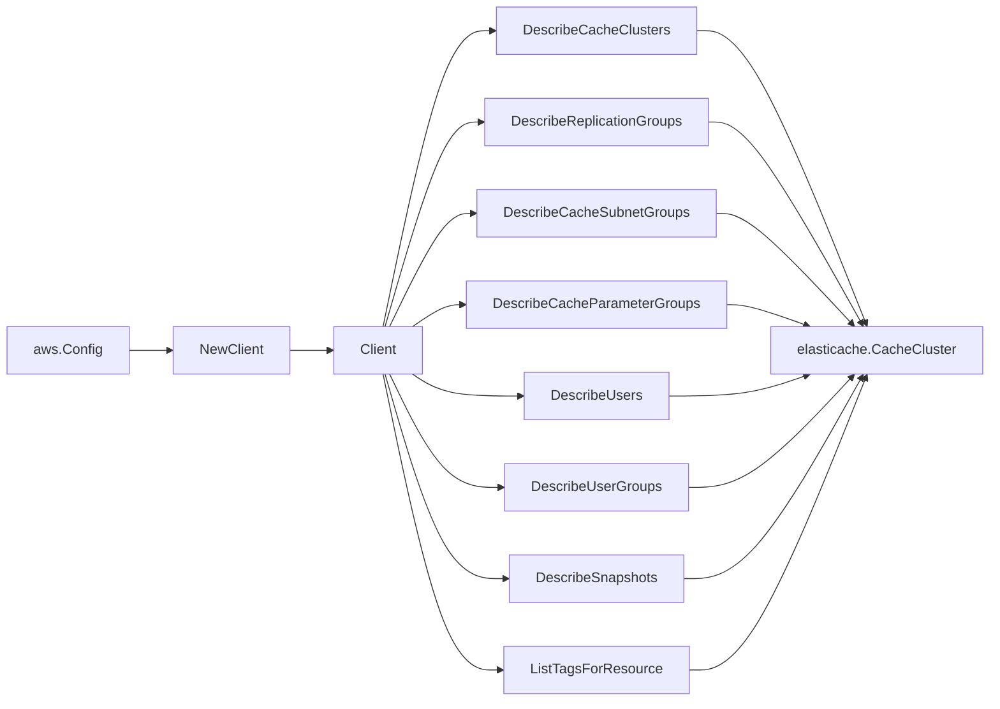

# AWS ElastiCache SDK Adapter

## Purpose

`internal/collector/awscloud/services/elasticache/awssdk` adapts AWS SDK for Go
v2 ElastiCache responses to the scanner-owned `Client` contract. It owns cache
cluster pagination, replication group pagination, parameter group pagination,
subnet group pagination, user pagination, user group pagination, snapshot
pagination, tag reads, throttle classification, and per-call AWS API
telemetry.

## Ownership boundary

This package owns SDK calls for ElastiCache. It does not own workflow claims,
credential acquisition, ElastiCache fact selection, graph writes, reducer
admission, or query behavior.

## Exported surface

See `doc.go` for the godoc contract.

- `Client` - AWS SDK-backed implementation of `elasticache.Client`.
- `NewClient` - builds a `Client` for one claimed AWS boundary.

## Dependencies

- `internal/collector/awscloud` for account, region, and service boundary
  labels.
- `internal/collector/awscloud/services/elasticache` for scanner-owned result
  types.
- `internal/telemetry` for AWS API call and throttle instruments.
- AWS SDK for Go v2 `elasticache` and Smithy error contracts.

## Telemetry

ElastiCache paginator pages and point reads are wrapped with:

- `aws.service.pagination.page`
- `eshu_dp_aws_api_calls_total`
- `eshu_dp_aws_throttle_total`

Metric labels stay bounded to service, account, region, operation, and
result. ElastiCache ARNs, cluster IDs, replication group IDs, user IDs, tags,
and raw AWS error payloads stay out of metric labels.

## Gotchas / invariants

- `DescribeCacheClusters` is invoked with `ShowCacheNodeInfo=false`. Per-node
  inventory metadata is not required for cache cluster identity and would
  inflate the cluster snapshot.
- `DescribeReplicationGroups` and `DescribeCacheSubnetGroups` results are
  cached per `Client` instance so cluster KMS, VPC, and subnet resolution
  share a single AWS pagination cycle with the scanner's group passes.
- ElastiCache `CacheCluster` responses do not include `KmsKeyId`, `VpcId`, or
  `SubnetIds`. The adapter resolves KMS through the cluster's replication
  group and VPC/subnet IDs through the cache subnet group.
- The adapter drops `User.Passwords` and `User.AccessString` before scanner
  code sees them; AUTH tokens, password material, and ACL grant strings can
  never reach facts or logs.
- Snapshot mapping persists name, source identity, and status only; node
  snapshot detail, engine version, KMS keys, snapshot windows, and AUTH token
  state are intentionally not projected into scanner-owned types per #713.
- The adapter must not call CreateCacheCluster, DeleteCacheCluster,
  ModifyCacheCluster, CreateReplicationGroup, DeleteReplicationGroup,
  ModifyReplicationGroup, CreateUser, DeleteUser, ModifyUser, CopySnapshot,
  DeleteSnapshot, ExportSnapshotsToS3, or any other mutation/data API.
- `ListTagsForResource` is invoked only when AWS reports an ARN for the
  resource; ARNs are bounded identifiers and not sensitive payload.
- SDK adapters translate AWS records into scanner-owned types; scanner tests
  should not mock AWS SDK pagination.

## Related docs

- `docs/public/services/collector-aws-cloud.md`
- `docs/public/services/collector-aws-cloud-scanners.md`
- `docs/public/services/collector-aws-cloud-security.md`
- `docs/public/guides/collector-authoring.md`
