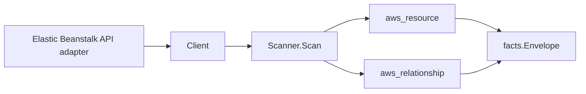

# AWS Elastic Beanstalk Scanner

## Purpose

`internal/collector/awscloud/services/elasticbeanstalk` owns the Elastic
Beanstalk scanner contract for the AWS cloud collector. It converts
applications, environments, application versions, and the relationships Elastic
Beanstalk reports into AWS cloud fact envelopes.

## Ownership boundary

This package owns scanner-level Elastic Beanstalk fact selection, option-setting
redaction, and identity mapping. It does not own AWS SDK pagination, STS
credentials, workflow claims, fact persistence, graph writes, reducer admission,
or query behavior.

## Exported surface

See `doc.go` for the godoc contract.

- `Client` - minimal Elastic Beanstalk read surface consumed by `Scanner`.
- `Scanner` - emits Elastic Beanstalk resource and relationship envelopes for
  one boundary.
- `Application`, `Environment`, `ApplicationVersion` - scanner-owned resource
  representations.
- `EnvironmentResources`, `OptionSetting` - scanner-owned nested records used
  for relationship joins and redaction.

## Dependencies

- `internal/collector/awscloud` for boundaries, resource constants,
  relationship constants, redaction helpers, and envelope builders.
- `internal/facts` for emitted fact envelope kinds.
- `internal/redact` for HMAC-SHA256 option-setting value markers.

The package depends on a small `Client` interface rather than the AWS SDK for
Go v2 so tests can use fake clients and runtime adapters can own SDK behavior.

## Telemetry

This scanner emits no spans or logs directly. `awsruntime.ClaimedSource` records
scan duration and emitted resource/relationship counts after `Scanner.Scan`
returns. The `awssdk` adapter records Elastic Beanstalk API call counts,
throttles, and pagination spans.

## Gotchas / invariants

- Every environment option-setting value is replaced with a
  `redacted:hmac-sha256:` marker before persistence. Option-setting names and
  namespaces are kept; values never are, because they can carry secret
  environment variable values. Requires `ESHU_AWS_REDACTION_KEY`.
- The scanner never reads or persists application-version source bundle object
  contents or environment-info presigned-URL bundles; the scanner-owned types
  have no field for those bodies.
- Environment relationships join on AWS-reported identities only. The
  environment-to-VPC, environment-to-IAM (instance profile and service role)
  joins come from the deployed option settings (`aws:ec2:vpc/VPCId`,
  `aws:autoscaling:launchconfiguration/IamInstanceProfile`,
  `aws:elasticbeanstalk:environment/ServiceRole`). The
  environment-to-load-balancer, environment-to-Auto-Scaling-group, and
  environment-to-launch-template joins come from
  `DescribeEnvironmentResources`.
- The scanner never fabricates an `arn:aws:` string. IAM target ARNs are set
  only when AWS reported a full ARN; bare names are kept as the target id.
- Load-balancer joins are typed by the identifier `DescribeEnvironmentResources`
  reports. An ELBv2 (ALB/NLB) ARN keeps the `aws_elbv2_load_balancer` target
  type and carries a real `target_arn` so it joins the ELBv2 scanner's
  ARN-keyed node; a bare Classic Load Balancer name (which has no ELBv2 node)
  falls back to the generic `aws_resource` target type and never fabricates an
  ARN. Auto Scaling group joins target `aws_autoscaling_group`; launch-template
  joins target `aws_ec2_launch_template`.
- The scanner stops on client errors and wraps them with `%w`. Runtime adapters
  decide whether an AWS service error is retryable, terminal, or a warning fact.

## Evidence

Collector Performance Evidence: `go test ./internal/collector/awscloud/services/elasticbeanstalk/...`
covers the bounded Elastic Beanstalk metadata path: one DescribeApplications
call, one paginated DescribeApplicationVersions stream, one paginated
DescribeEnvironments stream, and a per-environment DescribeEnvironmentResources
plus DescribeConfigurationSettings fan-out. No mutation, environment-rebuild,
CNAME-swap, environment-info data-plane, or configuration-validation API is
reachable, and the collector performs no graph writes.

No-Regression Evidence: `go test ./cmd/collector-aws-cloud ./internal/collector/awscloud/...`
covers application, environment, and application-version fact emission, every
relationship's non-empty target type and join key, redaction of every
option-setting value, structural absence of clear-text secret values in emitted
facts, runtime registration, the registry-derived redaction-key requirement, and
command configuration. The SDK adapter reflection contract test proves the
mutation and data-plane APIs are unreachable.

Collector Observability Evidence: Elastic Beanstalk uses the existing AWS
collector `aws.service.pagination.page` span plus `eshu_dp_aws_api_calls_total`,
`eshu_dp_aws_throttle_total`,
`eshu_dp_aws_resources_emitted_total{service="elasticbeanstalk"}`,
`eshu_dp_aws_relationships_emitted_total`, and `aws_scan_status` rows. Metric
labels stay bounded to service, account, region, operation, result, and resource
type.

No-Observability-Change: the existing AWS collector telemetry contract already
diagnoses Elastic Beanstalk scans through `aws.service.scan`,
`aws.service.pagination.page`, API/throttle counters, resource/relationship
counters, and `aws_scan_status`. No new instrument or label was added.

Collector Deployment Evidence: Elastic Beanstalk runs inside the existing hosted
`collector-aws-cloud` runtime, so `/healthz`, `/readyz`, `/metrics`, and
`/admin/status` stay covered by the command wiring and Helm collector runtime.

## Related docs

- `docs/public/services/collector-aws-cloud.md`
- `docs/public/services/collector-aws-cloud-scanners.md`
- `docs/public/guides/collector-authoring.md`
