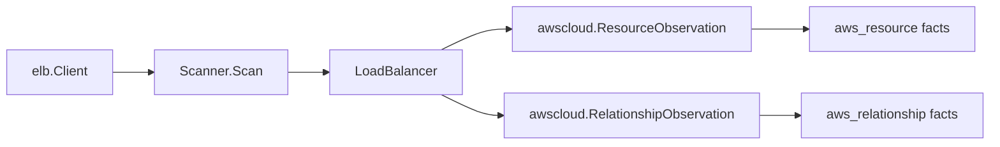

# AWS Classic ELB (v1) Scanner

## Purpose

`internal/collector/awscloud/services/elb` owns the scanner-side Classic Load
Balancer (ELB v1) fact selection for the AWS cloud collector. It converts each
Classic load balancer and its reported registered instances, subnets, security
groups, VPC, and HTTPS/SSL listener certificates into `aws_resource` and
`aws_relationship` facts. It is the v1 analog of the `elbv2` scanner, which owns
Application and Network Load Balancers.

The package implements the `elb` slice from
`docs/public/services/collector-aws-cloud.md`.

## Ownership boundary

This package owns scanner-owned Classic ELB models and fact-envelope
construction. It does not own AWS SDK calls, credentials, throttling, workflow
claims, graph writes, reducer admission, or query behavior.



## Exported surface

See `doc.go` for the godoc contract.

- `Scanner` - emits Classic ELB facts for one claimed AWS boundary.
- `Client` - scanner-owned read surface implemented by `awssdk.Client`.
- `LoadBalancer`, `Listener`, and `HealthCheck` - scanner-owned Classic ELB
  records.

## Synthesized ARN

Classic load balancers carry no AWS-assigned ARN. The scanner synthesizes a
partition-aware ARN from the scan boundary and the load balancer name:

```
arn:<partition>:elasticloadbalancing:<region>:<account>:loadbalancer/<name>
```

The partition (`aws`, `aws-us-gov`, `aws-cn`) is derived from the boundary
region. Hardcoding the commercial partition would mis-key the resource node and
every edge in GovCloud and China.

## Relationships

Every edge sources from the synthesized load balancer ARN:

- registers instance -> `aws_ec2_instance` (bare `i-...` id; forward reference,
  no EC2 instance resource scanner yet)
- in subnet -> `aws_ec2_subnet` (bare `subnet-...` id)
- uses security group -> `aws_ec2_security_group` (bare `sg-...` id)
- in VPC -> `aws_ec2_vpc` (bare `vpc-...` id)
- uses ACM certificate -> `aws_acm_certificate` (certificate ARN, for an
  `:acm:` listener `SSLCertificateId`)
- uses IAM server certificate -> `aws_iam_server_certificate` (certificate ARN,
  for an `:iam:` listener `SSLCertificateId`; forward reference, no IAM
  server-certificate scanner yet)

## Dependencies

- `internal/collector/awscloud` for AWS boundaries and fact envelopes.
- `internal/facts` for durable fact envelopes.
- `internal/redact` is not used here; Classic ELB facts carry no secret values.

## Telemetry

This package emits no metrics or spans directly. The `awssdk` adapter emits AWS
API call counters, throttle counters, and pagination spans.

## Gotchas / invariants

- Live instance health is deliberately not represented. The scanner derives
  registered instance ids from `DescribeLoadBalancers`, never calls
  `DescribeInstanceHealth`, and carries only an aggregate `instance_count` plus
  the per-instance edges. Live health belongs in a freshness/status layer.
- Certificate bodies and private keys are never read. Only the public
  `SSLCertificateId` ARN survives, and only as a graph edge plus listener
  attribute.
- A listener certificate id that is not ARN-shaped, or whose ARN service is
  neither `acm` nor `iam`, is skipped so no edge dangles.
- This package emits reported AWS evidence only. Do not infer service,
  environment, or deployable-unit truth here.

## Evidence

No-Regression Evidence:
`go test ./internal/collector/awscloud/services/elb/... ./internal/collector/awscloud/internal/relguard/... ./cmd/collector-aws-cloud/... -count=1`
covers Classic load balancer resource emission with the synthesized
partition-aware ARN, registered-instance / subnet / security-group / VPC / ACM-
certificate / IAM-server-certificate relationship emission with the
target_resource_id each target scanner publishes, the graph-join contract via
`relguard.AssertObservations`, the metadata-only guarantees (no live instance
health, no certificate bodies), the GovCloud and China synthesized-ARN cases,
the SDK adapter's metadata-only read surface (reflective exclusion test proving
no mutation or `DescribeInstanceHealth` method is reachable), runtime
registration, and the derived supported-service guard in the command. This is a
new metadata-only scanner with no graph-write, queue, or hot-path behavior
change.

No-Observability-Change: the scanner reuses the existing AWS collector telemetry
contract. The `awssdk` adapter emits the shared `aws.service.pagination.page`
span and `eshu_dp_aws_api_calls_total`, `eshu_dp_aws_throttle_total` counters
labeled by service, account, region, operation, and result only. No new metric,
span, label, or status field is introduced, and no metric label carries an ARN,
DNS name, certificate ARN, tag, or instance id.

## Related docs

- `docs/public/services/collector-aws-cloud.md`
- `docs/public/services/collector-aws-cloud-scanners.md`
- `docs/public/reference/telemetry/index.md`
