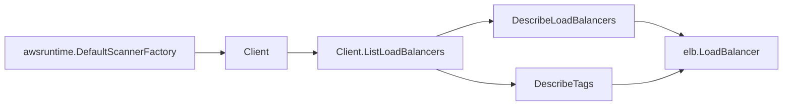

# AWS Classic ELB (v1) SDK Adapter

## Purpose

`internal/collector/awscloud/services/elb/awssdk` adapts AWS SDK for Go v2
Classic Load Balancing (ELB v1) responses to the scanner-owned `elb.Client`
contract. It owns ELB API pagination, batched tag reads, response mapping,
throttle classification, and per-call telemetry.

## Ownership boundary

This package owns SDK calls for Classic ELB. It does not own workflow claims,
credential acquisition, fact-envelope identity, graph writes, reducer admission,
or query behavior.

## Exported surface

See `doc.go` for the godoc contract.

- `Client` - Classic ELB SDK adapter implementing `services/elb.Client`.
- `NewClient` - constructs a claim-scoped Classic ELB adapter from AWS SDK
  config, boundary, tracer, and telemetry instruments.

## Dependencies

- AWS SDK for Go v2 `service/elasticloadbalancing` (v1, Classic ELB).
- `internal/collector/awscloud` for claim boundary labels.
- `internal/collector/awscloud/services/elb` for scanner-owned record types.
- `internal/telemetry` for AWS API counters, throttle counters, and pagination
  spans.

## Telemetry

Classic ELB paginator pages and tag point reads are wrapped with:

- `aws.service.pagination.page`
- `eshu_dp_aws_api_calls_total{service="elb",operation,result}`
- `eshu_dp_aws_throttle_total{service="elb"}`

Resource names, DNS names, certificate ARNs, tags, and instance ids are never
metric labels.

## Gotchas / invariants

- `DescribeLoadBalancers` uses the AWS SDK marker-based paginator. Listeners,
  registered instances, subnets, security groups, and the health-check
  configuration all arrive in the load balancer description, so no per-load-
  balancer follow-up read is needed for topology.
- `DescribeTags` accepts at most 20 load balancer names per call; keep
  `describeTagsLimit` aligned with the AWS API contract.
- The adapter never calls `DescribeInstanceHealth`. Live instance health is
  excluded from this stable topology slice.
- The accepted SDK surface (`apiClient`) names only `DescribeLoadBalancers` and
  `DescribeTags`. A reflective guard test fails the build if any mutation,
  lifecycle, or live-state-read method becomes reachable.
- Only the public `SSLCertificateId` ARN is mapped from a listener; certificate
  bodies and private keys are never read.

## Related docs

- `docs/public/services/collector-aws-cloud.md`
- `docs/public/reference/telemetry/index.md`
