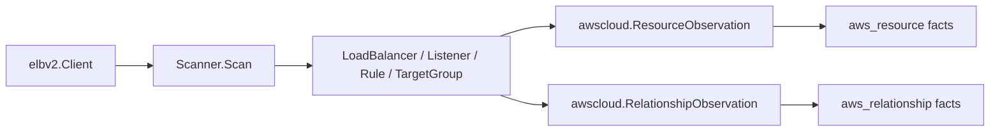

# AWS ELBv2 Scanner

## Purpose

`internal/collector/awscloud/services/elbv2` owns the scanner-side ELBv2 fact
selection for the AWS cloud collector. It converts load balancers, listeners,
target groups, listener rules, and routing edges into `aws_resource` and
`aws_relationship` facts.

The package implements the ELBv2 slice from
`docs/docs/adrs/2026-04-20-aws-cloud-scanner-collector.md`.

## Ownership boundary

This package owns scanner-owned ELBv2 models and fact-envelope construction. It
does not own AWS SDK calls, credentials, throttling, workflow claims, graph
writes, reducer admission, or query behavior.

## Exported surface

See `doc.go` for the godoc contract.

- `Scanner` - emits ELBv2 facts for one claimed AWS boundary.
- `Client` - scanner-owned read surface implemented by `awssdk.Client`.
- `LoadBalancer`, `Listener`, `Rule`, and `TargetGroup` - scanner-owned ELBv2
  records.
- `Action` and `Condition` - typed routing action and rule-condition evidence.

## Dependencies

- `internal/collector/awscloud` for AWS boundaries and fact envelopes.
- `internal/facts` for durable fact envelopes.
- `internal/redact` is not used here; ELBv2 facts do not contain secret values.

## Telemetry

This package emits no metrics or spans directly. The `awssdk` adapter emits
AWS API call counters, throttle counters, and pagination spans.

## Gotchas / invariants

- Target health status is deliberately not represented. It is live/noisy state
  and belongs in a freshness/status layer, not the stable topology fact stream.
- Listener-to-target-group route relationships aggregate all default-action and
  rule-action evidence for a `(listener, target group)` pair, because
  `aws_relationship` identity is source + target + relationship type.
- Rule conditions stay typed so later Route53 and correlation work can answer
  hostname/path routing questions without reparsing strings.
- This package emits reported AWS evidence only. Do not infer service,
  environment, or deployable-unit truth here.

## Related docs

- `docs/docs/adrs/2026-04-20-aws-cloud-scanner-collector.md`
- `docs/docs/reference/telemetry/index.md`
