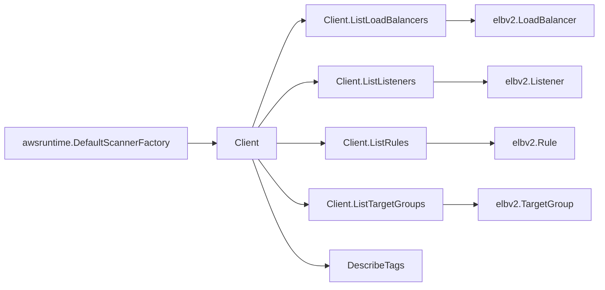

# AWS ELBv2 SDK Adapter

## Purpose

`internal/collector/awscloud/services/elbv2/awssdk` adapts AWS SDK for Go v2
ELBv2 responses to the scanner-owned `elbv2.Client` contract. It owns ELBv2 API
pagination, batched tag reads, response mapping, throttle classification, and
per-call telemetry.

## Ownership boundary

This package owns SDK calls for ELBv2. It does not own workflow claims,
credential acquisition, fact-envelope identity, graph writes, reducer
admission, or query behavior.

## Exported surface

See `doc.go` for the godoc contract.

- `Client` - ELBv2 SDK adapter implementing `services/elbv2.Client`.
- `NewClient` - constructs a claim-scoped ELBv2 adapter from AWS SDK config,
  boundary, tracer, and telemetry instruments.

## Dependencies

- AWS SDK for Go v2 `service/elasticloadbalancingv2`.
- `internal/collector/awscloud` for claim boundary labels.
- `internal/collector/awscloud/services/elbv2` for scanner-owned target types.
- `internal/telemetry` for AWS API counters, throttle counters, and pagination
  spans.

## Telemetry

ELBv2 paginator pages and tag point reads are wrapped with:

- `aws.service.pagination.page`
- `eshu_dp_aws_api_calls_total{service="elbv2",operation,result}`
- `eshu_dp_aws_throttle_total{service="elbv2"}`

Resource ARNs, DNS names, rule conditions, tags, and target group names are
never metric labels.

## Gotchas / invariants

- `DescribeLoadBalancers`, `DescribeListeners`, `DescribeRules`, and
  `DescribeTargetGroups` use AWS SDK paginators.
- `DescribeTags` accepts at most 20 resource ARNs per call; keep
  `describeTagsLimit` aligned with the AWS API contract.
- The adapter does not call `DescribeTargetHealth`. Target health is excluded
  from this stable topology slice.
- OIDC and Cognito action configs are intentionally not persisted here because
  they can include sensitive client configuration. The scanner keeps routing
  action type, forward target groups, redirects, and fixed-response details.

## Related docs

- `docs/docs/adrs/2026-04-20-aws-cloud-scanner-collector.md`
- `docs/docs/reference/telemetry/index.md`
