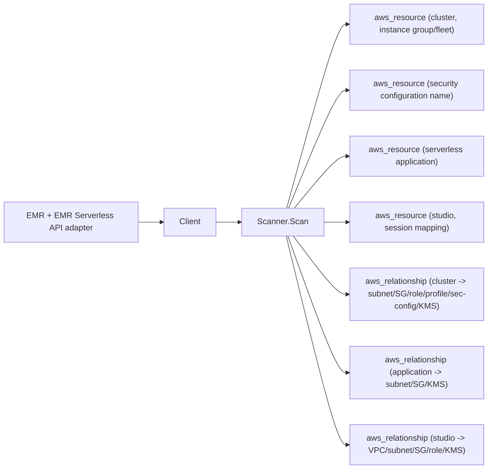

# AWS EMR Scanner

## Purpose

`internal/collector/awscloud/services/emr` owns the Amazon EMR scanner contract
for the AWS cloud collector. One service kind (`emr`) covers three EMR
surfaces: EMR on EC2 clusters, EMR Serverless applications, and EMR Studio. It
converts clusters (running and recently terminated), uniform instance groups,
instance fleets, security configurations, Serverless applications, Studios, and
Studio session mappings into reported AWS facts and relationship evidence.

## Ownership boundary

This package owns scanner-level EMR fact selection and identity mapping. It
does not own AWS SDK pagination, credential acquisition, workflow claims, fact
persistence, graph writes, reducer admission, or query behavior. SDK behavior
lives in the sibling `awssdk` adapter; the scanner depends only on the `Client`
interface declared in `types.go`.

## Exported surface

See `doc.go` for the godoc contract.

- `Client` - minimal EMR + EMR Serverless metadata read surface consumed by
  `Scanner`. The interface exposes only List/Describe/Get-class reads; the
  `awssdk` package tests assert no method name matches a mutation, job/step
  body reader, or security-configuration policy-body reader.
- `Scanner` - emits EMR resource and relationship facts for one boundary.
- `Cluster`, `InstanceGroup`, `InstanceFleet` - EMR on EC2 inventory and
  networking metadata. No step args, bootstrap bodies, or configuration
  property values.
- `SecurityConfiguration` - name and creation time only. The encryption and
  authentication policy body is intentionally absent from the type.
- `ServerlessApplication` - EMR Serverless application metadata with network
  and disk-encryption references. No job-run details.
- `Studio`, `StudioSessionMapping` - EMR Studio metadata and identity
  bindings. `SessionPolicyARN` is a managed-policy reference, never the body.

## Emitted resources and relationships

| Resource type | Notes |
| --- | --- |
| `aws_emr_cluster` | running + recently terminated; resource_id is cluster ARN |
| `aws_emr_instance_group` | scoped under cluster |
| `aws_emr_instance_fleet` | scoped under cluster |
| `aws_emr_security_configuration` | name only |
| `aws_emrserverless_application` | resource_id is application ARN |
| `aws_emr_studio` | resource_id is studio ARN |
| `aws_emr_studio_session_mapping` | scoped under studio |

| Relationship type | target_type | join key |
| --- | --- | --- |
| `emr_cluster_uses_subnet` | `aws_ec2_subnet` | bare subnet id |
| `emr_cluster_uses_security_group` | `aws_ec2_security_group` | bare sg id |
| `emr_cluster_uses_iam_role` | `aws_iam_role` | role name or ARN (target_arn for ARN) |
| `emr_cluster_uses_instance_profile` | `aws_iam_instance_profile` | profile name or ARN |
| `emr_cluster_uses_security_configuration` | `aws_emr_security_configuration` | config name |
| `emr_cluster_uses_kms_key` | `aws_kms_key` | key id or ARN (target_arn for ARN) |
| `emr_cluster_has_instance_group` | `aws_emr_instance_group` | scoped group id |
| `emr_cluster_has_instance_fleet` | `aws_emr_instance_fleet` | scoped fleet id |
| `emrserverless_application_uses_subnet` | `aws_ec2_subnet` | bare subnet id |
| `emrserverless_application_uses_security_group` | `aws_ec2_security_group` | bare sg id |
| `emrserverless_application_uses_kms_key` | `aws_kms_key` | key ARN |
| `emr_studio_in_vpc` | `aws_ec2_vpc` | bare vpc id |
| `emr_studio_uses_subnet` | `aws_ec2_subnet` | bare subnet id |
| `emr_studio_uses_security_group` | `aws_ec2_security_group` | bare sg id |
| `emr_studio_uses_iam_role` | `aws_iam_role` | role name or ARN |
| `emr_studio_uses_kms_key` | `aws_kms_key` | key ARN |
| `emr_studio_has_session_mapping` | `aws_emr_studio_session_mapping` | scoped mapping id |

The cluster-to-VPC and application-to-VPC joins requested by the issue are
derived from subnet membership downstream: the EMR cluster API and the EMR
Serverless API do not report a VPC id. EMR Studio does report its VPC id, so
`emr_studio_in_vpc` is emitted directly.

## Dependencies

- `internal/collector/awscloud` for boundaries, resource constants,
  relationship constants, and envelope builders.
- `internal/facts` for emitted fact envelope kinds.

The package depends on the small `Client` interface rather than the AWS SDK for
Go v2 so tests can use fake clients and runtime adapters can own SDK behavior.

## Telemetry

This scanner emits no spans or logs directly. `awsruntime.ClaimedSource`
records scan duration and emitted resource counts after `Scanner.Scan` returns.
The `awssdk` adapter records EMR API call counts, throttles, and pagination
spans. The required resource signal is
`eshu_dp_aws_resources_emitted_total{service="emr"}` with the existing bounded
AWS collector labels.

## Gotchas / invariants

- The scanner is metadata-only. It must never call any mutation API:
  RunJobFlow, TerminateJobFlows, AddJobFlowSteps, CancelSteps,
  ModifyInstanceGroups, ModifyInstanceFleet, AddInstanceGroups,
  AddInstanceFleet, ModifyCluster, SetTerminationProtection,
  PutAutoScalingPolicy, CreateSecurityConfiguration,
  DeleteSecurityConfiguration, Create/Delete/Update Studio,
  Create/Delete/Update StudioSessionMapping, and on the Serverless side
  Create/Delete/Update/Start/Stop Application, StartJobRun, CancelJobRun.
- It must never persist step command lines. The scanner does not call
  ListSteps or DescribeStep; `Args` has no field on any scanner-owned type.
- It must never persist bootstrap action script bodies. The scanner does not
  call ListBootstrapActions.
- It must never persist security configuration policy bodies. The scanner
  reads only ListSecurityConfigurations (name + creation time) and never calls
  DescribeSecurityConfiguration.
- It must never persist EMR Serverless job-run entry-point arguments. The
  scanner does not call GetJobRun, ListJobRuns, or ListJobRunAttempts.
- Emit reported evidence only. Do not infer workload ownership, environment,
  repository, or deployable-unit truth from cluster names, tags, or roles.
- Every relationship sets a non-empty `target_type`. Synthesized identity uses
  the value EMR reports; `target_arn` is set only for ARN-shaped values and no
  ARN is fabricated, so partition stays correct in GovCloud and China.
- Keep cluster ids, ARNs, role names, key ids, and tags out of metric labels.

## Evidence

Collector Performance Evidence:
`go test ./internal/collector/awscloud/services/emr/... -race` covers the
bounded EMR metadata path: ListClusters with bounded states and a recent
CreatedAfter window, per-cluster DescribeCluster, instance group or fleet
roll-up by collection type, ListSecurityConfigurations name-only mapping,
ListApplications plus GetApplication, and ListStudios plus DescribeStudio with
ListStudioSessionMappings, all without mutation or sensitive-body calls.

No-Regression Evidence:
`go test ./cmd/collector-aws-cloud ./internal/collector/awscloud/...` covers EMR
resource and relationship fact emission, omission of step args, bootstrap
bodies, security configuration policy bodies, and Serverless job-run arguments,
the reflective SDK-adapter exclusion guards, runtime registration through the
derived supported-service guard, and command configuration.

Collector Observability Evidence: EMR uses the existing AWS collector
`aws.service.pagination.page` span plus `eshu_dp_aws_api_calls_total`,
`eshu_dp_aws_throttle_total`, `eshu_dp_aws_resources_emitted_total`,
`eshu_dp_aws_relationships_emitted_total`, and `aws_scan_status` rows.

No-Observability-Change: the existing AWS collector telemetry contract already
diagnoses EMR scans through the bounded shared instruments; this scanner adds
no new metric, span, or log.

Collector Deployment Evidence: EMR runs inside the existing hosted
`collector-aws-cloud` runtime, so `/healthz`, `/readyz`, `/metrics`, and
`/admin/status` stay covered by the command wiring and Helm collector runtime.

## Related docs

- `docs/public/services/collector-aws-cloud.md`
- `docs/public/services/collector-aws-cloud-scanners.md`
- `docs/public/guides/collector-authoring.md`
