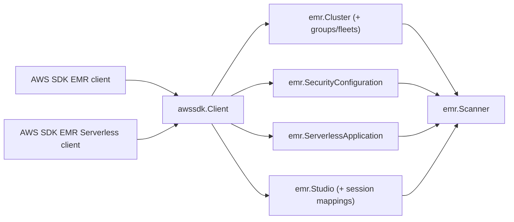

# AWS EMR SDK Adapter

## Purpose

`internal/collector/awscloud/services/emr/awssdk` adapts AWS SDK for Go v2 EMR
and EMR Serverless responses into scanner-owned records. It handles
Marker-based EMR pagination, NextToken-based EMR Serverless pagination,
`Describe*`/`Get*` enrichment, telemetry, and response normalization for one
claimed account and region. Pagination and production client construction live
in `client.go`; AWS SDK type to scanner-owned mapping lives in `mapper.go`, so
the adapter stays under the package line budget.

## Ownership boundary

This package owns the AWS EMR and EMR Serverless API calls needed for the EMR
scan slice. The parent `emr` package owns fact-envelope construction.
Credential loading, workflow claims, graph writes, reducer admission, and query
behavior live outside this package.

## Exported surface

See `doc.go` for the godoc contract.

- `Client` - implements `emr.Client`.
- `NewClient` - builds an EMR SDK adapter for one claimed AWS boundary.

The unexported `emrAPIClient` and `emrServerlessAPIClient` interfaces declare
the exact metadata-only SDK method sets the adapter depends on. The package
tests reflect over them to prove no mutation, step/bootstrap body, security
configuration policy-body, or job-run reader method is reachable.

## Dependencies

- AWS SDK for Go v2 EMR client and EMR types.
- AWS SDK for Go v2 EMR Serverless client and EMR Serverless types.
- `internal/collector/awscloud` for the claimed boundary and API-call recording.
- `internal/collector/awscloud/services/emr` for scanner-owned records.
- `internal/telemetry` for AWS API call counters, throttle counters, and
  pagination spans.

## Telemetry

`recordAPICall` emits:

- `aws.service.pagination.page` spans with service, account, region, and
  operation attributes.
- `eshu_dp_aws_api_calls_total` with service, account, region, operation, and
  result labels.
- `eshu_dp_aws_throttle_total` for throttling errors during EMR and EMR
  Serverless reads.

## Gotchas / invariants

- `ListClusters` returns summaries; the adapter calls `DescribeCluster` for
  full networking and IAM metadata, then `ListInstanceGroups` or
  `ListInstanceFleets` by `InstanceCollectionType`.
- `ListClusters` is bounded: it requests running, transitional, and terminated
  states and sets `CreatedAfter` to a recent window so terminated-cluster
  evidence stays current without an unbounded historical scan. The window is
  anchored to `Boundary.ObservedAt` when set so the scan is deterministic in
  tests.
- EMR pagination uses `Marker`; EMR Serverless uses `NextToken`. The shared
  `advance` helper stops on an empty token and on an unchanging token so a
  buggy server response cannot loop forever.
- Security configurations are read name-only through
  `ListSecurityConfigurations`. The adapter never calls
  `DescribeSecurityConfiguration`, which returns the policy body.
- EMR Serverless applications are read through `GetApplication` for network and
  disk-encryption references only. The adapter never calls a job-run reader,
  which would carry SparkSubmit entry-point arguments.
- Do not persist step args, bootstrap script bodies, security configuration
  policy bodies, or job-run arguments. They have no field on any scanner-owned
  type.

## Related docs

- `docs/public/services/collector-aws-cloud.md`
- `docs/public/reference/telemetry/index.md`
