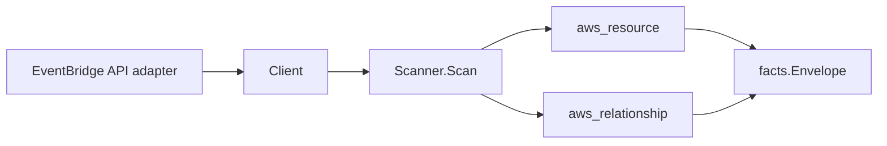

# AWS EventBridge Scanner

## Purpose

`internal/collector/awscloud/services/eventbridge` owns the EventBridge scanner
contract for the AWS cloud collector. It converts event bus and rule metadata
into `aws_resource` facts and emits relationship evidence for rule membership
and ARN-addressable targets.

## Ownership boundary

This package owns scanner-level EventBridge fact selection and identity mapping.
It does not own AWS SDK pagination, STS credentials, workflow claims, fact
persistence, graph writes, reducer admission, or query behavior.



## Exported surface

See `doc.go` for the godoc contract.

- `Client` - minimal EventBridge metadata read surface consumed by `Scanner`.
- `Scanner` - emits event bus, rule, and target relationship facts for one
  boundary.
- `EventBus` - scanner-owned event bus representation.
- `Rule` - scanner-owned rule representation.
- `Target` - safe target metadata with payload fields intentionally omitted.

## Dependencies

- `internal/collector/awscloud` for boundaries, resource constants,
  relationship constants, and envelope builders.
- `internal/facts` for emitted fact envelope kinds.

The package depends on a small `Client` interface rather than the AWS SDK for Go
v2 so tests can use fake clients and runtime adapters can own SDK behavior.

## Telemetry

This scanner emits no spans or logs directly. `awsruntime.ClaimedSource`
records scan duration and emitted resource counts after `Scanner.Scan` returns.
The `awssdk` adapter records EventBridge API call counts, throttles, and
pagination spans.

## Gotchas / invariants

- EventBridge facts are metadata only. The scanner must not put events, mutate
  rules, mutate targets, or read payload delivery content.
- Event bus policy JSON is not persisted because it carries authorization
  configuration.
- Target input payloads, input paths, input transformers, and HTTP parameters
  are not persisted because they can carry payload fragments, headers, query
  strings, or secrets.
- Target relationships are emitted only when the rule identity and target ARN
  are both present.
- Non-ARN target identities such as webhook URLs are not persisted.
- Tags are raw AWS tag evidence. Do not infer environment, owner, workload, or
  deployable-unit truth from tags in this package.

## Verification

```bash
go test ./internal/collector/awscloud/services/eventbridge/... -count=1
go test ./cmd/collector-aws-cloud ./internal/collector/awscloud/... -count=1
go run ./cmd/eshu docs verify ../go/internal/collector/awscloud/services/eventbridge --limit 1000 \
  --fail-on contradicted,missing_evidence
```

Run the AWS runtime tests when scan warnings or partial-status behavior changes.

## Related docs

- `docs/public/services/collector-aws-cloud.md`
- `docs/public/guides/collector-authoring.md`
