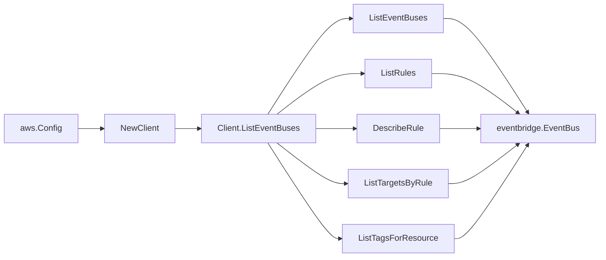

# AWS EventBridge SDK Adapter

## Purpose

`internal/collector/awscloud/services/eventbridge/awssdk` adapts AWS SDK for Go
v2 EventBridge responses to the scanner-owned `Client` contract. It
owns event bus pagination, rule pagination, rule metadata reads, target
pagination, tag reads, throttle classification, and per-call AWS API telemetry.

## Ownership boundary

This package owns SDK calls for EventBridge. It does not own workflow claims,
credential acquisition, EventBridge fact selection, graph writes, reducer
admission, or query behavior.

## Exported surface

See `doc.go` for the godoc contract.

- `Client` - AWS SDK-backed implementation of `eventbridge.Client`.
- `NewClient` - builds a `Client` for one claimed AWS boundary.

## Dependencies

- `internal/collector/awscloud` for account, region, and service boundary
  labels.
- `internal/collector/awscloud/services/eventbridge` for scanner-owned result
  types.
- `internal/telemetry` for AWS API call and throttle instruments.
- AWS SDK for Go v2 `eventbridge` and Smithy error contracts.

## Telemetry

EventBridge paginator pages and point reads are wrapped with:

- `aws.service.pagination.page`
- `eshu_dp_aws_api_calls_total`
- `eshu_dp_aws_throttle_total`

Metric labels stay bounded to service, account, region, operation, and result.
Event bus ARNs, rule ARNs, target ARNs, tags, event patterns, and raw AWS error
payloads stay out of metric labels.

## Gotchas / invariants

- ListEventBuses discovers buses but does not persist the EventBus `Policy`
  field.
- ListRules and DescribeRule read routing metadata. ListTargetsByRule reads
  target metadata, but `Input`, `InputPath`, `InputTransformer`, and
  `HttpParameters` are intentionally discarded.
- ListTagsForResource reads event bus and rule tags as raw evidence.
- The adapter must not call PutEvents, PutRule, PutTargets, DeleteRule,
  RemoveTargets, archive/replay APIs, schema APIs, or connection/API
  destination secret-shaped APIs.
- SDK adapters translate AWS records into scanner-owned types; scanner tests
  should not mock AWS SDK pagination.

## Related docs

- `docs/docs/adrs/2026-04-20-aws-cloud-scanner-collector.md`
- `docs/docs/guides/collector-authoring.md`
