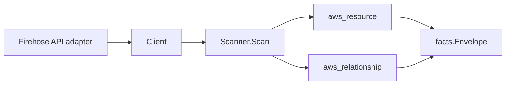

# Amazon Data Firehose Scanner

## Purpose

`internal/collector/awscloud/services/firehose` owns the Firehose scanner
contract for the AWS cloud collector. It converts Amazon Data Firehose delivery
stream metadata into `aws_resource` facts and emits relationship evidence for
each stream's S3 bucket, Amazon Redshift cluster, and Amazon OpenSearch Service
domain destinations, its Kinesis data stream source, its delivery IAM role, its
server-side encryption KMS key, its CloudWatch Logs error-logging log group, and
its data-transformation Lambda functions.

## Ownership boundary

This package owns scanner-level Firehose fact selection and identity mapping. It
does not own AWS SDK pagination, STS credentials, workflow claims, fact
persistence, graph writes, reducer admission, or query behavior.

## Exported surface

See `doc.go` for the godoc contract.

- `Client` - minimal Firehose metadata read surface consumed by `Scanner`.
- `Scanner` - emits one delivery stream resource plus its destination, source,
  role, KMS, log-group, and transform relationships for one boundary.
- `DeliveryStream`, `Destination` - scanner-owned views with secret-bearing
  fields (access keys, HEC tokens, Redshift passwords, processing-configuration
  bodies) intentionally omitted.

## Dependencies

- `internal/collector/awscloud` for boundaries, resource constants,
  relationship constants, and envelope builders.
- `internal/facts` for emitted fact envelope kinds.

The package depends on a small `Client` interface rather than the AWS SDK for
Go v2 so tests can use fake clients and runtime adapters can own SDK behavior.

## Telemetry

This scanner emits no spans or logs directly. `awsruntime.ClaimedSource`
records scan duration and emitted resource counts after `Scanner.Scan` returns.
The `awssdk` adapter records Firehose API call counts, throttles, and
pagination spans.

## Gotchas / invariants

- Firehose facts are metadata only. The scanner must not read delivery records,
  mutate a delivery stream, toggle encryption, tag a stream, or persist
  destination access keys, Splunk HEC tokens, Redshift passwords, HTTP endpoint
  URLs/access keys, or processing-configuration Lambda bodies.
- The delivery stream `resource_id` prefers the stream ARN and falls back to the
  stream name, matching how other ARN-addressable AWS resources publish their
  identity.
- ARN-keyed edges (S3 bucket, OpenSearch domain, source Kinesis data stream,
  delivery IAM role, SSE KMS key, transform Lambda) are emitted only when AWS
  reports an ARN-shaped target identity, and the scanner uses the reported ARN
  verbatim so GovCloud (`aws-us-gov`) and China (`aws-cn`) edges resolve to the
  partition-correct target node instead of dangling. No ARN is synthesized.
- The Redshift destination edge is keyed by the cluster identifier parsed from
  the destination JDBC URL host (AWS reports a JDBC URL, not an ARN), matching
  the `Name` the Redshift scanner publishes. No fabricated ARN is set on that
  edge.
- The CloudWatch log group edge is keyed by the reported log group name (the
  cloudwatchlogs scanner keys its log group node by ARN-or-name), with no
  fabricated ARN.
- A delivery IAM role, KMS key, log group, or transform Lambda reported on more
  than one destination of a stream collapses to a single edge; distinct S3
  buckets stay distinct.
- The KMS SSE edge is emitted only for a customer-managed key
  (`CUSTOMER_MANAGED_CMK`); AWS-owned keys report no key ARN and produce no edge.
- Splunk and HTTP endpoint destinations carry secret-bearing access material and
  report no Eshu-resolvable resource family, so the scanner records the
  destination class in the resource `destination_types` attribute but emits no
  destination edge for them.
- Emit reported evidence only. Do not infer deployment, workload, repository
  ownership, environment, or deployable-unit truth from delivery stream,
  destination, or role names, or from AWS tags.
- The `kinesis` scanner also surfaces Firehose delivery streams under the
  `aws_kinesis_firehose_delivery_stream` resource type. This package is the
  dedicated first-class Firehose owner using the distinct
  `aws_firehose_delivery_stream` resource type and adds the source-stream,
  KMS-SSE, and CloudWatch-log-group joins the bundled `kinesis` view does not
  emit.

## Evidence

Collector Performance Evidence:
`go test ./internal/collector/awscloud/services/firehose/...` covers the bounded
Firehose metadata path: one paginated `ListDeliveryStreams` stream followed by
one `DescribeDeliveryStream` point read per stream, no `PutRecord`,
`PutRecordBatch`, mutation, encryption-toggle, or tag-write calls, and no graph
writes in the collector. The describe-per-stream fan-out is the same bounded
shape the Glue workflow path uses (`ListWorkflows` + `GetWorkflow` per name).

No-Regression Evidence:
`go test ./internal/collector/awscloud/services/firehose/... ./internal/collector/awscloud/internal/relguard/... ./cmd/collector-aws-cloud/... -count=1`
covers delivery stream metadata fact emission, the stream-to-S3-bucket,
stream-to-Redshift-cluster, stream-to-OpenSearch-domain, stream-sourced-from-
Kinesis-stream, stream-uses-IAM-role, stream-uses-KMS-key,
stream-logs-to-CloudWatch-log-group, and stream-uses-Lambda-transform
relationship emission (each asserting `target_type` and `target_resource_id`),
duplicate-target edge collapsing, the commercial/`aws-us-gov`/`aws-cn`
partition-faithful ARN assertions, the metadata-only/no-secret resource
assertions, the SDK adapter mutation/record-API exclusion reflection test,
runtime registration, the relguard graph-join guard over the live scanner tree,
and the derived collector-aws-cloud supported-service guard. This is a new
metadata-only scanner with no graph-write, queue, or hot-path behavior change to
existing scanners.

No-Observability-Change: the scanner reuses the existing AWS collector telemetry
contract — `aws.service.scan`, `aws.service.pagination.page`,
`eshu_dp_aws_api_calls_total`, `eshu_dp_aws_throttle_total`,
`eshu_dp_aws_resources_emitted_total`, `eshu_dp_aws_relationships_emitted_total`,
and `aws_scan_status`. No new instrument, span, or metric label is introduced,
and metric labels stay bounded to service, account, region, operation, result,
and status.

Collector Deployment Evidence: Firehose runs inside the existing hosted
`collector-aws-cloud` runtime, so `/healthz`, `/readyz`, `/metrics`, and
`/admin/status` stay covered by the command wiring and Helm collector runtime.

## Related docs

- `docs/public/services/collector-aws-cloud.md`
- `docs/public/services/collector-aws-cloud-scanners.md`
- `docs/public/services/collector-aws-cloud-security.md`
