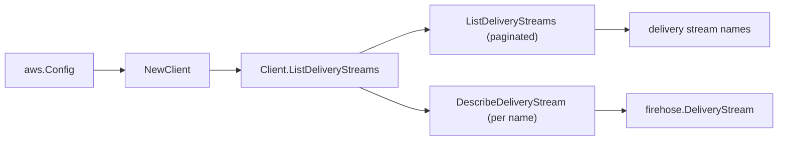

# Amazon Data Firehose SDK Adapter

## Purpose

`internal/collector/awscloud/services/firehose/awssdk` adapts AWS SDK for Go v2
Firehose responses to the scanner-owned `Client` contract. It owns delivery
stream listing pagination, the per-stream describe fan-out, throttle
classification, per-call AWS API telemetry, and the mapping of each delivery
stream description into safe identity, source, encryption, and destination
metadata.

## Ownership boundary

This package owns SDK calls for Firehose. It does not own workflow claims,
credential acquisition, Firehose fact selection, graph writes, reducer
admission, or query behavior.

## Exported surface

See `doc.go` for the godoc contract.

- `Client` - AWS SDK-backed implementation of `firehose.Client`.
- `NewClient` - builds a `Client` for one claimed AWS boundary.

## Dependencies

- `internal/collector/awscloud` for account, region, and service boundary
  labels.
- `internal/collector/awscloud/services/firehose` for scanner-owned result
  types.
- `internal/telemetry` for AWS API call and throttle instruments.
- AWS SDK for Go v2 `firehose` and Smithy error contracts.

## Telemetry

Firehose list pages and per-stream describe reads are wrapped with:

- `aws.service.pagination.page`
- `eshu_dp_aws_api_calls_total`
- `eshu_dp_aws_throttle_total`

Metric labels stay bounded to service, account, region, operation, and result.
Firehose ARNs, names, JDBC URLs, endpoint URLs, tags, and raw AWS error
payloads stay out of metric labels.

## Gotchas / invariants

- The adapter read surface is `ListDeliveryStreams` and
  `DescribeDeliveryStream` only. The `apiClient` interface omits PutRecord,
  PutRecordBatch, CreateDeliveryStream, DeleteDeliveryStream, UpdateDestination,
  Start/StopDeliveryStreamEncryption, and Tag/UntagDeliveryStream, so they are
  unreachable by construction. A reflective guard test pins this.
- The KMS key ARN is mapped only for a `CUSTOMER_MANAGED_CMK` encryption
  configuration; an AWS-owned key reports a service-managed key reference that
  is never propagated.
- Destination mapping records only the join-relevant target identities (S3
  bucket ARN, Redshift cluster identifier parsed from the JDBC URL host,
  OpenSearch domain ARN), the delivery role ARN, the CloudWatch log group name,
  and the transform Lambda ARNs. The Redshift password embedded in the
  destination configuration, the Splunk HEC token, and the HTTP endpoint URL and
  access key are never mapped.
- The transform Lambda ARNs come only from the `LambdaArn` parameter of a
  `Lambda`-type processor; no other processor parameter is read, so the
  processing-configuration body never leaves AWS.
- SDK adapters translate AWS records into scanner-owned types; scanner tests
  should not mock AWS SDK pagination.

## Related docs

- `docs/public/services/collector-aws-cloud-scanners.md`
- `docs/public/services/collector-aws-cloud-security.md`
