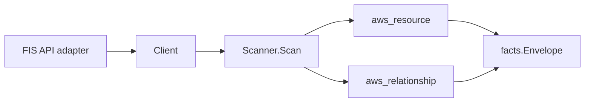

# AWS Fault Injection Service (FIS) Scanner

## Purpose

`internal/collector/awscloud/services/fis` owns the AWS Fault Injection Service
scanner contract for the AWS cloud collector. It converts FIS experiment-template
metadata into `aws_resource` facts and emits relationship evidence for the
execution IAM role, the explicit resource targets (EC2 instance, ECS cluster,
RDS DB instance/cluster), the logging destinations (CloudWatch Logs log group,
S3 bucket), and the CloudWatch alarm stop conditions.

## Ownership boundary

This package owns scanner-level FIS fact selection and identity mapping. It does
not own AWS SDK pagination, STS credentials, workflow claims, fact persistence,
graph writes, reducer admission, or query behavior.

## Exported surface

See `doc.go` for the godoc contract.

- `Client` - minimal FIS metadata read surface consumed by `Scanner`.
- `Scanner` - emits experiment-template resources plus their relationships for
  one boundary.
- `Snapshot`, `ExperimentTemplate`, `Action`, `Target` - scanner-owned views
  with action parameter values, target filter values, and experiment run output
  intentionally absent.

## Dependencies

- `internal/collector/awscloud` for boundaries, resource constants,
  relationship constants, partition helpers, and envelope builders.
- `internal/facts` for emitted fact envelope kinds.

The package depends on a small `Client` interface rather than the AWS SDK for
Go v2 so tests can use fake clients and the runtime adapter can own SDK
behavior.

## Telemetry

This scanner emits no spans or logs directly. `awsruntime.ClaimedSource`
records scan duration and emitted resource counts after `Scanner.Scan` returns.
The `awssdk` adapter records FIS API call counts, throttles, and pagination
spans.

## Gotchas / invariants

- FIS facts are metadata only. The scanner must never start or stop an
  experiment, never read experiment run results or resolved-target inventories,
  and never persist action parameter values or target filter/tag selectors.
- The experiment-template node publishes its resource_id as the template ARN
  (falling back to the template id). Every template edge is sourced on that id.
- The template-to-IAM-role edge is emitted only when FIS reports an ARN-shaped
  role; the role ARN matches the IAM scanner's published role resource_id.
- The template-target edges are emitted only for explicitly listed resource
  ARNs whose family this scanner models. EC2 instances are keyed by the bare
  instance id (`i-...`) extracted from the ARN (`target_arn` carries the full
  ARN); ECS clusters and RDS DB instances/clusters are keyed by ARN, matching
  the ECS and RDS scanners' published resource_ids. Targets selected only by
  tag or filter, and ARNs from unmodeled families, are skipped rather than
  dangled.
- The template-to-CloudWatch-log-group edge trims the trailing `:*` wildcard
  from the reported log group ARN so it joins the cloudwatchlogs node.
- The template-to-S3 edge synthesizes the partition-aware bucket ARN
  (`arn:<partition>:s3:::<bucket>`) via `awscloud.PartitionForBoundary` so it
  joins the S3 bucket node in GovCloud and China, not just commercial.
- The template-to-CloudWatch-alarm stop-condition edge is emitted only for
  `aws:cloudwatch:alarm` stop conditions whose Value is an alarm ARN; the
  implicit `none` stop condition emits no edge.
- Emit reported evidence only. Do not infer deployment, workload, repository
  ownership, environment, or deployable-unit truth from template names or AWS
  tags.

## Evidence

No-Regression Evidence: metadata-only control-plane scanner; new read path, no change to existing hot paths. `go test ./internal/collector/awscloud/services/fis/...` green.

No-Observability-Change: reuses shared AWS pagination span + API-call/throttle counters; no telemetry contract change.

## Related docs

- `docs/public/services/collector-aws-cloud.md`
- `docs/public/services/collector-aws-cloud-scanners.md`
- `docs/public/services/collector-aws-cloud-security.md`
