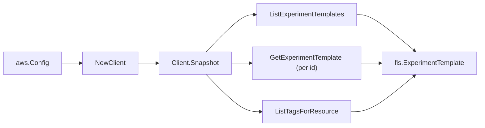

# AWS FIS SDK Adapter

## Purpose

`internal/collector/awscloud/services/fis/awssdk` adapts AWS SDK for Go v2 FIS
responses to the scanner-owned `Client` contract. It owns experiment-template
pagination, per-template detail reads, resource-tag reads, throttle
classification, and per-call AWS API telemetry.

## Ownership boundary

This package owns SDK calls for FIS. It does not own workflow claims, credential
acquisition, FIS fact selection, graph writes, reducer admission, or query
behavior.

## Exported surface

See `doc.go` for the godoc contract.

- `Client` - AWS SDK-backed implementation of `fis.Client`.
- `NewClient` - builds a `Client` for one claimed AWS boundary.

## Dependencies

- `internal/collector/awscloud` for account, region, and service boundary
  labels.
- `internal/collector/awscloud/services/fis` for scanner-owned result types.
- `internal/telemetry` for AWS API call and throttle instruments.
- AWS SDK for Go v2 `fis` and Smithy error contracts.

## Telemetry

FIS paginator pages and point reads are wrapped with:

- `aws.service.pagination.page`
- `eshu_dp_aws_api_calls_total`
- `eshu_dp_aws_throttle_total`

Metric labels stay bounded to service, account, region, operation, and result.
FIS resource ARNs, names, descriptions, tags, and raw AWS error payloads stay
out of metric labels.

## Gotchas / invariants

- The adapter reads metadata only. It must never call StartExperiment,
  StopExperiment, GetExperiment, ListExperiments, ListExperimentResolvedTargets,
  any Create/Update/Delete mutation API, or any Tag/Untag mutation. The accepted
  read surface is ListExperimentTemplates, GetExperimentTemplate, and
  ListTagsForResource only; `exclusion_test.go` fails the build otherwise.
- The list response carries only summaries; the adapter expands each id through
  GetExperimentTemplate to read action, target, logging, and stop-condition
  metadata. Action parameter values, target filter values, and resource-tag
  selectors are dropped during mapping and never persisted.
- FIS templates have no dedicated name field; the adapter reads the `Name` tag
  value when present. When the detail response omits tags it falls back to
  ListTagsForResource on the template ARN.
- The S3 log mapping copies only the destination bucket name and prefix, never
  any log object contents.
- SDK adapters translate AWS records into scanner-owned types; scanner tests
  should not mock AWS SDK pagination.

## Related docs

- `docs/public/services/collector-aws-cloud-scanners.md`
- `docs/public/services/collector-aws-cloud-security.md`
