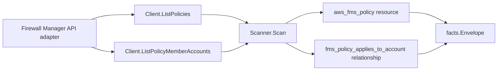

# AWS Firewall Manager Scanner

## Purpose

`internal/collector/awscloud/services/fms` owns the scanner contract for AWS
Firewall Manager (FMS) metadata. It converts a claim-scoped policy listing into
`aws_resource` facts for each Firewall Manager policy and `aws_relationship`
facts linking each policy to the Organizations member accounts it applies to.

## Ownership boundary

This package owns scanner-level fact selection and identity mapping. It does not
own AWS SDK pagination, STS credentials, workflow claims, fact persistence,
graph writes, reducer admission, or query behavior.

## Exported surface

See `doc.go` for the godoc contract.

- `Client` - minimal Firewall Manager metadata surface consumed by `Scanner`.
- `Scanner` - emits Firewall Manager policy facts for one administrator account.
- `Policy` - scanner-owned policy identity, security service type, in-scope
  resource type label, and remediation flag.

## Dependencies

- `internal/collector/awscloud` for boundaries, resource constants,
  relationship constants, and envelope builders.
- `internal/facts` for emitted fact envelope kinds.

The package depends on a small `Client` interface rather than the AWS SDK for Go
v2 so scanner tests use fakes and SDK behavior stays in `awssdk`.

## Telemetry

This scanner emits no spans or logs directly. `awsruntime.ClaimedSource`
records scan duration and emitted resource counts after `Scanner.Scan` returns.
The `awssdk` adapter records Firewall Manager API call counts, throttles, and
pagination spans. Firewall Manager resources appear on
`eshu_dp_aws_resources_emitted_total{service="fms"}` with the bounded
`resource_type=aws_fms_policy` label.

## Gotchas / invariants

- Firewall Manager facts are metadata only. The scanner must not call or rely on
  mutation APIs such as PutPolicy, DeletePolicy, PutNotificationChannel,
  AssociateAdminAccount, PutResourceSet, or BatchAssociateResource.
- Policy rule payloads never cross the scanner boundary. The
  SecurityServicePolicyData managed service data document, account
  inclusion/exclusion maps, and resource tag selectors are out of scope. The
  scanner reads only ListPolicies; GetPolicy (which returns the rule payload) is
  deliberately excluded from the SDK adapter read surface.
- The governing security service type and in-scope AWS resource type are
  recorded as labels on the policy resource. They name the kind of resource the
  policy governs; the policy does not own those resource nodes.
- The member-account edge is keyed on the bare 12-digit account id with no
  synthesized target ARN, matching the `resource_id` the organizations scanner
  publishes for an `aws_organizations_account` node, so the edge joins instead
  of dangling. Member accounts are deduplicated and sorted so the relationship
  identity is stable across generations and never keyed on API response order.
- FMS is reachable only from the FMS administrator account. A non-administrator
  claim returns no policies; ordinary credential and permission failures still
  surface as errors.
- Member accounts are reported FMS compliance evidence. Do not infer AWS
  Organizations ownership, workload ownership, or account hierarchy truth here;
  reducers own correlation.

## Evidence

Collector Performance Evidence:
`go test ./internal/collector/awscloud/services/fms/...` covers the bounded
Firewall Manager metadata path: one paginated ListPolicies stream and one
paginated ListComplianceStatus stream per policy reduced to a deduplicated,
sorted member-account set, no GetPolicy calls, no mutations, and no graph writes
in the collector.

No-Regression Evidence:
`go test ./internal/collector/awscloud/services/fms/... ./internal/collector/awscloud/internal/relguard/... ./cmd/collector-aws-cloud/... -count=1`
covers Firewall Manager policy fact emission, security-service-type and
in-scope resource-type label emission, policy-to-member-account relationship
emission keyed on the bare account id, the metadata-only rule-payload omission,
the relguard graph-join contract, partition-aware ARN handling (the policy ARN
is used verbatim from the API for commercial, GovCloud, and China partitions),
runtime registration, and the SDK adapter's read-only metadata surface.

Collector Observability Evidence: Firewall Manager uses the existing AWS
collector `aws.service.pagination.page` span plus `eshu_dp_aws_api_calls_total`,
`eshu_dp_aws_throttle_total`, `eshu_dp_aws_resources_emitted_total`,
`eshu_dp_aws_relationships_emitted_total`, and `aws_scan_status` rows. Metric
labels stay bounded to service, account, region, operation, result, and
resource type; policy ARNs, policy ids, and member account ids stay out of
metric labels.

No-Observability-Change: the existing AWS collector telemetry contract already
diagnoses Firewall Manager scans through `aws.service.scan`,
`aws.service.pagination.page`, API/throttle counters, resource/relationship
counters, and `aws_scan_status`. This scanner adds no new instrument, span, or
metric label.

Collector Deployment Evidence: Firewall Manager runs inside the existing hosted
`collector-aws-cloud` runtime, so `/healthz`, `/readyz`, `/metrics`, and
`/admin/status` stay covered by the command wiring and Helm collector runtime.

## Related docs

- `docs/public/services/collector-aws-cloud.md`
- `docs/public/services/collector-aws-cloud-scanners.md`
- `docs/public/services/collector-aws-cloud-security.md`
- `docs/public/guides/collector-authoring.md`
