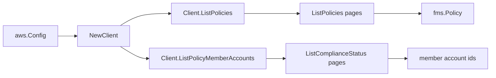

# AWS Firewall Manager SDK Adapter

## Purpose

`internal/collector/awscloud/services/fms/awssdk` adapts AWS SDK for Go v2
Firewall Manager responses to the scanner-owned `Client` contract. It owns
policy pagination, per-policy member-account resolution from compliance status,
throttle classification, and per-call AWS API telemetry.

## Ownership boundary

This package owns SDK calls for Firewall Manager. It does not own workflow
claims, credential acquisition, Firewall Manager fact-envelope construction,
graph writes, reducer admission, or query behavior.

## Exported surface

See `doc.go` for the godoc contract.

- `Client` - AWS SDK-backed implementation of `fms.Client`.
- `NewClient` - builds a `Client` for one claimed AWS boundary.

## Dependencies

- `internal/collector/awscloud` for account, region, and service boundary
  labels.
- `internal/collector/awscloud/services/fms` for scanner-owned result types.
- `internal/telemetry` for AWS API call and throttle instruments.
- AWS SDK for Go v2 `fms` and Smithy error contracts.

## Telemetry

Firewall Manager pages are wrapped with:

- `aws.service.pagination.page`
- `eshu_dp_aws_api_calls_total`
- `eshu_dp_aws_throttle_total`

Metric labels stay bounded to service, account, region, operation, and result.
Policy ARNs, policy ids, member account ids, and raw AWS error payloads stay out
of metric labels.

## API allowlist

The adapter may call only:

- `ListPolicies`
- `ListComplianceStatus`

`GetPolicy` is deliberately excluded. It returns the full `Policy` with the
SecurityServicePolicyData managed service data document (the policy rule
payload); `ListPolicies` already returns every metadata field the scanner
records, so the rule payload is unreachable by construction.

## Gotchas / invariants

- FMS is reachable only from the FMS administrator account. `ListPolicies`
  returns an empty list for a non-administrator account; do not hide ordinary
  credential or permission failures.
- `ListComplianceStatus` reports one `PolicyComplianceStatus` per member account
  the policy is evaluated against. The adapter keeps only the `MemberAccount`
  id (deduplicated); it never copies compliance evaluation results, issue info,
  or violator resource details into scanner-owned types.
- Member account ids are returned in their raw API order; the scanner sorts and
  dedupes them, so the adapter never keys identity on order.
- Policy ARNs are used verbatim from the API. The adapter never synthesizes an
  ARN, so the GovCloud (`aws-us-gov`) and China (`aws-cn`) partitions survive.
- Do not call PutPolicy, DeletePolicy, GetPolicy, PutNotificationChannel,
  AssociateAdminAccount, PutResourceSet, BatchAssociateResource, or any other
  FMS mutation or rule-payload read. A reflective guard test on the `apiClient`
  interface enforces this.
- SDK adapters translate AWS records into scanner-owned types; scanner tests
  should not mock AWS SDK pagination.

## Related docs

- `docs/public/services/collector-aws-cloud.md`
- `docs/public/services/collector-aws-cloud-scanners.md`
- `docs/public/services/collector-aws-cloud-security.md`
- `docs/public/guides/collector-authoring.md`
