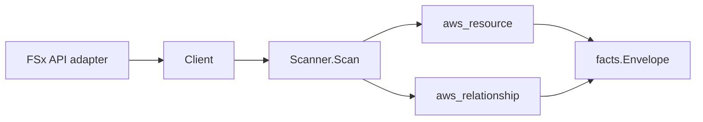

# AWS FSx Scanner

## Purpose

`internal/collector/awscloud/services/fsx` owns the FSx scanner contract for the
AWS cloud collector. It converts FSx file systems (Windows File Server, Lustre,
NetApp ONTAP, OpenZFS), backups, snapshots, storage virtual machines, and
volumes into AWS cloud fact envelopes. One scanner covers all four flavors.

## Ownership boundary

This package owns scanner-level FSx fact selection and relationship mapping. It
does not own AWS SDK pagination, STS credentials, workflow claims, fact
persistence, graph writes, reducer admission, or query behavior.

## Exported surface

See `doc.go` for the godoc contract.

- `Client` - minimal FSx read surface consumed by `Scanner`. It exposes only
  describe-style reads (`ListFileSystems`, `ListBackups`,
  `ListStorageVirtualMachines`, `ListVolumes`, `ListSnapshots`) and no
  mutations.
- `Scanner` - emits FSx resource and relationship envelopes for one boundary.
- `FileSystem`, `Backup`, `StorageVirtualMachine`, `Volume`, `Snapshot` -
  scanner-owned FSx resource representations. None carry a password, SVM admin
  password, or self-managed AD credential field.

## Dependencies

- `internal/collector/awscloud` for boundaries, resource constants, relationship
  constants, and envelope builders.
- `internal/facts` for emitted fact envelope kinds.

The package depends on a small `Client` interface rather than the AWS SDK for Go
v2 so tests can use fake clients and the runtime adapter (`awssdk`) owns SDK
behavior.

## Telemetry

This scanner emits no spans or logs directly. `awsruntime.ClaimedSource` records
scan duration and emitted resource/relationship counts after `Scanner.Scan`
returns. The `awssdk` adapter records FSx API call counts, throttles, and
pagination spans. The collector counts emitted facts under
`eshu_dp_aws_resources_emitted_total{service="fsx"}` and
`eshu_dp_aws_relationships_emitted_total{service="fsx"}`.

## Gotchas / invariants

- The scanner is metadata-only. It never reads file contents and never calls a
  mutation API (Create/Delete/Update/Restore/Copy/Release). A reflection test in
  the `awssdk` adapter fails the build if any such method is added to the SDK
  seam.
- Active Directory self-managed credentials are never persisted across any
  flavor. The Windows and SVM self-managed AD `Password`, `UserName`,
  `FileSystemAdministratorsGroup`, `DnsIps`, and `DomainJoinServiceAccountSecret`
  are never mapped. Only the AWS Managed Microsoft AD directory ID is kept as a
  relationship join key.
- The ONTAP fsxadmin password and the SVM admin password are never mapped. The
  scanner-owned types have no field for them.
- Relationship target identity joins the target scanner's `resource_id`: VPC and
  subnet edges target the bare AWS ID (`aws_ec2_vpc`, `aws_ec2_subnet`); KMS
  edges target the key ARN or ID (`aws_kms_key`) with `target_arn` set only when
  ARN-shaped; AD edges target the bare directory ID (`aws_ds_directory`, a
  forward-looking type for a future Directory Service scanner); SVM-to-file
  system, volume-to-SVM, volume-to-file system, and backup-to-file system edges
  upgrade to the parent ARN when known so they join the FSx resource facts.
- The scanner stops on client errors and wraps each list error with `%w`.
  Runtime adapters decide whether an AWS service error is retryable, terminal,
  or a warning fact.

## Evidence

Collector Performance Evidence: `go test ./internal/collector/awscloud/services/fsx/...`
covers the bounded FSx metadata path: paginated DescribeFileSystems,
DescribeBackups, DescribeStorageVirtualMachines, DescribeVolumes, and
DescribeSnapshots. Each is a single account/region account-wide describe with
SDK pagination; there is no per-file-system fanout. No file-content reads, no
mutation calls, and no graph writes exist in the collector. Cardinality is
bounded by the file system, backup, SVM, volume, and snapshot count per claim.

No-Regression Evidence: `go test ./cmd/collector-aws-cloud ./internal/collector/awscloud/...`
covers FSx metadata fact emission across all four flavors, VPC/subnet/KMS/AD/
backup/SVM/volume relationship emission with non-empty target_type and join
keys, omission of AD self-managed credentials and SVM/fsxadmin passwords, SDK
pagination, runtime self-registration, the derived supported-service guard, and
command configuration.

Collector Observability Evidence: FSx uses the existing AWS collector
`aws.service.pagination.page` span plus `eshu_dp_aws_api_calls_total`,
`eshu_dp_aws_throttle_total`, `eshu_dp_aws_resources_emitted_total`,
`eshu_dp_aws_relationships_emitted_total`, and `aws_scan_status` rows. Metric
labels stay bounded to service, account, region, operation, result, and status.

No-Observability-Change: the existing AWS collector telemetry contract already
diagnoses FSx scans through `aws.service.scan`, `aws.service.pagination.page`,
API/throttle counters, resource/relationship counters, and `aws_scan_status`.

Collector Deployment Evidence: FSx runs inside the existing hosted
`collector-aws-cloud` runtime, so `/healthz`, `/readyz`, `/metrics`, and
`/admin/status` stay covered by the command wiring and Helm collector runtime.

## Related docs

- `docs/public/services/collector-aws-cloud-scanners.md`
- `docs/public/guides/collector-authoring.md`
