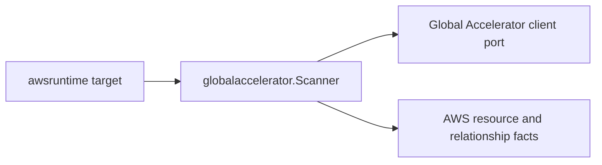

# Global Accelerator AWS Collector Service

## Purpose

`globalaccelerator` owns metadata-only AWS Global Accelerator fact emission for
the AWS collector. It turns scanner-owned topology projections into AWS resource
and relationship envelopes for accelerators, listeners, endpoint groups, and
endpoints.

## Ownership boundary

This package owns Global Accelerator identity, safe metadata projection, and the
reported endpoint target relationships. It does not call AWS APIs, schedule
claims, load credentials, write facts, or infer workload, environment,
repository, or deployable-unit truth.

The scanner emits one `aws_globalaccelerator_accelerator` resource per
accelerator, one `aws_globalaccelerator_listener` per listener, one
`aws_globalaccelerator_endpoint_group` per endpoint group, and one
`aws_globalaccelerator_endpoint` per endpoint, walking the nested topology the
client returns.

## Exported surface

See `doc.go` for the godoc-rendered package contract.

- `Scanner` validates the `globalaccelerator` service boundary and emits fact
  envelopes.
- `Client` is the scanner-owned metadata port implemented by the AWS SDK
  adapter; it returns accelerators with listeners and endpoint groups nested.
- `Accelerator`, `IPSet`, `Listener`, `PortRange`, `EndpointGroup`,
  `PortOverride`, and `Endpoint` are safe control-plane projections used by
  tests and adapters.

## Dependencies

- `internal/collector/awscloud` for boundaries, service constants, and resource
  and relationship observation contracts.
- `internal/facts` for the fact envelope returned by `Scanner`.

## Telemetry

The scanner itself emits no new metrics. The AWS SDK adapter records API calls
with the shared AWS collector API-call events, spans, throttle counters, and
operation labels.

No-Observability-Change: existing AWS collector API-call metrics, pagination
spans, throttle counters, and per-service operation labels cover Global
Accelerator accelerator, listener, endpoint group, and tag listing.

## Gotchas / invariants

- Global Accelerator is a global-endpoint service whose control plane is
  reachable only in `us-west-2`. Schedule the claim for `us-west-2`; the SDK
  adapter pins its client region there regardless of the claim region.
- Endpoint relationships are typed from the reported endpoint id:
  `aws_elbv2_load_balancer` when the id is an `:elasticloadbalancing:` ARN,
  `aws_vpc_elastic_ip` for an `eipalloc-` allocation id, `aws_ec2_instance` for
  an `i-` instance id, and `aws_resource` otherwise. `target_arn` is set only
  when the endpoint id is ARN-shaped; non-ARN ids keep `target_resource_id`
  populated and `target_arn` empty.
- Endpoints have no ARN of their own. The scanner mints a stable endpoint
  resource id of `<endpoint_group_arn>#endpoint#<endpoint_id>` so membership and
  target edges share one identity.
- Static IP addresses are public anycast addresses and DNS names are public, so
  both are safe metadata. The scanner never mutates a Global Accelerator
  resource.

## Evidence

Collector Performance Evidence: `go test -race
./internal/collector/awscloud/services/globalaccelerator/...` covers the bounded
Global Accelerator metadata path: one paginated ListAccelerators stream, a
per-accelerator paginated ListListeners stream, a per-listener paginated
ListEndpointGroups stream, and a per-accelerator ListTagsForResource read.
Cardinality is bounded by accelerators per account times listeners per
accelerator times endpoint groups per listener; each List level paginates at
100 per page. No mutation API is reachable, and the collector performs no graph
writes.

No-Regression Evidence: `go test ./cmd/collector-aws-cloud
./internal/collector/awscloud/...` covers accelerator, listener, endpoint-group,
and endpoint fact emission, every relationship's non-empty target type and
endpoint-target join-key typing (ELB v2 ARN, Elastic IP allocation id, EC2
instance id, generic fallback), runtime registration, and command
configuration. The SDK adapter reflection contract test proves the mutation,
BYOIP, and custom-routing traffic APIs are unreachable.

Collector Observability Evidence: Global Accelerator uses the existing AWS
collector `aws.service.pagination.page` span plus `eshu_dp_aws_api_calls_total`,
`eshu_dp_aws_throttle_total`,
`eshu_dp_aws_resources_emitted_total{service="globalaccelerator"}`,
`eshu_dp_aws_relationships_emitted_total`, and `aws_scan_status` rows. Metric
labels stay bounded to service, account, region, operation, result, and
resource type.

No-Observability-Change: the existing AWS collector telemetry contract already
diagnoses Global Accelerator scans through `aws.service.scan`,
`aws.service.pagination.page`, API/throttle counters, resource/relationship
counters, and `aws_scan_status`. No new instrument or label was added.

Collector Deployment Evidence: Global Accelerator runs inside the existing
hosted `collector-aws-cloud` runtime, so `/healthz`, `/readyz`, `/metrics`, and
`/admin/status` stay covered by the command wiring and Helm collector runtime.

## Related docs

- `docs/public/services/collector-aws-cloud.md`
- `docs/public/services/collector-aws-cloud-scanners.md`
- `docs/public/guides/collector-authoring.md`
