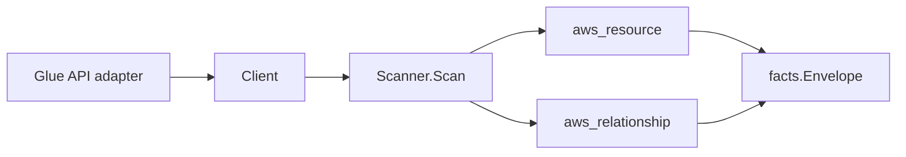

# AWS Glue Scanner

## Purpose

`internal/collector/awscloud/services/glue` owns the Glue scanner contract for
the AWS cloud collector. It converts Data Catalog database and table metadata,
crawler metadata, job metadata, trigger metadata, workflow metadata, and
connection metadata into `aws_resource` facts and emits relationship evidence
for catalog membership, S3 storage locations, crawler-to-database routing,
crawler IAM roles, job IAM roles, and trigger-to-job invocations.

## Ownership boundary

This package owns scanner-level Glue fact selection and identity mapping. It
does not own AWS SDK pagination, STS credentials, workflow claims, fact
persistence, graph writes, reducer admission, or query behavior.

## Exported surface

See `doc.go` for the godoc contract.

- `Client` - minimal Glue metadata read surface consumed by `Scanner`.
- `Scanner` - emits database, table, crawler, job, trigger, workflow, and
  connection resources plus their relationships for one boundary.
- `Database`, `Table`, `Crawler`, `Job`, `Trigger`, `Workflow`, `Connection` -
  scanner-owned views with secret-bearing fields intentionally omitted.

## Dependencies

- `internal/collector/awscloud` for boundaries, resource constants,
  relationship constants, and envelope builders.
- `internal/facts` for emitted fact envelope kinds.

The package depends on a small `Client` interface rather than the AWS SDK for
Go v2 so tests can use fake clients and runtime adapters can own SDK behavior.

## Telemetry

This scanner emits no spans or logs directly. `awsruntime.ClaimedSource`
records scan duration and emitted resource counts after `Scanner.Scan` returns.
The `awssdk` adapter records Glue API call counts, throttles, and pagination
spans.

## Gotchas / invariants

- Glue facts are metadata only. The scanner must not run jobs, start
  crawlers, mutate Data Catalog state, or read job script bodies,
  default-argument values, connection passwords, JDBC URLs that carry
  credentials, classifier custom patterns, or table column statistics that
  contain sample values.
- Job and connection argument or property values are never persisted. Only
  the key names survive, and any key whose name suggests credential material
  is dropped before persistence by `filterSafeKeys`.
- Connection property values (including `PASSWORD`, `ENCRYPTED_PASSWORD`,
  `KAFKA_SASL_PASSWORD`, JDBC URL connection strings, and SECRET_ID
  references) stay outside the contract; the SDK adapter calls
  `GetConnections` with `HidePassword=true` so AWS never returns them.
- Workflow graph payloads and run state stay outside the contract. The SDK
  adapter calls `GetWorkflow` with `IncludeGraph=false`.
- Job-to-IAM-role and crawler-to-IAM-role relationships are emitted only when
  AWS reports a parseable IAM role ARN.
- Table-to-S3-location relationships are emitted only when the storage
  location starts with `s3://`. Non-S3 locations (HDFS, on-prem, etc.) are
  reported through resource attributes but not promoted to relationships.
- Trigger-to-job relationships are emitted once per distinct job name in the
  trigger action list. Duplicate job names within a single trigger collapse to
  one edge.
- Tags are not yet emitted because the Glue tag APIs sit outside the metadata
  read paths used here. When tags are added, treat them as raw AWS tag
  evidence and do not infer environment, owner, workload, or deployable-unit
  truth in this package.

## Evidence

Collector Performance Evidence:
`go test ./internal/collector/awscloud/services/glue/...` covers the bounded
Glue metadata path: one paginated GetDatabases stream, one paginated GetTables
stream per database, one paginated GetCrawlers stream, one paginated GetJobs
stream, one paginated GetTriggers stream, one paginated ListWorkflows stream
with one GetWorkflow point read per name (with `IncludeGraph=false`), one
paginated GetConnections stream with `HidePassword=true`, no StartCrawler or
StartJobRun calls, no mutations, and no graph writes in the collector.

No-Regression Evidence:
`go test ./cmd/collector-aws-cloud ./internal/collector/awscloud/...` covers
Glue database, table, crawler, job, trigger, workflow, and connection metadata
fact emission, table-in-database and table-to-S3-location relationship
emission, crawler-to-database and crawler-to-IAM-role relationship emission,
job-to-IAM-role relationship emission, trigger-to-job relationship emission,
secret-shaped default-argument and connection-property key redaction, runtime
registration, command configuration, and the SDK adapter's safe metadata
mapping.

Collector Observability Evidence: Glue uses the existing AWS collector
`aws.service.pagination.page` span plus `eshu_dp_aws_api_calls_total`,
`eshu_dp_aws_throttle_total`, `eshu_dp_aws_resources_emitted_total`,
`eshu_dp_aws_relationships_emitted_total`, and `aws_scan_status` rows. Metric
labels stay bounded to service, account, region, operation, result, and
status.

No-Observability-Change: the existing AWS collector telemetry contract already
diagnoses Glue scans through `aws.service.scan`,
`aws.service.pagination.page`, API/throttle counters, resource/relationship
counters, and `aws_scan_status`.

### Partition-aware S3 location join (#816)

No-Regression Evidence: `go test ./internal/collector/awscloud/services/glue/... -count=1`
covers the new `TestTableS3LocationRelationshipDerivesPartition` (commercial /
`aws-us-gov` / `aws-cn` / blank-region-fallback) alongside the existing
table-to-S3-location commercial assertions. Glue tables carry no ARN, so the
table->S3-location target ARN now derives its partition from the scan
boundary's region via `partition(boundary)` instead of hardcoding `aws`,
letting GovCloud and China joins resolve to the bucket node the S3 scanner
publishes (`arn:<partition>:s3:::<bucket>`) instead of dangling.
Commercial-partition output is byte-for-byte unchanged; this is a metadata-only
correctness fix with no graph-write, queue, or hot-path behavior change.

No-Observability-Change: the fix only changes the partition substring of a
synthesized target ARN value; no instrument, span, metric label, or
`aws_scan_status` row changes.

Collector Deployment Evidence: Glue runs inside the existing hosted
`collector-aws-cloud` runtime, so `/healthz`, `/readyz`, `/metrics`, and
`/admin/status` stay covered by the command wiring and Helm collector
runtime.

### Partition-aware ARNs (#866)

No-Regression Evidence: `go test ./internal/collector/awscloud/services/glue/... -count=1`
keeps `TestTableS3LocationRelationshipDerivesPartition` (commercial /
`aws-us-gov` / `aws-cn` / blank-region-fallback) green after the table->S3
bucket-ARN synthesis was switched from the package-local `partition` helper to
the shared `awscloud.PartitionForBoundary`. The derivation logic is identical;
commercial output (`us-east-1`) is byte-for-byte unchanged; this is a
metadata-only consolidation with no graph-write, queue, or hot-path behavior
change.

No-Observability-Change: the change only swaps a helper; the synthesized ARN
value is unchanged for every region, and no instrument, span, metric label, or
`aws_scan_status` row changes.

## Related docs

- `docs/public/services/collector-aws-cloud.md`
- `docs/public/services/collector-aws-cloud-scanners.md`
- `docs/public/services/collector-aws-cloud-security.md`
