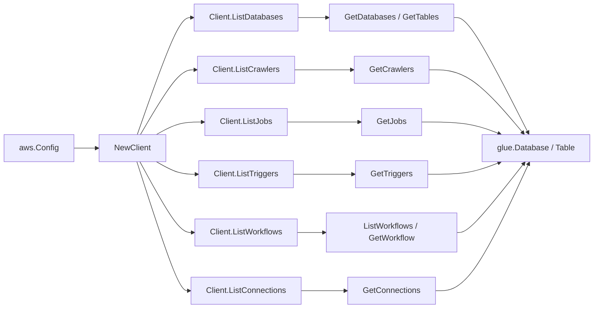

# AWS Glue SDK Adapter

## Purpose

`internal/collector/awscloud/services/glue/awssdk` adapts AWS SDK for Go v2
Glue responses to the scanner-owned `Client` contract. It owns Data Catalog
pagination, crawler pagination, job pagination, trigger pagination, workflow
pagination, connection pagination, throttle classification, and per-call AWS
API telemetry.

## Ownership boundary

This package owns SDK calls for Glue. It does not own workflow claims,
credential acquisition, Glue fact selection, graph writes, reducer admission,
or query behavior.

## Exported surface

See `doc.go` for the godoc contract.

- `Client` - AWS SDK-backed implementation of `glue.Client`.
- `NewClient` - builds a `Client` for one claimed AWS boundary.

## Dependencies

- `internal/collector/awscloud` for account, region, and service boundary
  labels.
- `internal/collector/awscloud/services/glue` for scanner-owned result types.
- `internal/telemetry` for AWS API call and throttle instruments.
- AWS SDK for Go v2 `glue` and Smithy error contracts.

## Telemetry

Glue paginator pages and point reads are wrapped with:

- `aws.service.pagination.page`
- `eshu_dp_aws_api_calls_total`
- `eshu_dp_aws_throttle_total`

Metric labels stay bounded to service, account, region, operation, and result.
Glue resource ARNs, names, parameters, tags, schedules, and raw AWS error
payloads stay out of metric labels.

## Gotchas / invariants

- `GetConnections` is always called with `HidePassword=true` so the AWS API
  never returns `PASSWORD`, `ENCRYPTED_PASSWORD`, or other credential-bearing
  property values to the adapter.
- `GetWorkflow` is always called with `IncludeGraph=false` so workflow run
  history and graph edges stay outside the scanner contract.
- Job default-argument values are never propagated. The adapter forwards only
  the argument key names; the scanner drops secret-shaped keys before
  persistence.
- Connection property values are never propagated. The adapter forwards only
  the property key names.
- The adapter must not call `StartCrawler`, `StartJobRun`, `BatchStopJobRun`,
  `CreateJob`, `UpdateJob`, `DeleteJob`, `CreateDatabase`, `DeleteDatabase`,
  `CreateConnection`, `DeleteConnection`, `GetUserDefinedFunctions`,
  `GetColumnStatisticsForTable`, classifier custom-pattern reads, or any
  other mutation or sensitive-payload API.
- SDK adapters translate AWS records into scanner-owned types; scanner tests
  should not mock AWS SDK pagination.

## Related docs

- `docs/public/services/collector-aws-cloud-scanners.md`
- `docs/public/services/collector-aws-cloud-security.md`
