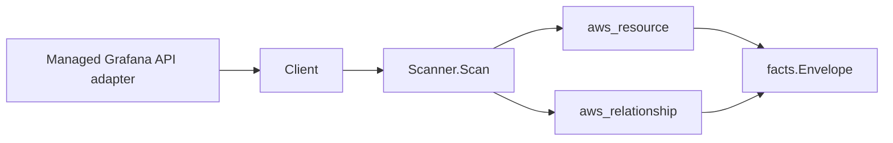

# Amazon Managed Grafana Scanner

## Purpose

`internal/collector/awscloud/services/grafana` owns the Amazon Managed Grafana
scanner contract for the AWS cloud collector. It converts Managed Grafana
workspace metadata into `aws_resource` facts and emits relationship evidence for
the workspace IAM role and, when a `vpcConfiguration` is present, the
workspace's VPC subnets and security groups.

## Ownership boundary

This package owns scanner-level Grafana fact selection and identity mapping. It
does not own AWS SDK pagination, STS credentials, workflow claims, fact
persistence, graph writes, reducer admission, or query behavior.

## Exported surface

See `doc.go` for the godoc contract.

- `Client` - minimal Managed Grafana metadata read surface consumed by
  `Scanner`.
- `Scanner` - emits workspace resources plus their relationships for one
  boundary.
- `Snapshot`, `Workspace` - scanner-owned views with dashboards, alert rules,
  query results, and authentication secrets intentionally absent.

## Dependencies

- `internal/collector/awscloud` for boundaries, resource constants, relationship
  constants, partition helpers, and envelope builders.
- `internal/facts` for emitted fact envelope kinds.

The package depends on a small `Client` interface rather than the AWS SDK for Go
v2 so tests can use fake clients and the runtime adapter can own SDK behavior.

## Telemetry

This scanner emits no spans or logs directly. `awsruntime.ClaimedSource` records
scan duration and emitted resource counts after `Scanner.Scan` returns. The
`awssdk` adapter records Managed Grafana API call counts, throttles, and
pagination spans.

## Gotchas / invariants

- Grafana facts are metadata only. The scanner must never read dashboards,
  panels, alert rules, or query results, must never read SAML or IAM Identity
  Center authentication configuration, and must never persist a workspace API
  key, service-account token, or any credential.
- Managed Grafana does not report an ARN on the workspace description, so the
  `awssdk` adapter synthesizes a partition-aware workspace ARN
  (`arn:<partition>:grafana:<region>:<account>:/workspaces/<id>`) via
  `awscloud.PartitionForBoundary`. The workspace node publishes that ARN as its
  resource_id, and every outgoing edge is sourced on it.
- The workspace-to-IAM-role edge is emitted only when AWS reports an ARN-shaped
  `workspaceRoleArn`. The IAM scanner publishes a role's resource_id as the role
  ARN, so the edge keys the role ARN directly.
- The workspace-to-subnet and workspace-to-security-group edges are emitted only
  when a `vpcConfiguration` is present. The EC2 scanner publishes subnet and
  security-group resource_ids as the BARE ids (`subnet-...`, `sg-...`), so these
  edges target the bare ids, not ARNs, and de-duplicate repeated ids.
- Data sources, notification destinations, and authentication providers are
  recorded as enum names only; never connection strings, endpoints, or secrets.
- Emit reported evidence only. Do not infer deployment, workload, repository
  ownership, environment, or deployable-unit truth from workspace names or AWS
  tags.

## Evidence

No-Regression Evidence: metadata-only control-plane scanner; new read path, no change to existing hot paths. `go test ./internal/collector/awscloud/services/grafana/...` green.

No-Observability-Change: reuses shared AWS pagination span + API-call/throttle counters; no telemetry contract change.

Collector Performance Evidence:
`go test ./internal/collector/awscloud/services/grafana/...` covers the bounded
Grafana metadata path: one paginated ListWorkspaces stream, one
DescribeWorkspace point read per workspace, one ListTagsForResource point read
per workspace, no dashboard reads, no authentication reads, no API-key or token
mints, no mutations, and no graph writes in the collector.

Collector Deployment Evidence: Grafana runs inside the existing hosted
`collector-aws-cloud` runtime, so `/healthz`, `/readyz`, `/metrics`, and
`/admin/status` stay covered by the command wiring and Helm collector runtime.

## Related docs

- `docs/public/services/collector-aws-cloud.md`
- `docs/public/services/collector-aws-cloud-scanners.md`
- `docs/public/services/collector-aws-cloud-security.md`
