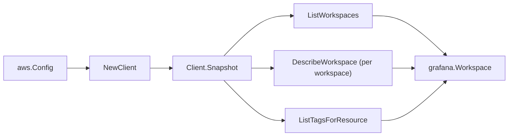

# Amazon Managed Grafana SDK Adapter

## Purpose

`internal/collector/awscloud/services/grafana/awssdk` adapts AWS SDK for Go v2
Managed Grafana responses to the scanner-owned `Client` contract. It owns
workspace pagination, per-workspace point reads, resource-tag reads,
partition-aware workspace ARN synthesis, throttle classification, and per-call
AWS API telemetry.

## Ownership boundary

This package owns SDK calls for Managed Grafana. It does not own workflow
claims, credential acquisition, Grafana fact selection, graph writes, reducer
admission, or query behavior.

## Exported surface

See `doc.go` for the godoc contract.

- `Client` - AWS SDK-backed implementation of `grafana.Client`.
- `NewClient` - builds a `Client` for one claimed AWS boundary.

## Dependencies

- `internal/collector/awscloud` for account, region, service boundary labels,
  and partition helpers.
- `internal/collector/awscloud/services/grafana` for scanner-owned result types.
- `internal/telemetry` for AWS API call and throttle instruments.
- AWS SDK for Go v2 `grafana` and Smithy error contracts.

## Telemetry

Grafana paginator pages and point reads are wrapped with:

- `aws.service.pagination.page`
- `eshu_dp_aws_api_calls_total`
- `eshu_dp_aws_throttle_total`

Metric labels stay bounded to service, account, region, operation, and result.
Grafana workspace ARNs, names, endpoints, tags, and raw AWS error payloads stay
out of metric labels.

## Gotchas / invariants

- `ListWorkspaces` returns only summaries, so each workspace needs one
  `DescribeWorkspace` point read to read the role and `vpcConfiguration`
  metadata.
- Managed Grafana does not report an ARN on the workspace description. The
  adapter synthesizes a partition-aware ARN
  (`arn:<partition>:grafana:<region>:<account>:/workspaces/<id>`) via
  `awscloud.PartitionForBoundary`; never hardcode `arn:aws:`.
- The adapter reads metadata only. It must never call
  `DescribeWorkspaceAuthentication` (which returns SAML / IAM Identity Center
  configuration), `DescribeWorkspaceConfiguration`, `CreateWorkspaceApiKey`, any
  service-account-token API, `AssociateLicense`, or any `Create*`, `Update*`,
  `Delete*` mutation API.
- Data sources, notification destinations, and authentication providers are
  mapped as enum names only; never connection strings, endpoints, or secrets.
- `ListTagsForResource` is a metadata read; Grafana tags carry no dashboard or
  secret content.
- SDK adapters translate AWS records into scanner-owned types; scanner tests
  should not mock AWS SDK pagination.

## Related docs

- `docs/public/services/collector-aws-cloud-scanners.md`
- `docs/public/services/collector-aws-cloud-security.md`
