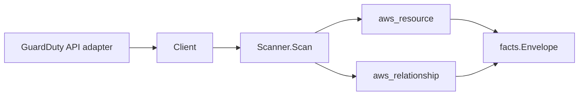

# AWS GuardDuty Scanner

## Purpose

`internal/collector/awscloud/services/guardduty` owns the GuardDuty scanner
contract for the AWS cloud collector. It converts detector, member-account,
filter-name, publishing-destination, threat intel set, and IP set metadata into
reported AWS facts and relationship evidence.

## Ownership boundary

This package owns scanner-level GuardDuty fact selection and identity mapping.
It does not own AWS SDK pagination, credential acquisition, workflow claims,
fact persistence, graph writes, reducer admission, or query behavior.

## Exported surface

See `doc.go` for the godoc contract.

- `Client` - minimal GuardDuty metadata read surface consumed by `Scanner`.
- `Scanner` - emits GuardDuty metadata and direct detector-child relationship
  facts for one boundary.
- `Detector` - scanner-owned detector summary with feature configuration and
  aggregate finding counts.
- `MemberAccount` - metadata-only member account summary.
- `FilterSummary` - filter name only; criteria expressions are not part of the
  contract.
- `PublishingDestination` - finding export destination type, status, and
  destination ARN.
- `ThreatIntelSet` and `IPSet` - set name, format, status, and location ARN
  without fetching list contents.

## Dependencies

- `internal/collector/awscloud` for boundaries, resource constants,
  relationship constants, and envelope builders.
- `internal/facts` for emitted fact envelope kinds.

The package depends on a small `Client` interface rather than the AWS SDK for Go
v2 so tests can use fake clients and runtime adapters can own SDK behavior.

## Telemetry

This scanner emits no spans or logs directly. `awsruntime.ClaimedSource`
records scan duration and emitted resource counts after `Scanner.Scan` returns.
The `awssdk` adapter records GuardDuty API call counts, throttles, and
pagination spans. The required resource signal is
`eshu_dp_aws_resources_emitted_total{service="guardduty"}` with the existing
bounded AWS collector labels.

## Gotchas / invariants

- GuardDuty facts are metadata only. The scanner must not call GetFindings,
  ListFindings, or persist finding bodies.
- Aggregate finding counts by severity and finding type are allowed because
  they do not include finding bodies, affected resources, access keys, network
  details, process trees, or attacker infrastructure.
- Filter resources carry names only. Do not add GetFilter or persist
  FindingCriteria / Criterion expressions.
- Threat intel set and IP set resources carry name, format, status, and
  location ARN only. Do not fetch S3 locations or persist list entries.
- Publishing destination resources carry destination type, status, and
  destination ARN. Do not add destination mutations.
- Member-account facts omit invitation email addresses.
- Tags are raw AWS tag evidence. Do not infer environment, owner, workload,
  repository, or deployable-unit truth from tags in this package.

## Evidence

Collector Performance Evidence: `go test ./internal/collector/awscloud/services/guardduty/...`
covers the bounded GuardDuty metadata path: paginated detector discovery,
detector metadata reads, aggregate finding statistics by severity/type, member
account pages, filter-name pages, publishing destination metadata, threat intel
set metadata, and IP set metadata without finding-body or list-content reads.

No-Regression Evidence: `go test ./cmd/collector-aws-cloud ./internal/collector/awscloud/...`
covers GuardDuty resource and relationship fact emission, omission of finding
bodies, omission of filter criteria, omission of threat intel and IP list
contents, runtime registration, command configuration, and the SDK adapter's
safe metadata mapping.

Collector Observability Evidence: GuardDuty uses the existing AWS collector
`aws.service.pagination.page` span plus `eshu_dp_aws_api_calls_total`,
`eshu_dp_aws_throttle_total`, `eshu_dp_aws_resources_emitted_total`,
`eshu_dp_aws_relationships_emitted_total`, and `aws_scan_status` rows. Metric
labels stay bounded to service, account, region, operation, result, resource
type, and status.

No-Observability-Change: the existing AWS collector telemetry contract already
diagnoses GuardDuty scans through `aws.service.scan`,
`aws.service.pagination.page`, API/throttle counters, resource/relationship
counters, and `aws_scan_status`.

Collector Deployment Evidence: GuardDuty runs inside the existing hosted
`collector-aws-cloud` runtime, so `/healthz`, `/readyz`, `/metrics`, and
`/admin/status` stay covered by the command wiring and Helm collector runtime.

## Related docs

- `docs/public/services/collector-aws-cloud.md`
- `docs/public/services/collector-aws-cloud-scanners.md`
- `docs/public/guides/collector-authoring.md`
