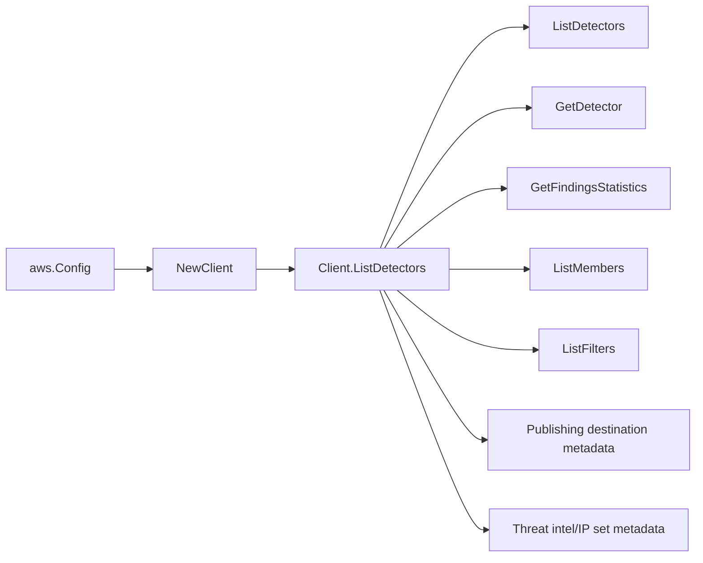

# AWS GuardDuty SDK Adapter

## Purpose

`internal/collector/awscloud/services/guardduty/awssdk` adapts AWS SDK for Go v2
GuardDuty responses to the scanner-owned `guardduty.Client` contract. It owns
GuardDuty pagination, point metadata reads, aggregate finding statistics,
throttle classification, and per-call AWS API telemetry.

## Ownership boundary

This package owns SDK calls for GuardDuty. It does not own workflow claims,
credential acquisition, GuardDuty fact selection, graph writes, reducer
admission, query behavior, or S3 object reads.

## Exported surface

See `doc.go` for the godoc contract.

- `Client` - AWS SDK-backed implementation of `guardduty.Client`.
- `NewClient` - builds a `Client` for one claimed AWS boundary.

## Dependencies

- `internal/collector/awscloud` for account, region, and service boundary
  labels.
- `internal/collector/awscloud/services/guardduty` for scanner-owned result
  types.
- `internal/telemetry` for AWS API call and throttle instruments.
- AWS SDK for Go v2 `guardduty` and Smithy error contracts.

## Telemetry

GuardDuty paginator pages and point reads are wrapped with:

- `aws.service.pagination.page`
- `eshu_dp_aws_api_calls_total`
- `eshu_dp_aws_throttle_total`

Metric labels stay bounded to service, account, region, operation, and result.
Detector IDs, finding types, destination ARNs, list locations, tags, and raw AWS
error payloads stay out of metric labels.

## Gotchas / invariants

- The adapter calls `GetFindingsStatistics` for aggregate counts by severity
  and finding type. It does not call ListFindings or GetFindings.
- `ListFilters` is name-only. Do not add GetFilter; criteria expressions are
  out of scope.
- `GetThreatIntelSet` and `GetIPSet` expose list locations. Those locations are
  persisted as metadata only. Do not add S3 clients or object reads here.
- The allowed call surface is detector/list metadata, aggregate statistics,
  member pages, filter names, publishing destination metadata, threat intel set
  metadata, and IP set metadata.
- SDK adapters translate AWS records into scanner-owned types; scanner tests
  should not mock AWS SDK pagination.

## Related docs

- `docs/public/services/collector-aws-cloud.md`
- `docs/public/services/collector-aws-cloud-scanners.md`
- `docs/public/guides/collector-authoring.md`
