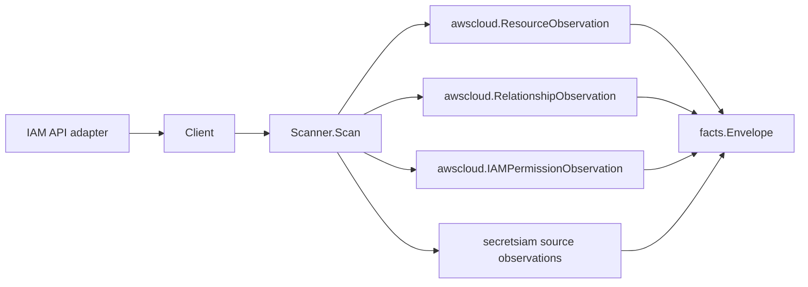

# AWS IAM Scanner

## Purpose

`internal/collector/awscloud/services/iam` owns the IAM scanner contract for the
AWS cloud collector. It converts roles, users, managed policies, instance
profiles, trust principals, and IAM relationships into `awscloud` observations.
It also emits derived `aws_iam_permission` facts and `secrets_iam_posture`
source facts: normalized, metadata-only projections of inline, attached
managed, and role trust policy statements.

## Ownership boundary

This package owns scanner-level IAM fact selection and IAM relationship
mapping. It does not own AWS SDK pagination, STS credentials, workflow claims,
fact persistence, graph writes, or reducer admission.

## Exported surface

See `doc.go` for the godoc contract.

- `Client` - minimal IAM read surface consumed by `Scanner`.
- `Scanner` - emits IAM resource, relationship, and derived permission fact
  envelopes for one boundary.
- `Role` - scanner-owned IAM role representation, including its normalized
  permission statements.
- `User` - scanner-owned IAM user principal, including its normalized permission
  statements.
- `Policy` - scanner-owned IAM managed policy representation.
- `InstanceProfile` - scanner-owned IAM instance profile representation.
- `OIDCProvider` - scanner-owned IAM OIDC provider representation with URL
  fingerprint and counts only.
- `CoverageWarning` - explicit source-local warning state emitted as
  `secrets_iam_coverage_warning`.
- `TrustPrincipal` - normalized principal from a role trust policy.
- `PolicyStatement` - normalized, metadata-only IAM policy statement (effect,
  action set, resource pattern, condition key/operator summary; no raw JSON or
  values).
  `Source` distinguishes inline, attached managed, trust, and
  permissions-boundary policy documents.

## Dependencies

- `internal/collector/awscloud` for boundaries, resource and relationship
  constants, and envelope builders.
- `internal/collector/secretsiam` for secrets/IAM posture source fact
  envelopes.
- `internal/facts` for the emitted fact envelope type.

The package depends on a small `Client` interface rather than the AWS SDK for Go
v2 so tests can use fake clients and runtime adapters can own SDK behavior.

## Telemetry

This scanner emits no metrics, spans, or logs directly. The runtime adapter that
implements `Client` must record IAM API call counts, throttles, page latency,
scan duration, and warnings/failures.

No-Regression Evidence: The #1310 IAM source-fact expansion is covered by
`go test ./internal/collector/awscloud/services/iam ./internal/collector/awscloud/services/iam/awssdk ./internal/collector/secretsiam ./internal/facts -count=1`. The test fixture includes one role, one user, one managed policy, one instance profile, one OIDC provider, permissions boundaries, inline and attached managed policy statements, trust statements, and one coverage warning. No queue, graph, Compose, Helm, or worker-concurrency settings changed.

Observability Evidence: The scanner remains inside the existing
`collector-aws-cloud` runtime boundary. The SDK adapter records the new
`GetRole`, `GetUser`, permission-boundary `GetPolicy`/`GetPolicyVersion`,
`ListOpenIDConnectProviders`, and `GetOpenIDConnectProvider` reads through
`recordAPICall`, so operators can use
scanner status, commit status, `eshu_dp_aws_scan_duration_seconds`,
`eshu_dp_aws_api_calls_total`, and `eshu_dp_aws_throttle_total` without adding
high-cardinality IAM ARN, policy JSON, OIDC URL, client ID, thumbprint,
credential, or token labels.

## Gotchas / invariants

- IAM is global, but scans still carry the claim region from the AWS collector
  boundary so the scheduler can partition work consistently.
- Role trust principals become relationships to principal identities; they do
  not create canonical principal graph truth in this package.
- Inline policy names remain role attributes. Managed policies become resources
  and role-to-policy relationships.
- The scanner stops on client errors. Runtime adapters decide whether an AWS
  service error is retryable, terminal, or a warning fact.
- Trust policy JSON is transient parse input only. Do not persist it in facts,
  metric labels, logs, status errors, or graph properties.
- Derived `aws_iam_permission` facts are metadata-only. The scanner emits only
  the normalized statement (effect, action set, resource pattern, condition key
  and operator names, and trust assume-principals). It never persists the raw
  policy JSON body or condition values, which can embed source IPs, tags, or
  other sensitive selectors. The SDK adapter normalizes documents at the wiring
  boundary so this package never holds raw policy JSON.
- `secrets_iam_posture` facts use their own `collector_kind` and remain source
  facts only; reducers own trust-chain, posture, and graph promotion decisions.
- Per-principal managed policy document fan-out is bounded in the SDK adapter to
  avoid an N+1 against IAM (each managed document costs a GetPolicy +
  GetPolicyVersion pair). The scanner consumes already-normalized statements.
- These facts are emitted but not yet consumed. The reducer graph projection
  (CAN_ASSUME / escalation-primitive edges) is a separate principal-review PR
  under issue #1134.

## Related docs

- `docs/public/services/collector-aws-cloud.md`
- `docs/public/guides/collector-authoring.md`
