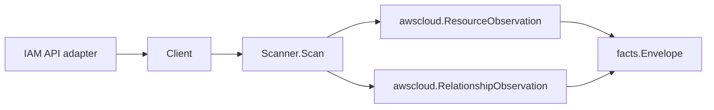

# AWS IAM Scanner

## Purpose

`internal/collector/awscloud/services/iam` owns the IAM scanner contract for the
AWS cloud collector. It converts roles, managed policies, instance profiles,
trust principals, and IAM relationships into `awscloud` observations.

## Ownership boundary

This package owns scanner-level IAM fact selection and IAM relationship
mapping. It does not own AWS SDK pagination, STS credentials, workflow claims,
fact persistence, graph writes, or reducer admission.

## Exported surface

See `doc.go` for the godoc contract.

- `Client` - minimal IAM read surface consumed by `Scanner`.
- `Scanner` - emits IAM resource and relationship fact envelopes for one
  boundary.
- `Role` - scanner-owned IAM role representation.
- `Policy` - scanner-owned IAM managed policy representation.
- `InstanceProfile` - scanner-owned IAM instance profile representation.
- `TrustPrincipal` - normalized principal from a role trust policy.

## Dependencies

- `internal/collector/awscloud` for boundaries, resource and relationship
  constants, and envelope builders.
- `internal/facts` for the emitted fact envelope type.

The package depends on a small `Client` interface rather than the AWS SDK for Go
v2 so tests can use fake clients and runtime adapters can own SDK behavior.

## Telemetry

This scanner emits no metrics, spans, or logs directly. The runtime adapter that
implements `Client` must record IAM API call counts, throttles, page latency,
scan duration, and warnings/failures.

## Gotchas / invariants

- IAM is global, but scans still carry the claim region from the AWS collector
  boundary so the scheduler can partition work consistently.
- Role trust principals become relationships to principal identities; they do
  not create canonical principal graph truth in this package.
- Inline policy names remain role attributes. Managed policies become resources
  and role-to-policy relationships.
- The scanner stops on client errors. Runtime adapters decide whether an AWS
  service error is retryable, terminal, or a warning fact.
- Trust policy JSON is payload evidence. Do not promote it to metric labels.

## Related docs

- `docs/docs/adrs/2026-04-20-aws-cloud-scanner-collector.md`
- `docs/docs/guides/collector-authoring.md`
