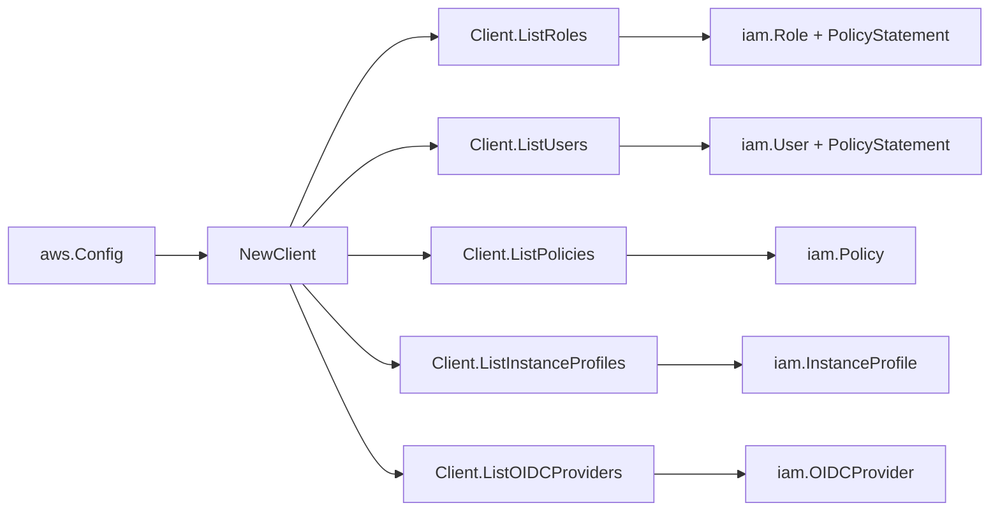

# AWS IAM SDK Adapter

## Purpose

`internal/collector/awscloud/services/iam/awssdk` adapts AWS SDK for Go v2 IAM
responses to the scanner-owned `iam.Client` contract. It owns IAM API
pagination, trust policy decoding, policy-document normalization, throttle
classification, permission-boundary detail reads, OIDC provider metadata
fingerprinting, and per-page AWS API telemetry. It reads role/user detail
(`GetRole`, `GetUser`), inline and attached managed policy documents
(`GetRolePolicy`, `GetUserPolicy`, `GetPolicy` + `GetPolicyVersion`), and OIDC
provider metadata (`ListOpenIDConnectProviders`, `GetOpenIDConnectProvider`).
It also reads the single managed policy document referenced by a role/user
permissions boundary when present. It normalizes policy documents into
metadata-only `iam.PolicyStatement` values; it never returns the raw policy JSON
body or condition values.

## Ownership boundary

This package owns SDK calls for IAM. It does not own workflow claims,
credential acquisition, IAM fact selection, graph writes, reducer admission, or
query behavior.

## Exported surface

See `doc.go` for the godoc contract.

- `Client` - AWS SDK-backed implementation of `iam.Client`.
- `NewClient` - builds a `Client` for one claimed AWS boundary.

## Dependencies

- `internal/collector/awscloud` for account, region, and service boundary
  labels.
- `internal/collector/awscloud/services/iam` for scanner-owned result types.
- `internal/telemetry` for AWS API call and throttle instruments.
- AWS SDK for Go v2 `iam` and Smithy error contracts.

## Telemetry

Each IAM paginator page is wrapped with:

- `aws.service.pagination.page`
- `eshu_dp_aws_api_calls_total`
- `eshu_dp_aws_throttle_total`

Metric labels stay bounded to service, account, region, operation, and result.
Resource ARNs, policy JSON, tags, and raw AWS error payloads stay out of metric
labels.

## Gotchas / invariants

- `ListPolicies` intentionally requests local customer-managed policies only.
- Role trust policy documents from IAM are URL-escaped JSON and are decoded
  before scanner mapping.
- A wildcard principal string is reported as an AWS principal identifier so
  downstream evidence keeps the source shape.
- SDK adapters translate AWS records into scanner-owned types; scanner tests
  should not mock AWS SDK paginators.
- Policy-document normalization is metadata-only. `policy_normalize.go` keeps the
  effect, action/resource patterns, statement SID, condition KEYS, and trust
  assume-principals; it discards the raw JSON and every condition value. The raw
  policy body is never returned from this package.
- Role and user detail reads expose permissions boundary metadata. The adapter
  returns only the boundary policy ARN and AWS boundary attachment type, plus
  normalized metadata-only statements from the boundary policy document tagged as
  `permission_boundary`.
- OIDC provider detail reads return a deterministic URL fingerprint plus client
  ID and thumbprint counts. Raw provider URLs, client IDs, and thumbprints are
  not returned.
- The per-principal managed policy document fan-out is bounded by
  `maxPolicyDocumentsPerPrincipal`. Each managed document costs a `GetPolicy` +
  `GetPolicyVersion` pair, so the cap stops an N+1 against IAM for principals
  with many attachments. `boundedManagedPolicyStatements` makes the bound unit
  testable without an AWS client.
- A permissions boundary fetch is one additional managed policy document for the
  principal that has a boundary. It is not counted as an attached managed policy
  grant and does not widen the attached-policy fan-out cap.

## Related docs

- `docs/public/services/collector-aws-cloud.md`
- `docs/public/guides/collector-authoring.md`
