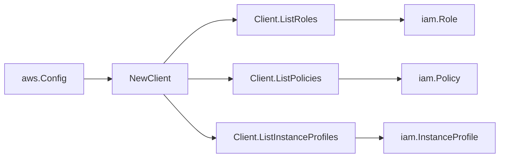

# AWS IAM SDK Adapter

## Purpose

`internal/collector/awscloud/services/iam/awssdk` adapts AWS SDK for Go v2 IAM
responses to the scanner-owned `iam.Client` contract. It owns IAM API
pagination, trust policy decoding, throttle classification, and per-page AWS
API telemetry.

## Ownership boundary

This package owns SDK calls for IAM. It does not own workflow claims,
credential acquisition, IAM fact selection, graph writes, reducer admission, or
query behavior.

## Exported surface

See `doc.go` for the godoc contract.

- `Client` - AWS SDK-backed implementation of `iam.Client`.
- `NewClient` - builds a `Client` for one claimed AWS boundary.

## Dependencies

- `internal/collector/awscloud` for account, region, and service boundary
  labels.
- `internal/collector/awscloud/services/iam` for scanner-owned result types.
- `internal/telemetry` for AWS API call and throttle instruments.
- AWS SDK for Go v2 `iam` and Smithy error contracts.

## Telemetry

Each IAM paginator page is wrapped with:

- `aws.service.pagination.page`
- `eshu_dp_aws_api_calls_total`
- `eshu_dp_aws_throttle_total`

Metric labels stay bounded to service, account, region, operation, and result.
Resource ARNs, policy JSON, tags, and raw AWS error payloads stay out of metric
labels.

## Gotchas / invariants

- `ListPolicies` intentionally requests local customer-managed policies only.
- Role trust policy documents from IAM are URL-escaped JSON and are decoded
  before scanner mapping.
- A wildcard principal string is reported as an AWS principal identifier so
  downstream evidence keeps the source shape.
- SDK adapters translate AWS records into scanner-owned types; scanner tests
  should not mock AWS SDK paginators.

## Related docs

- `docs/docs/adrs/2026-04-20-aws-cloud-scanner-collector.md`
- `docs/docs/guides/collector-authoring.md`
