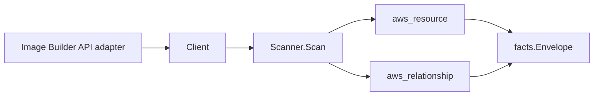

# EC2 Image Builder Scanner

## Purpose

`internal/collector/awscloud/services/imagebuilder` owns the EC2 Image Builder
scanner contract for the AWS cloud collector. It converts image pipeline, image
recipe, container recipe, infrastructure configuration, and distribution
configuration metadata into `aws_resource` facts and emits relationship evidence
for pipeline-to-recipe/config wiring, pipeline-to-execution-role,
infrastructure-configuration-to-instance-profile/subnet/security-group/SNS-topic/
S3-log-bucket, and container-recipe-to-ECR-repository/KMS-key.

## Ownership boundary

This package owns scanner-level Image Builder fact selection and identity
mapping. It does not own AWS SDK pagination, STS credentials, workflow claims,
fact persistence, graph writes, reducer admission, or query behavior.

## Exported surface

See `doc.go` for the godoc contract.

- `Client` - minimal Image Builder metadata read surface consumed by `Scanner`.
- `Scanner` - emits the five resource types plus their relationships for one
  boundary.
- `Snapshot`, `ImagePipeline`, `ImageRecipe`, `ContainerRecipe`,
  `InfrastructureConfiguration`, `DistributionConfiguration` - scanner-owned
  views with component build-document, Dockerfile body, and user-data fields
  intentionally absent.

## Dependencies

- `internal/collector/awscloud` for boundaries, resource constants,
  relationship constants, partition helpers, and envelope builders.
- `internal/facts` for emitted fact envelope kinds.

The package depends on a small `Client` interface rather than the AWS SDK for
Go v2 so tests can use fake clients and the runtime adapter can own SDK
behavior.

## Telemetry

This scanner emits no spans or logs directly. `awsruntime.ClaimedSource`
records scan duration and emitted resource counts after `Scanner.Scan` returns.
The `awssdk` adapter records Image Builder API call counts, throttles, and
pagination spans.

## Gotchas / invariants

- Every resource node publishes its resource_id as the resource ARN, the same
  value every pipeline/recipe/config edge sources and targets on.
- The pipeline-to-recipe/config edges key directly on the ARNs Image Builder
  reports, which are exactly the resource_id values the recipe/config nodes
  publish, so the edges join in-service nodes.
- AWS reports the IAM instance profile and the ECR repository by NAME, and the
  S3 logging bucket by NAME. The scanner synthesizes the partition-aware
  instance-profile, ECR repository, and S3 bucket ARNs with
  `awscloud.PartitionForBoundary` so the edges join the real IAM, ECR, and S3
  nodes in GovCloud and China, never just commercial. Never hardcode `arn:aws:`.
- Subnet and security-group edges key on the bare AWS id (subnet-..., sg-...),
  the resource_id the VPC and EC2 scanners publish, and leave `target_arn`
  empty.
- The container-recipe-to-KMS-key edge is emitted only when AWS reports a key
  identifier; `target_arn` is set only when the identifier is ARN-shaped so a
  bare id or alias is never given a fabricated ARN.
- The parent AMI of a recipe is recorded as an attribute, not an edge, because
  Eshu has no EC2 AMI resource type.
- Metadata only: never read or persist component build-document bodies,
  Dockerfile template bodies, instance user data, EC2 key pair names, scan
  findings, or build artifacts. The EC2 key pair is reduced to a configured
  boolean.
- Emit reported evidence only. Do not infer deployment, workload, repository
  ownership, environment, or deployable-unit truth from resource names or AWS
  tags.

## Evidence

No-Regression Evidence: metadata-only control-plane scanner; new read path, no change to existing hot paths. `go test ./internal/collector/awscloud/services/imagebuilder/...` green.

No-Observability-Change: reuses shared AWS pagination span + API-call/throttle counters; no telemetry contract change.

## Related docs

- `docs/public/services/collector-aws-cloud.md`
- `docs/public/services/collector-aws-cloud-scanners.md`
- `docs/public/services/collector-aws-cloud-security.md`
