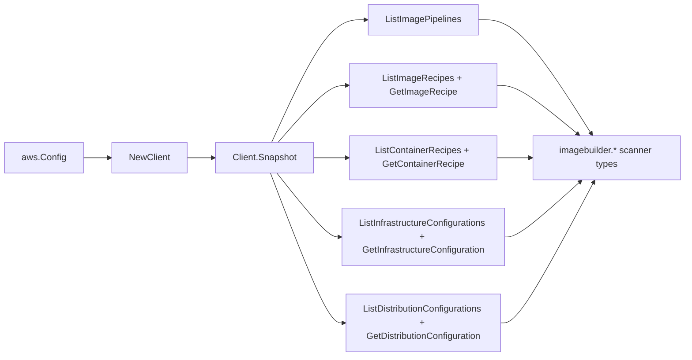

# EC2 Image Builder SDK Adapter

## Purpose

`internal/collector/awscloud/services/imagebuilder/awssdk` adapts AWS SDK for Go
v2 EC2 Image Builder responses to the scanner-owned `Client` contract. It owns
pipeline/recipe/configuration pagination, the per-resource get reads that fetch
one resource's control-plane metadata, throttle classification, and per-call AWS
API telemetry.

## Ownership boundary

This package owns SDK calls for Image Builder. It does not own workflow claims,
credential acquisition, Image Builder fact selection, graph writes, reducer
admission, or query behavior.

## Exported surface

See `doc.go` for the godoc contract.

- `Client` - AWS SDK-backed implementation of `imagebuilder.Client`.
- `NewClient` - builds a `Client` for one claimed AWS boundary.

## Dependencies

- `internal/collector/awscloud` for account, region, and service boundary
  labels.
- `internal/collector/awscloud/services/imagebuilder` for scanner-owned result
  types.
- `internal/telemetry` for AWS API call and throttle instruments.
- AWS SDK for Go v2 `imagebuilder` and Smithy error contracts.

## Telemetry

Image Builder paginator pages and point reads are wrapped with:

- `aws.service.pagination.page`
- `eshu_dp_aws_api_calls_total`
- `eshu_dp_aws_throttle_total`

Metric labels stay bounded to service, account, region, operation, and result.
Image Builder resource ARNs, names, versions, tags, and raw AWS error payloads
stay out of metric labels.

## Gotchas / invariants

- Recipes and container recipes are listed with `Owner = Self` so Amazon-managed
  and shared catalog resources do not flood the scan.
- A resource that disappears between the list page and the get read is skipped,
  not failed; the scan stays best-effort and idempotent.
- The adapter reads metadata only. It must never call any `Create*`, `Update*`,
  `Delete*`, `Start*`, `Cancel*`, `Import*`, or run-control API, and must never
  fetch component build versions, image build versions, per-built-image reads,
  scan findings, workflows, or resource policies.
- `mapContainerRecipe` deliberately drops `DockerfileTemplateData`; only the
  target ECR repository name, KMS key reference, and component ARNs are kept.
- The EC2 key pair name is reduced to a `KeyPairConfigured` boolean; the name
  itself is never copied.
- SDK adapters translate AWS records into scanner-owned types; scanner tests
  should not mock AWS SDK pagination.

## Related docs

- `docs/public/services/collector-aws-cloud-scanners.md`
- `docs/public/services/collector-aws-cloud-security.md`
