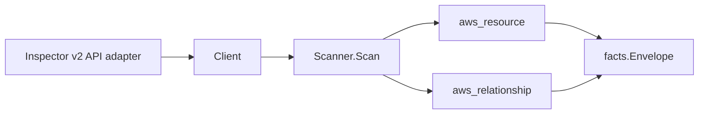

# AWS Inspector v2 Scanner

## Purpose

`internal/collector/awscloud/services/inspector2` owns the Amazon Inspector v2
scanner contract for the AWS cloud collector. It converts account scan status,
enabled scan features (EC2, ECR, Lambda, Lambda code), member-account, findings
filter-name, and CIS scan configuration metadata into reported AWS facts and
relationship evidence.

## Ownership boundary

This package owns scanner-level Inspector v2 fact selection and identity
mapping. It does not own AWS SDK pagination, credential acquisition, workflow
claims, fact persistence, graph writes, reducer admission, or query behavior.

## Exported surface

See `doc.go` for the godoc contract.

- `Client` - minimal Inspector v2 metadata read surface consumed by `Scanner`.
- `Scanner` - emits account status, member-account, filter-name, and CIS scan
  configuration facts plus the account-to-feature-status,
  member-to-administrator, and CIS-config-to-target-account relationships for
  one boundary.
- `AccountStatus` and `FeatureStatus` - scanner-owned account status with
  per-resource-type feature enablement.
- `MemberAccount` - metadata-only member account summary.
- `FilterSummary` - filter name and non-criteria identity only; criteria
  expressions, descriptions, and reasons are not part of the contract.
- `CisScanConfiguration` - CIS scan configuration metadata with the target
  account set, excluding scan results.

## Dependencies

- `internal/collector/awscloud` for boundaries, resource constants,
  relationship constants, and envelope builders.
- `internal/facts` for emitted fact envelope kinds.

The package depends on a small `Client` interface rather than the AWS SDK for Go
v2 so tests can use fake clients and runtime adapters can own SDK behavior.

## Telemetry

This scanner emits no spans or logs directly. `awsruntime.ClaimedSource`
records scan duration and emitted resource counts after `Scanner.Scan` returns.
The `awssdk` adapter records Inspector v2 API call counts, throttles, and
pagination spans. The required resource signal is
`eshu_dp_aws_resources_emitted_total{service="inspector2"}` with the existing
bounded AWS collector labels.

## Gotchas / invariants

- Inspector v2 facts are metadata only. The scanner must never read or persist
  finding details. A CVE plus package version plus affected host ARN reveals
  exploitation surface.
- Aggregate finding counts by severity, resource type, or status would be the
  only acceptable finding signal, and even those are out of scope for this
  slice. The scanner makes no finding-listing or finding-aggregation call.
- Filter resources carry the filter name and non-criteria identity only. Never
  add GetFilter or persist FilterCriteria, Description, or Reason, which encode
  threat-hunting hypotheses.
- CIS scan configuration resources carry name, owner, security level, coarse
  schedule kind, target account count, and tags. Scan results are out of scope.
- Member-account facts come from the delegated-administrator view. A standalone
  account emits no member relationships.
- Tags are raw AWS tag evidence. Do not infer environment, owner, workload,
  repository, or deployable-unit truth from tags in this package.

## Evidence

Collector Performance Evidence: `go test ./internal/collector/awscloud/services/inspector2/...`
covers the bounded Inspector v2 metadata path: one account status read,
paginated member, filter-name, and CIS scan configuration list reads, and
relationship fan-out bounded by feature count (four per account) and the CIS
target account set. The scanner issues no per-finding read, so handler cost
scales with configuration cardinality, not finding volume.

No-Regression Evidence: `go test ./cmd/collector-aws-cloud ./internal/collector/awscloud/...`
covers Inspector v2 resource and relationship fact emission, omission of
finding details, omission of filter criteria, standalone-account member
suppression, runtime registration, command configuration, and the SDK adapter's
safe metadata mapping.

Collector Observability Evidence: Inspector v2 uses the existing AWS collector
`aws.service.pagination.page` span plus `eshu_dp_aws_api_calls_total`,
`eshu_dp_aws_throttle_total`, `eshu_dp_aws_resources_emitted_total`,
`eshu_dp_aws_relationships_emitted_total`, and `aws_scan_status` rows. Metric
labels stay bounded to service, account, region, operation, result, resource
type, and status.

No-Observability-Change: the existing AWS collector telemetry contract already
diagnoses Inspector v2 scans through `aws.service.scan`,
`aws.service.pagination.page`, API/throttle counters, resource/relationship
counters, and `aws_scan_status`.

Collector Deployment Evidence: Inspector v2 runs inside the existing hosted
`collector-aws-cloud` runtime, so `/healthz`, `/readyz`, `/metrics`, and
`/admin/status` stay covered by the command wiring and Helm collector runtime.

## Related docs

- `docs/public/services/collector-aws-cloud.md`
- `docs/public/services/collector-aws-cloud-scanners.md`
- `docs/public/guides/collector-authoring.md`
